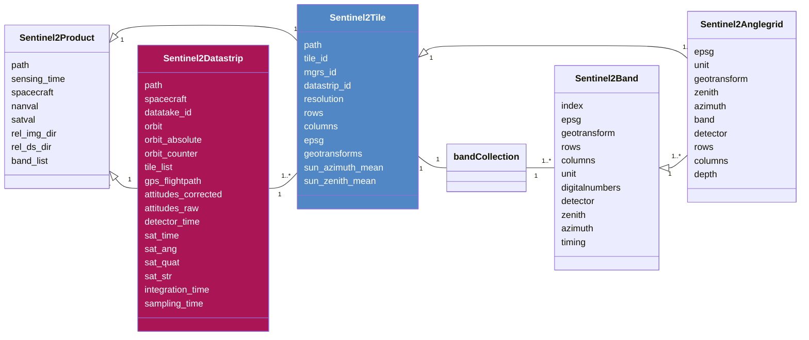

[](https://github.com/space-accountants/s2d2)
[](https://github.com/space-accountants/s2d2)
[](https://doi.org/10.5281/zenodo.10654893)
[](https://bestpractices.coreinfrastructure.org/projects/8399)
[](https://fair-software.eu)
[](https://sonarcloud.io/dashboard?id=space-accountants_s2d2)
[](https://s2d2.readthedocs.io/en/latest/?badge=latest)

# S2D2: Sentinel-2 data deepening


Easing the extraction of hard-to-find information that is within the meta-data of Sentinel-2 imagery.

## How to use s2d2

## A brief overview of Sentinel-2
With ease you can get lost in the terminology of Sentinel-2 data, and miss the rational. 
Therefore, a brief overview of the satellite system is given here, so hopefully a better understanding of the jargon can be created.

The Sentinel-2 satellites are a tandem mission that orbit in a sun-synchronous orbit. 
Since their inclination is 98 degrees, their orbit is in North-East to South-West orientation. 
Recordings of the sun-lit part are counted, in the meta-data these are termed **relative orbit number**.
This numbering system follows the orbit of the satellite system, hence when these are plotted on a map, 
the numbering of neighboring orbits is not incremental.

The flightpath over one orbit is called a **datatake**, this can the full extent of the orbit, but typically the sensor acquires only over land. 
Hence, recordings can be short, more specifics about the coverage can be found in the [campaign archive](https://sentinel.esa.int/web/sentinel/copernicus/sentinel-2/acquisition-plans/archive).
Furthermore, within a fight the data transfer can be subdivided towards different ground stations.
In that case the datatake is subdivided into **datastrips**, which should have some spatial overlap.

```geojson {description: "todo make a caption of this figure"}
{
"type": "FeatureCollection",
"crs": { "type": "name", "properties": { "name": "urn:ogc:def:crs:OGC:1.3:CRS84" } },
"features": [
{ "type": "Feature", "properties": { "fill": "#AA1555", "Scenes": "64" }, "geometry": { "type": "Polygon", "coordinates": [ [ [ 163.074136837991944, 60.738750237623613 ], [ 160.527472941528572, 61.151095718040182 ], [ 158.502806035932394, 57.702818586280863 ], [ 156.778532745115427, 54.232582236586687 ], [ 155.274980375344029, 50.745473567324389 ], [ 154.150677513387564, 47.829074748292342 ], [ 156.017942073372524, 47.499729559644067 ], [ 157.860362379948555, 47.140567762863583 ], [ 159.197722307382833, 50.029804552877991 ], [ 161.002460439337, 53.47677175346125 ], [ 163.088881182557628, 56.896231981667718 ], [ 165.551847364486321, 60.27955007917059 ], [ 163.074136837991944, 60.738750237623613 ] ] ] } },
{ "type": "Feature", "properties": { "fill": "#AA1555", "Scenes": "24" }, "geometry": { "type": "Polygon", "coordinates": [ [ [ 147.30891938961264, 17.99320544158703 ], [ 145.979745238663185, 18.275581379627603 ], [ 145.175316605403083, 14.719856241039023 ], [ 144.835022686249658, 13.197294210992666 ], [ 146.131989624159615, 12.916248026612895 ], [ 147.425877558149978, 12.628849759267727 ], [ 147.782568914428339, 14.15006678390537 ], [ 148.633594373520054, 17.701840934540186 ], [ 147.30891938961264, 17.99320544158703 ] ] ] } },
{ "type": "Feature", "properties": { "fill": "#AA1555", "Scenes": "18" }, "geometry": { "type": "Polygon", "coordinates": [ [ [ 145.413319019935699, 9.738735242217869 ], [ 144.130611927431374, 10.019480052865966 ], [ 143.347733134474225, 6.46057467370615 ], [ 143.295215023618226, 6.22128143818889 ], [ 144.566461000180198, 5.940413828633486 ], [ 145.836343630931879, 5.656659465638152 ], [ 145.889896192177503, 5.895881326560534 ], [ 146.693753110628592, 9.453233462733923 ], [ 145.413319019935699, 9.738735242217869 ] ] ] } },
{ "type": "Feature", "properties": { "Name": "44043-4", "description": null, "timestamp": null, "begin": "2023-11-28T00:57:03.204", "end": "2023-11-28T01:07:09.348", "altitudeMode": null, "tessellate": "-1", "extrude": "0", "visibility": "0", "drawOrder": null, "icon": null, "ID": "44043-4", "Timeliness": "NOMINAL", "Station": "INS_/EDRS-C/SGS_", "Mode": "NOBS", "ObservationTimeStart": "2023-11-28T00:57:03.204", "ObservationTimeStop": "2023-11-28T01:07:09.348", "ObservationDuration": "606144", "OrbitAbsolute": "44043", "OrbitRelative": "2", "Scenes": "168" }, "geometry": { "type": "Polygon", "coordinates": [ [ [ 143.237779258709821, -0.084060846473957 ], [ 141.97280358400937, 0.198010263009932 ], [ 141.185927470901333, -3.359933750613149 ], [ 140.389910722245105, -6.916225433916138 ], [ 139.58041106682208, -10.470147917270891 ], [ 138.752735848979825, -14.020962951321746 ], [ 137.901682971228269, -17.567903335269392 ], [ 137.021349180757625, -21.110161923049841 ], [ 136.104890424656702, -24.646875856594122 ], [ 135.144213265952885, -28.177103836551492 ], [ 134.129567246440473, -31.699793855689538 ], [ 133.048997491157934, -35.213737159028362 ], [ 132.951142907020625, -35.519810196129065 ], [ 134.517219880226804, -35.843084043714803 ], [ 136.096088346307027, -36.145947248915981 ], [ 136.181799341553699, -35.838545194122347 ], [ 137.134912181476494, -32.310922822010568 ], [ 138.0416692053806, -28.777051756370568 ], [ 138.911545599949335, -25.237705790753658 ], [ 139.752340452859187, -21.693597321441608 ], [ 140.570614486754522, -18.145402745598677 ], [ 141.372018580528788, -14.59377994915989 ], [ 142.161544062421314, -11.039380348864769 ], [ 142.943719909106477, -7.482856980343001 ], [ 143.722774389859921, -3.924870099613203 ], [ 144.502774063088452, -0.366091172671624 ], [ 143.237779258709821, -0.084060846473957 ] ] ] } },
{ "type": "Feature", "properties": { "fill": "#AA1555", "Scenes": "333" }, "geometry": { "type": "Polygon", "coordinates": [ [ [ 137.887082532124538, 60.721861156567428 ], [ 135.341668838197904, 61.134037930585883 ], [ 133.318747268969588, 57.685635438951522 ], [ 131.595740024298834, 54.215304463770821 ], [ 130.093147263949135, 50.728120323888916 ], [ 128.756447677720388, 47.227540989862931 ], [ 127.547077283514923, 43.716019117290301 ], [ 126.43691425203339, 40.195373057352825 ], [ 125.404928937146195, 36.667008484672238 ], [ 124.435020609792787, 33.132060097441816 ], [ 123.514584425439153, 29.591484199772509 ], [ 122.633536655281077, 26.046120344337535 ], [ 121.783634208341425, 22.496732901300494 ], [ 120.957987505163288, 18.944039495589703 ], [ 120.150702617300865, 15.388730358165075 ], [ 119.356609436757239, 11.831481665754973 ], [ 118.571050739814055, 8.272964701338248 ], [ 117.789723759422614, 4.713850794128328 ], [ 117.008517371135838, 1.154816940883882 ], [ 116.223390206913777, -2.403451375426162 ], [ 115.430247684608517, -5.960257171820324 ], [ 114.624817562814243, -9.514888365374189 ], [ 114.617309501295836, -9.547697043813599 ], [ 115.902663581139947, -9.834349766173016 ], [ 117.190330829437585, -10.116163469173916 ], [ 117.197563501685934, -10.083328728709965 ], [ 117.978494839031029, -6.526346559932802 ], [ 118.757408057877626, -2.968080179262748 ], [ 119.538348127733187, 0.590795385134467 ], [ 120.325357661164574, 4.149590010270707 ], [ 121.122599380401994, 7.707595256794143 ], [ 121.934484462323212, 11.264080439574188 ], [ 122.765813542855298, 14.818287031325157 ], [ 123.621945123416182, 18.369420558443306 ], [ 124.508999685635757, 21.916638752582283 ], [ 125.434114446861543, 25.459034350829388 ], [ 126.405776030696188, 28.995610463359576 ], [ 127.434262839379798, 32.525245394325736 ], [ 128.532246614296781, 36.046642166301211 ], [ 129.715628023406737, 39.558255971619609 ], [ 131.004722024263287, 43.058188391403505 ], [ 132.425976670663687, 46.544030886429908 ], [ 134.01452223640058, 50.012628727465781 ], [ 135.81803576427933, 53.459717043819026 ], [ 137.902852756501659, 56.879332457752746 ], [ 140.363651339112693, 60.262857447574731 ], [ 137.887082532124538, 60.721861156567428 ] ] ] } },
{ "type": "Feature", "properties": { "Name": "44044-2", "description": null, "timestamp": null, "begin": "2023-11-28T02:43:16.596", "end": "2023-11-28T02:45:22.876", "altitudeMode": null, "tessellate": "-1", "extrude": "0", "visibility": "0", "drawOrder": null, "icon": null, "ID": "44044-2", "Timeliness": "NOMINAL", "Station": "EDRS-C", "Mode": "NOBS", "ObservationTimeStart": "2023-11-28T02:43:16.596", "ObservationTimeStop": "2023-11-28T02:45:22.876", "ObservationDuration": "126280", "OrbitAbsolute": "44044", "OrbitRelative": "3", "Scenes": "35" }, "geometry": { "type": "Polygon", "coordinates": [ [ [ 113.617072812997904, -19.71957689196757 ], [ 112.269711235277271, -19.424327198897466 ], [ 111.37137744662445, -22.963792755626251 ], [ 110.43285827887415, -26.497232126063562 ], [ 110.346612391502106, -26.813148267727041 ], [ 111.77288468040372, -27.118460858207659 ], [ 113.207059682464632, -27.409347276939013 ], [ 113.285087158464464, -27.0926047206395 ], [ 114.140225466090158, -23.550905119504741 ], [ 114.969538836865595, -20.004768351246121 ], [ 113.617072812997904, -19.71957689196757 ] ] ] } },
{ "type": "Feature", "properties": { "Name": "44045-1", "description": null, "timestamp": null, "begin": "2023-11-28T04:01:12.581", "end": "2023-11-28T04:17:26.741", "altitudeMode": null, "tessellate": "-1", "extrude": "0", "visibility": "0", "drawOrder": null, "icon": null, "ID": "44045-1", "Timeliness": "NOMINAL", "Station": "INS_/EDRS-C/SGS_", "Mode": "NOBS", "ObservationTimeStart": "2023-11-28T04:01:12.581", "ObservationTimeStop": "2023-11-28T04:17:26.741", "ObservationDuration": "974160", "OrbitAbsolute": "44045", "OrbitRelative": "4", "Scenes": "270" }, "geometry": { "type": "Polygon", "coordinates": [ [ [ 112.647094866832262, 60.631549083210572 ], [ 110.108348131988549, 61.042827698543704 ], [ 108.094705132798893, 57.59375866790355 ], [ 106.378431164398677, 54.122924278900797 ], [ 104.880855052532013, 50.635345629909082 ], [ 103.547998584716723, 47.134445814880877 ], [ 102.34160611513164, 43.622659102358085 ], [ 101.233779147811902, 40.101790511951954 ], [ 100.203633063635991, 36.573237451203028 ], [ 99.235180478600824, 33.038128421139177 ], [ 98.315904639234773, 29.497415327416679 ], [ 97.435778290852767, 25.951935301257066 ], [ 96.586599768401257, 22.402451188858262 ], [ 95.761509995179722, 18.849679688871444 ], [ 94.954637412492531, 15.29431053801699 ], [ 94.160829557121829, 11.737019571109505 ], [ 93.375443563269172, 8.178477656469987 ], [ 92.594176284932118, 4.619356676684909 ], [ 92.421786712589835, 3.833373864389552 ], [ 93.688824528785389, 3.552174512742301 ], [ 94.955051989925451, 3.26925174662012 ], [ 95.129523858516137, 4.055113529353993 ], [ 95.926439281721144, 7.613149060757545 ], [ 96.737874779059908, 11.169684252155719 ], [ 97.568620100167905, 14.72396143724848 ], [ 98.424017740139163, 18.275187213025308 ], [ 99.310164866724278, 21.822520757119875 ], [ 100.234167838238534, 25.365056778751256 ], [ 101.204472368525416, 28.901801146307708 ], [ 102.231302427814839, 32.431636011233635 ], [ 103.327256757546422, 35.953269827443293 ], [ 104.508130955868282, 39.465165934385567 ], [ 105.794100040867747, 42.965437488006188 ], [ 107.211426201074147, 46.451691885832552 ], [ 108.794967549336775, 49.920798190690995 ], [ 110.592019772184287, 53.368525285715357 ], [ 112.668303602003078, 56.788966422620788 ], [ 115.117572969401039, 60.173591744023327 ], [ 112.647094866832262, 60.631549083210572 ] ] ] } },
{ "type": "Feature", "properties": { "Name": "44046-1", "description": null, "timestamp": null, "begin": "2023-11-28T05:41:53.301", "end": "2023-11-28T05:54:27.373", "altitudeMode": null, "tessellate": "-1", "extrude": "0", "visibility": "0", "drawOrder": null, "icon": null, "ID": "44046-1", "Timeliness": "NOMINAL", "Station": "EDRS-C", "Mode": "NOBS", "ObservationTimeStart": "2023-11-28T05:41:53.301", "ObservationTimeStop": "2023-11-28T05:54:27.373", "ObservationDuration": "754072", "OrbitAbsolute": "44046", "OrbitRelative": "5", "Scenes": "209" }, "geometry": { "type": "Polygon", "coordinates": [ [ [ 87.522882086274649, 60.701742087648995 ], [ 84.978956280359995, 61.113718197185904 ], [ 82.958109642213941, 57.66516666467389 ], [ 81.236607737763123, 54.194723166447169 ], [ 79.735136306293597, 50.707450873882934 ], [ 78.399310541084844, 47.206798828441237 ], [ 77.190598641411427, 43.695218373454125 ], [ 76.080951911863721, 40.174523025107433 ], [ 75.049375254500518, 36.64611651378695 ], [ 74.079792220335662, 33.111132260341599 ], [ 73.159615347628687, 29.570525731323787 ], [ 72.27877353360806, 26.02513593690994 ], [ 71.429032948516692, 22.47572690555311 ], [ 70.603510832300287, 18.923016054193262 ], [ 70.155454443229786, 16.958268641507782 ], [ 71.475105890389457, 16.676345698926454 ], [ 72.790645862341222, 16.386130629248367 ], [ 73.26714534915682, 18.34842531663914 ], [ 74.153997169239986, 21.895669271579539 ], [ 75.07886357139212, 25.438096225130568 ], [ 76.050222036494517, 28.974709904537367 ], [ 77.078338801509588, 32.504389474595236 ], [ 78.175869291266594, 36.025839172803266 ], [ 79.358692033317325, 39.537515918480302 ], [ 80.647091497871756, 43.037523770915648 ], [ 82.06747301922907, 46.52345779072833 ], [ 83.654891225284146, 49.992170088061364 ], [ 85.456960920953435, 53.439401132799411 ], [ 87.539870740925224, 56.859201094129901 ], [ 89.998091938677675, 60.242972081140557 ], [ 87.522882086274649, 60.701742087648995 ] ] ] } },
{ "type": "Feature", "properties": { "Name": "44046-2", "description": null, "timestamp": null, "begin": "2023-11-28T06:04:30.039", "end": "2023-11-28T06:04:48.079", "altitudeMode": null, "tessellate": "-1", "extrude": "0", "visibility": "0", "drawOrder": null, "icon": null, "ID": "44046-2", "Timeliness": "NOMINAL", "Station": "EDRS-C/SGS_", "Mode": "NOBS", "ObservationTimeStart": "2023-11-28T06:04:30.039", "ObservationTimeStop": "2023-11-28T06:04:48.079", "ObservationDuration": "18040", "OrbitAbsolute": "44046", "OrbitRelative": "5", "Scenes": "5" }, "geometry": { "type": "Polygon", "coordinates": [ [ [ 63.415440802410238, -19.100526499386156 ], [ 62.073319805142333, -18.805958769618144 ], [ 61.822127255294738, -19.817295195969869 ], [ 63.172917177188495, -20.112989395638408 ], [ 64.528940643419375, -20.398405276878393 ], [ 64.762466662793827, -19.385380085161035 ], [ 63.415440802410238, -19.100526499386156 ] ] ] } },
{ "type": "Feature", "properties": { "fill": "#AA1555", "Scenes": "406" }, "geometry": { "type": "Polygon", "coordinates": [ [ [ 62.276214771548098, 60.602009124815957 ], [ 59.739642036313441, 61.012995410573183 ], [ 57.729014182432941, 57.563709745763944 ], [ 56.01492923059174, 54.092711635150778 ], [ 54.518984622403273, 50.605004613215179 ], [ 53.187370259841835, 47.104001072166454 ], [ 51.981939606582294, 43.59212855274825 ], [ 50.874867224273146, 40.071187747185114 ], [ 49.845329026830832, 36.542572625506146 ], [ 48.877361520818972, 33.007410576190857 ], [ 47.958463169432449, 29.466652776885066 ], [ 47.078636484737267, 25.921134901051172 ], [ 46.229693270026559, 22.371619301942303 ], [ 45.404784365163465, 18.818822379330236 ], [ 44.598045482210971, 15.263433711392869 ], [ 43.804329394337906, 11.706129061426056 ], [ 43.018996856075418, 8.147579288147854 ], [ 42.237747001308904, 4.588456305756022 ], [ 41.45647335118111, 1.02943734064526 ], [ 40.671134769815829, -2.528791764294819 ], [ 39.877631732143826, -6.085533082232176 ], [ 39.071686063632228, -9.640074163638106 ], [ 38.248701033763538, -13.19168254440916 ], [ 37.403609322862188, -16.73959862511515 ], [ 36.530690904931873, -20.283025816078265 ], [ 35.623346231888618, -23.821116038997097 ], [ 35.250049611960208, -25.231004493604573 ], [ 36.65672389262069, -25.533832635051766 ], [ 38.070625479371245, -25.823214877843874 ], [ 38.411033141900873, -24.41007504209751 ], [ 39.246014399481652, -20.864952250672562 ], [ 40.05986688586303, -17.315898228001725 ], [ 40.8580672334339, -13.763568418049619 ], [ 41.645482617819134, -10.208613987273027 ], [ 42.426558283365779, -6.65168923257187 ], [ 43.205474300221283, -3.09345669139104 ], [ 43.986278040855218, 0.4654090778017 ], [ 44.773005980317599, 4.024218490785558 ], [ 45.569814494048273, 7.582263812160058 ], [ 46.38110368316439, 11.138815245724272 ], [ 47.211659268898785, 14.693115392523469 ], [ 48.066818147102992, 18.244371198784954 ], [ 48.952669939539518, 21.791742312346834 ], [ 49.876310966114822, 25.334324082608699 ], [ 50.846173632410959, 28.871123273602883 ], [ 51.872464202819955, 32.401023286257164 ], [ 52.967751341771418, 35.922734715522772 ], [ 54.147803371565509, 39.434723272836877 ], [ 55.432757938112438, 42.935105189230583 ], [ 56.848809391862375, 46.421493438763989 ], [ 58.430727084758658, 49.890764800949604 ], [ 60.225676958325828, 53.338699768983197 ], [ 62.299185218589244, 56.759409494692193 ], [ 64.744705964545133, 60.144392541467639 ], [ 62.276214771548098, 60.602009124815957 ] ] ] } },
{ "type": "Feature", "properties": { "Name": "44048-1", "description": null, "timestamp": null, "begin": "2023-11-28T09:03:18.563", "end": "2023-11-28T09:26:49.291", "altitudeMode": null, "tessellate": "-1", "extrude": "0", "visibility": "0", "drawOrder": null, "icon": null, "ID": "44048-1", "Timeliness": "NOMINAL", "Station": "SGS_", "Mode": "NOBS", "ObservationTimeStart": "2023-11-28T09:03:18.563", "ObservationTimeStop": "2023-11-28T09:26:49.291", "ObservationDuration": "1410728", "OrbitAbsolute": "44048", "OrbitRelative": "7", "Scenes": "391" }, "geometry": { "type": "Polygon", "coordinates": [ [ [ 37.118219782994991, 60.625432070870836 ], [ 34.579923500673416, 61.036650093444649 ], [ 32.566905661378186, 57.587536147414326 ], [ 30.851085523684237, 54.116667817790621 ], [ 29.353847634987389, 50.629062559013349 ], [ 28.021248651958839, 47.128141245026249 ], [ 26.815055557027971, 43.616336748844475 ], [ 25.707385004250895, 40.09545319250546 ], [ 24.677367287246415, 36.566887131057463 ], [ 23.709012888397329, 33.031767253420263 ], [ 22.789815300293331, 29.491044895406748 ], [ 21.909751074554663, 25.945557025504328 ], [ 21.060621338386085, 22.396066387611164 ], [ 20.23556907100868, 18.843289618322618 ], [ 19.4287242211857, 15.287916421402972 ], [ 18.634935411489078, 11.730622616758067 ], [ 17.849560526991041, 8.17207907063935 ], [ 17.068296894804774, 4.612957672109566 ], [ 16.287037155546447, 1.053935599068298 ], [ 15.501738702705243, -2.504300993119503 ], [ 14.708306099768626, -6.061054815114742 ], [ 13.902461807342776, -9.615613575537035 ], [ 13.079611003977387, -13.167244765387302 ], [ 12.234690186194733, -16.715188994838226 ], [ 11.36198453050371, -20.258649969641919 ], [ 10.915944050677814, -22.01770441287341 ], [ 12.287470075544606, -22.316063085711022 ], [ 13.664988177685776, -22.602887684679484 ], [ 14.076857561336913, -20.840533125054694 ], [ 14.890585210171091, -17.291454317263312 ], [ 15.688695831543296, -13.739104206750474 ], [ 16.47605311308341, -10.184133961494911 ], [ 17.257099970055897, -6.627197924956139 ], [ 18.036013701420124, -3.068958718592794 ], [ 18.816842545026091, 0.489909025979797 ], [ 19.60362612716111, 4.048715628512372 ], [ 20.400519371592136, 7.606753191660065 ], [ 21.211924528793045, 11.163291751226108 ], [ 22.04263051307387, 14.717573696365816 ], [ 22.897978658679282, 18.268805696504838 ], [ 23.784064569038112, 21.816147026794997 ], [ 24.707992521526329, 25.35869252921815 ], [ 25.678205471230658, 28.895448257892298 ], [ 26.70492371796912, 32.42529662335923 ], [ 27.800741081308264, 35.946946445338547 ], [ 28.981443567025888, 39.458861789548408 ], [ 30.267202380637414, 42.959156215208097 ], [ 31.68426433412824, 46.445438354368363 ], [ 33.267469135595093, 49.91457887014365 ], [ 35.064085566540093, 53.362349053529535 ], [ 37.139794017157726, 56.782845868945877 ], [ 39.588286231075664, 60.167545354451406 ], [ 37.118219782994991, 60.625432070870836 ] ] ] } },
{ "type": "Feature", "properties": { "Name": "44048-2", "description": null, "timestamp": null, "begin": "2023-11-28T09:35:43.281", "end": "2023-11-28T09:36:01.321", "altitudeMode": null, "tessellate": "-1", "extrude": "0", "visibility": "0", "drawOrder": null, "icon": null, "ID": "44048-2", "Timeliness": "NOMINAL", "Station": "SGS_", "Mode": "NOBS", "ObservationTimeStart": "2023-11-28T09:35:43.281", "ObservationTimeStop": "2023-11-28T09:36:01.321", "ObservationDuration": "18040", "OrbitAbsolute": "44048", "OrbitRelative": "7", "Scenes": "5" }, "geometry": { "type": "Polygon", "coordinates": [ [ [ 1.872110328911574, -53.576241426386716 ], [ -0.241444403914206, -53.174814080108639 ], [ -0.797183660737063, -54.150990958866579 ], [ 1.363419782122084, -54.559736675879286 ], [ 3.566305823108114, -54.92934003541324 ], [ 4.024885800002179, -53.939828800727113 ], [ 1.872110328911574, -53.576241426386716 ] ] ] } },
{ "type": "Feature", "properties": { "Name": "44049-1", "description": null, "timestamp": null, "begin": "2023-11-28T10:44:01.304", "end": "2023-11-28T11:00:19.072", "altitudeMode": null, "tessellate": "-1", "extrude": "0", "visibility": "0", "drawOrder": null, "icon": null, "ID": "44049-1", "Timeliness": "NOMINAL", "Station": "SGS_", "Mode": "NOBS", "ObservationTimeStart": "2023-11-28T10:44:01.304", "ObservationTimeStop": "2023-11-28T11:00:19.072", "ObservationDuration": "977768", "OrbitAbsolute": "44049", "OrbitRelative": "8", "Scenes": "271" }, "geometry": { "type": "Polygon", "coordinates": [ [ [ 11.911512204743039, 60.581029992505236 ], [ 9.376481440645883, 60.991809098271993 ], [ 7.367989051475229, 57.542369991945208 ], [ 5.655454754684349, 54.071255886307675 ], [ 4.160666040117515, 50.583457892769047 ], [ 2.829931785378779, 47.082380832252667 ], [ 1.625182689979388, 43.570447484882955 ], [ 0.518645041645551, 40.049455480492533 ], [ -0.510469671234047, 36.520796786877582 ], [ -1.478092600513097, 32.985597072856791 ], [ -2.396716988154316, 29.444807214260109 ], [ -3.276331366944075, 25.899262502028346 ], [ -4.125107908670797, 22.349724580800686 ], [ -4.949888748802887, 18.796909639305696 ], [ -5.756533025361187, 15.241507144054063 ], [ -6.550184257112392, 11.684192808280542 ], [ -7.33547912715981, 8.125637484481887 ], [ -8.116716889888764, 4.566513109820873 ], [ -8.336053973365281, 3.566508003958036 ], [ -7.069344329025959, 3.285259585249574 ], [ -5.80338380782813, 3.002417412416984 ], [ -5.581520864130209, 4.00227908534178 ], [ -4.784787978245117, 7.560331326399258 ], [ -3.973602376852882, 11.11689425952861 ], [ -3.143181191244861, 14.671210674943477 ], [ -2.288191491916197, 18.222487766030614 ], [ -1.402549003448935, 21.769885513455542 ], [ -0.479164518713735, 25.312499719817207 ], [ 0.490384938103292, 28.849337783284099 ], [ 1.516289696959136, 32.379284154076466 ], [ 2.611103214889114, 35.901050690902721 ], [ 3.790576503818798, 39.413104554777199 ], [ 5.074811961296349, 42.913564713076539 ], [ 6.489959940220226, 46.400047847081908 ], [ 8.070726935920176, 49.869436199322458 ], [ 9.864187025910823, 53.317518481109403 ], [ 11.935728710907021, 56.738418512393423 ], [ 14.378593882225799, 60.12365496570483 ], [ 11.911512204743039, 60.581029992505236 ] ] ] } },
{ "type": "Feature", "properties": { "Name": "44049-2", "description": null, "timestamp": null, "begin": "2023-11-28T11:17:10.854", "end": "2023-11-28T11:18:23.014", "altitudeMode": null, "tessellate": "-1", "extrude": "0", "visibility": "0", "drawOrder": null, "icon": null, "ID": "44049-2", "Timeliness": "NOMINAL", "Station": "SGS_", "Mode": "NOBS", "ObservationTimeStart": "2023-11-28T11:17:10.854", "ObservationTimeStop": "2023-11-28T11:18:23.014", "ObservationDuration": "72160", "OrbitAbsolute": "44049", "OrbitRelative": "8", "Scenes": "20" }, "geometry": { "type": "Polygon", "coordinates": [ [ [ -24.705678073490912, -56.190896907274457 ], [ -26.950033917930426, -55.768893078554619 ], [ -29.272416002592887, -59.151108829985795 ], [ -29.754616459064739, -59.780739166375632 ], [ -27.266366923798941, -60.243084761737819 ], [ -24.709838194605581, -60.65769874962524 ], [ -24.315711128079133, -60.01482053659069 ], [ -22.41320381168137, -56.571486680941085 ], [ -24.705678073490912, -56.190896907274457 ] ] ] } },
{ "type": "Feature", "properties": { "Name": "44050-1", "description": null, "timestamp": null, "begin": "2023-11-28T12:25:21.208", "end": "2023-11-28T12:25:39.248", "altitudeMode": null, "tessellate": "-1", "extrude": "0", "visibility": "0", "drawOrder": null, "icon": null, "ID": "44050-1", "Timeliness": "NOMINAL", "Station": "SGS_", "Mode": "NOBS", "ObservationTimeStart": "2023-11-28T12:25:21.208", "ObservationTimeStop": "2023-11-28T12:25:39.248", "ObservationDuration": "18040", "OrbitAbsolute": "44050", "OrbitRelative": "9", "Scenes": "5" }, "geometry": { "type": "Polygon", "coordinates": [ [ [ -14.721300041617024, 58.421881794219566 ], [ -17.108168217428151, 58.81312372890352 ], [ -17.654441506045487, 57.826355439289223 ], [ -15.328518591457582, 57.442924116517851 ], [ -13.054123159663229, 57.017718519285566 ], [ -12.390437178346744, 57.987425972847319 ], [ -14.721300041617024, 58.421881794219566 ] ] ] } },
{ "type": "Feature", "properties": { "Name": "44050-2", "description": null, "timestamp": null, "begin": "2023-11-28T12:30:39.441", "end": "2023-11-28T12:31:51.601", "altitudeMode": null, "tessellate": "-1", "extrude": "0", "visibility": "0", "drawOrder": null, "icon": null, "ID": "44050-2", "Timeliness": "NOMINAL", "Station": "SGS_", "Mode": "NOBS", "ObservationTimeStart": "2023-11-28T12:30:39.441", "ObservationTimeStop": "2023-11-28T12:31:51.601", "ObservationDuration": "72160", "OrbitAbsolute": "44050", "OrbitRelative": "9", "Scenes": "20" }, "geometry": { "type": "Polygon", "coordinates": [ [ [ -22.939162491458845, 39.966693917239546 ], [ -24.588219572541828, 40.273928694380942 ], [ -25.62175071393202, 36.745722601427687 ], [ -25.808169754671873, 36.083417559575459 ], [ -24.249625199224536, 35.784393530403186 ], [ -22.703521445410392, 35.465493095851265 ], [ -22.491326577573236, 36.125020274614556 ], [ -21.305833008033606, 39.636396221064935 ], [ -22.939162491458845, 39.966693917239546 ] ] ] } },
{ "type": "Feature", "properties": { "Name": "44050-3", "description": null, "timestamp": null, "begin": "2023-11-28T12:42:46.215", "end": "2023-11-28T12:45:28.575", "altitudeMode": null, "tessellate": "-1", "extrude": "0", "visibility": "0", "drawOrder": null, "icon": null, "ID": "44050-3", "Timeliness": "NOMINAL", "Station": "SGS_", "Mode": "NOBS", "ObservationTimeStart": "2023-11-28T12:42:46.215", "ObservationTimeStop": "2023-11-28T12:45:28.575", "ObservationDuration": "162360", "OrbitAbsolute": "44050", "OrbitRelative": "9", "Scenes": "45" }, "geometry": { "type": "Polygon", "coordinates": [ [ [ -33.629935035084891, -3.008907390866369 ], [ -34.897036540517206, -2.725813215024513 ], [ -35.691113060696551, -6.282451504320883 ], [ -36.497877346202763, -9.836849772841363 ], [ -37.065029736310827, -12.290655011509308 ], [ -35.766890876635813, -12.57924417001812 ], [ -34.465733395720228, -12.861595496330978 ], [ -33.92239112257699, -10.405549295239059 ], [ -33.141074277798495, -6.84871640850378 ], [ -32.362146190872984, -3.29053878797447 ], [ -33.629935035084891, -3.008907390866369 ] ] ] } },
{ "type": "Feature", "properties": { "Name": "44051-2", "description": null, "timestamp": null, "begin": "2023-11-28T14:17:06.958", "end": "2023-11-28T14:38:13.366", "altitudeMode": null, "tessellate": "-1", "extrude": "0", "visibility": "0", "drawOrder": null, "icon": null, "ID": "44051-2", "Timeliness": "NOMINAL", "Station": "INS_/SGS_", "Mode": "NOBS", "ObservationTimeStart": "2023-11-28T14:17:06.958", "ObservationTimeStop": "2023-11-28T14:38:13.366", "ObservationDuration": "1266408", "OrbitAbsolute": "44051", "OrbitRelative": "10", "Scenes": "351" }, "geometry": { "type": "Polygon", "coordinates": [ [ [ -53.708749086167316, 19.595540409604887 ], [ -55.050665045248756, 19.87857774974665 ], [ -55.862257500251566, 16.323890853813563 ], [ -56.659357148529068, 12.767087530384453 ], [ -57.446731068293595, 9.208839143864077 ], [ -58.228765093789185, 5.649816786904461 ], [ -59.009609705690174, 2.090695766994068 ], [ -59.793312571579229, -1.467840978439771 ], [ -60.5839424101245, -5.025099800878062 ], [ -61.385712292137498, -8.580372972489002 ], [ -62.203110312259767, -12.132934393768005 ], [ -63.041046152717222, -15.682033331432079 ], [ -63.905023827477869, -19.226885492013107 ], [ -64.801349133684113, -22.766659523245476 ], [ -65.737408591275255, -26.300459702810173 ], [ -66.722013515992401, -29.827297804970012 ], [ -67.765868348583808, -33.346055250298512 ], [ -68.88220979415641, -36.855428778474007 ], [ -70.087696839083719, -40.353852033426563 ], [ -71.403677553373299, -43.839381305592767 ], [ -72.858032259522673, -47.309526280237776 ], [ -74.487918396166748, -50.760993579087369 ], [ -76.343961348076846, -54.18928851101348 ], [ -76.527600580043611, -54.502074595120824 ], [ -74.349450233595064, -54.913573166755562 ], [ -72.127836487282892, -55.285448591810976 ], [ -71.976548981014446, -54.968179681114151 ], [ -70.440623858583749, -51.496646915374498 ], [ -69.078869822434655, -48.010608843776204 ], [ -67.850385536795926, -44.512601716208628 ], [ -66.725505252203874, -41.00447870486726 ], [ -65.682142271506407, -37.487652199279481 ], [ -64.703454687063385, -33.963246985610567 ], [ -63.776308552030258, -30.432199693275575 ], [ -62.890237347555498, -26.895324966546422 ], [ -62.036718824970905, -23.353360185916696 ], [ -61.208658168493415, -19.806995914960616 ], [ -60.400007117697228, -16.256896847031161 ], [ -59.605504025119707, -12.703716186617829 ], [ -58.820425332282504, -9.148105397437218 ], [ -58.040420372057, -5.590720829423023 ], [ -57.261363134070123, -2.032228262357751 ], [ -56.479221104767369, 1.526693582519889 ], [ -55.68993205161, 5.085350093067382 ], [ -54.889280775009063, 8.643027437792814 ], [ -54.072767890960307, 12.198988220053778 ], [ -53.235461974196099, 15.752465386445209 ], [ -52.371826184499646, 19.302653186696535 ], [ -53.708749086167316, 19.595540409604887 ] ] ] } },
{ "type": "Feature", "properties": { "Name": "44052-1", "description": null, "timestamp": null, "begin": "2023-11-28T15:46:08.387", "end": "2023-11-28T15:53:46.603", "altitudeMode": null, "tessellate": "-1", "extrude": "0", "visibility": "0", "drawOrder": null, "icon": null, "ID": "44052-1", "Timeliness": "NOMINAL", "Station": "INS_/SGS_", "Mode": "NOBS", "ObservationTimeStart": "2023-11-28T15:46:08.387", "ObservationTimeStop": "2023-11-28T15:53:46.603", "ObservationDuration": "458216", "OrbitAbsolute": "44052", "OrbitRelative": "11", "Scenes": "127" }, "geometry": { "type": "Polygon", "coordinates": [ [ [ -63.662025267559969, 60.512460007678747 ], [ -66.192029183755409, 60.922564443180349 ], [ -68.193566188253556, 57.472625226790967 ], [ -69.901055028632427, 54.001133597248163 ], [ -71.392081771912217, 50.513039403115364 ], [ -72.719951073250357, 47.01172288541008 ], [ -73.922481243293191, 43.499591364355865 ], [ -75.02727784236005, 39.978432523011385 ], [ -76.055013701335369, 36.449631825472657 ], [ -76.662308339259781, 34.252190250112399 ], [ -75.137934738513437, 33.956081424086328 ], [ -73.624816476195605, 33.641391544060134 ], [ -72.936214120144598, 35.830185145196658 ], [ -71.758626120894277, 39.342451834022334 ], [ -70.476733028993408, 42.843166936479683 ], [ -69.064527607433618, 46.329959185619593 ], [ -67.487507766984109, 49.799728580145562 ], [ -65.698898076015112, 53.248290535360297 ], [ -63.633757557325424, 56.669810021504993 ], [ -61.199539928892186, 60.055871859283968 ], [ -63.662025267559969, 60.512460007678747 ] ] ] } },
{ "type": "Feature", "properties": { "Name": "44052-2", "description": null, "timestamp": null, "begin": "2023-11-28T15:55:20.369", "end": "2023-11-28T16:01:28.385", "altitudeMode": null, "tessellate": "-1", "extrude": "0", "visibility": "0", "drawOrder": null, "icon": null, "ID": "44052-2", "Timeliness": "NOMINAL", "Station": "INS_/SGS_", "Mode": "NOBS", "ObservationTimeStart": "2023-11-28T15:55:20.369", "ObservationTimeStop": "2023-11-28T16:01:28.385", "ObservationDuration": "368016", "OrbitAbsolute": "44052", "OrbitRelative": "11", "Scenes": "102" }, "geometry": { "type": "Polygon", "coordinates": [ [ [ -76.680506293943637, 28.376477393019805 ], [ -78.11762445355366, 28.665707713112038 ], [ -78.989804331766265, 25.119221367394903 ], [ -79.832752521106372, 21.568902491835701 ], [ -80.653068154182947, 18.015459968112459 ], [ -81.456432427330782, 14.459579281460286 ], [ -82.247861094482261, 10.901934408366985 ], [ -83.03190320917912, 7.343195997823885 ], [ -83.124479567514612, 6.921682564772891 ], [ -81.851563219671448, 6.640875386859532 ], [ -80.580174678663809, 6.356838770599169 ], [ -80.485506009123583, 6.778202915641304 ], [ -79.677890641505854, 10.335157145044393 ], [ -78.852133074329103, 13.890034039160064 ], [ -78.003037120053378, 17.442049481128009 ], [ -77.124703335462797, 20.990375100915401 ], [ -76.210288644345383, 24.534122610224724 ], [ -75.251696437617085, 28.072321441793932 ], [ -76.680506293943637, 28.376477393019805 ] ] ] } },
{ "type": "Feature", "properties": { "Name": "44052-3", "description": null, "timestamp": null, "begin": "2023-11-28T16:01:59.517", "end": "2023-11-28T16:02:17.557", "altitudeMode": null, "tessellate": "-1", "extrude": "0", "visibility": "0", "drawOrder": null, "icon": null, "ID": "44052-3", "Timeliness": "NOMINAL", "Station": "SGS_", "Mode": "NOBS", "ObservationTimeStart": "2023-11-28T16:01:59.517", "ObservationTimeStop": "2023-11-28T16:02:17.557", "ObservationDuration": "18040", "OrbitAbsolute": "44052", "OrbitRelative": "11", "Scenes": "5" }, "geometry": { "type": "Polygon", "coordinates": [ [ [ -82.272675758836883, 4.739959294876625 ], [ -83.541520951371027, 5.020969554713326 ], [ -83.764382210703459, 4.004823650880502 ], [ -82.497119145589039, 3.723654607676132 ], [ -81.23070582294848, 3.440678822426731 ], [ -81.004914651138975, 4.456647864228693 ], [ -82.272675758836883, 4.739959294876625 ] ] ] } },
{ "type": "Feature", "properties": { "Name": "44052-4", "description": null, "timestamp": null, "begin": "2023-11-28T16:28:06.895", "end": "2023-11-28T16:28:32.151", "altitudeMode": null, "tessellate": "-1", "extrude": "0", "visibility": "0", "drawOrder": null, "icon": null, "ID": "44052-4", "Timeliness": "NOMINAL", "Station": "SGS_", "Mode": "NOBS", "ObservationTimeStart": "2023-11-28T16:28:06.895", "ObservationTimeStop": "2023-11-28T16:28:32.151", "ObservationDuration": "25256", "OrbitAbsolute": "44052", "OrbitRelative": "11", "Scenes": "7" }, "geometry": { "type": "Polygon", "coordinates": [ [ [ -169.563036503129467, -81.353399844408642 ], [ -170.866791545779478, -80.036007988825801 ], [ -179.316164766850477, -80.1473669189443 ], [ -179.270042291456377, -81.481438280098686 ], [ -179.20691364703481, -82.815921655160366 ], [ -167.795346544927412, -82.665224800345754 ], [ -169.563036503129467, -81.353399844408642 ] ] ] } },
{ "type": "Feature", "properties": { "Name": "44053-1", "description": null, "timestamp": null, "begin": "2023-11-28T17:26:48.722", "end": "2023-11-28T17:39:01.146", "altitudeMode": null, "tessellate": "-1", "extrude": "0", "visibility": "0", "drawOrder": null, "icon": null, "ID": "44053-1", "Timeliness": "NOMINAL", "Station": "INS_/SGS_", "Mode": "NOBS", "ObservationTimeStart": "2023-11-28T17:26:48.722", "ObservationTimeStop": "2023-11-28T17:39:01.146", "ObservationDuration": "732424", "OrbitAbsolute": "44053", "OrbitRelative": "12", "Scenes": "203" }, "geometry": { "type": "Polygon", "coordinates": [ [ [ -88.770934313821925, 60.604518685474432 ], [ -91.307691613102975, 61.015529778416166 ], [ -93.318575241454667, 57.566262491379284 ], [ -95.032845906128145, 54.095278271807196 ], [ -96.528928939472479, 50.607582143067013 ], [ -97.860648694823809, 47.106587404671103 ], [ -99.066160961655186, 43.594722167804711 ], [ -100.173297374718416, 40.073787491626234 ], [ -101.202886281318669, 36.545177586067496 ], [ -102.170895823652529, 33.010020088752974 ], [ -103.089826205355308, 29.469266084161756 ], [ -103.969678315012047, 25.923751421004621 ], [ -104.818641491973892, 22.374238494307278 ], [ -105.643565737682707, 18.82144372915463 ], [ -105.799615900935123, 18.139344582458921 ], [ -104.471468201127507, 17.857019376822898 ], [ -103.147778848938856, 17.565778120916299 ], [ -102.981491695517207, 18.246989041685932 ], [ -102.095614841264108, 21.794356966601949 ], [ -101.17194309837322, 25.336934853779454 ], [ -100.20204293205154, 28.873729391286179 ], [ -99.175706575585139, 32.403623874070476 ], [ -98.080362326592137, 35.925328686577373 ], [ -96.900241005756484, 39.43730942572742 ], [ -95.615200340490958, 42.937681975063335 ], [ -94.199040710616998, 46.42405886455051 ], [ -92.616985235121462, 49.89331621924287 ], [ -90.821856967979329, 53.34123354775496 ], [ -88.748113205823486, 56.761920484062621 ], [ -86.302274424390689, 60.146873181892971 ], [ -88.770934313821925, 60.604518685474432 ] ] ] } },
{ "type": "Feature", "properties": { "Name": "44053-2", "description": null, "timestamp": null, "begin": "2023-11-28T18:07:46.582", "end": "2023-11-28T18:08:15.446", "altitudeMode": null, "tessellate": "-1", "extrude": "0", "visibility": "0", "drawOrder": null, "icon": null, "ID": "44053-2", "Timeliness": "NOMINAL", "Station": "INS_", "Mode": "NOBS", "ObservationTimeStart": "2023-11-28T18:07:46.582", "ObservationTimeStop": "2023-11-28T18:08:15.446", "ObservationDuration": "28864", "OrbitAbsolute": "44053", "OrbitRelative": "12", "Scenes": "8" }, "geometry": { "type": "Polygon", "coordinates": [ [ [ -173.03356937174209, -80.047507508799555 ], [ -176.560488949949502, -78.87936583754994 ], [ -184.778334099974614, -79.54116481497077 ], [ -182.02326481247718, -80.789746235389089 ], [ -178.422541795606975, -82.011326714567176 ], [ -168.599282280022067, -81.16945301480618 ], [ -173.03356937174209, -80.047507508799555 ] ] ] } },
{ "type": "Feature", "properties": { "Name": "44054-1", "description": null, "timestamp": null, "begin": "2023-11-28T19:07:31.798", "end": "2023-11-28T19:14:15.894", "altitudeMode": null, "tessellate": "-1", "extrude": "0", "visibility": "0", "drawOrder": null, "icon": null, "ID": "44054-1", "Timeliness": "NOMINAL", "Station": "INS_", "Mode": "NOBS", "ObservationTimeStart": "2023-11-28T19:07:31.798", "ObservationTimeStop": "2023-11-28T19:14:15.894", "ObservationDuration": "404096", "OrbitAbsolute": "44054", "OrbitRelative": "13", "Scenes": "112" }, "geometry": { "type": "Polygon", "coordinates": [ [ [ -113.991197613591851, 60.541111123711751 ], [ -116.523298891631697, 60.95149699513415 ], [ -118.527741364048993, 57.501766860469878 ], [ -120.237334170235087, 54.030432678659437 ], [ -121.729929844381246, 50.542462038288129 ], [ -123.058994078217083, 47.041245419969357 ], [ -124.262449786697019, 43.529196585152427 ], [ -125.36797262152065, 40.00810736146024 ], [ -126.114896520209243, 37.468938922719076 ], [ -124.528425613716067, 37.167453181560617 ], [ -122.955384996661721, 36.845073848782278 ], [ -122.097951238189452, 39.37197213816367 ], [ -120.815080898570358, 42.872580860558443 ], [ -119.401647890264158, 46.359244136478587 ], [ -117.823064907529698, 49.828854563835094 ], [ -116.032432030710936, 53.277216428970149 ], [ -113.964621764208474, 56.698477555157744 ], [ -111.526794334032715, 60.084194706908832 ], [ -113.991197613591851, 60.541111123711751 ] ] ] } },
{ "type": "Feature", "properties": { "Name": "44054-2", "description": null, "timestamp": null, "begin": "2023-11-28T19:28:01.316", "end": "2023-11-28T19:28:30.180", "altitudeMode": null, "tessellate": "-1", "extrude": "0", "visibility": "0", "drawOrder": null, "icon": null, "ID": "44054-2", "Timeliness": "NOMINAL", "Station": "INS_", "Mode": "NOBS", "ObservationTimeStart": "2023-11-28T19:28:01.316", "ObservationTimeStop": "2023-11-28T19:28:30.180", "ObservationDuration": "28864", "OrbitAbsolute": "44054", "OrbitRelative": "13", "Scenes": "8" }, "geometry": { "type": "Polygon", "coordinates": [ [ [ -136.275384598360034, -11.739280284447453 ], [ -137.569264323584804, -11.451317273016953 ], [ -137.954887189504205, -13.105638150573389 ], [ -136.652317711178256, -13.394864465567979 ], [ -135.346511656992931, -13.67743099141471 ], [ -134.978706467096742, -12.021436850978981 ], [ -136.275384598360034, -11.739280284447453 ] ] ] } },
{ "type": "Feature", "properties": { "Name": "44054-3", "description": null, "timestamp": null, "begin": "2023-11-28T19:29:21.552", "end": "2023-11-28T19:31:06.184", "altitudeMode": null, "tessellate": "-1", "extrude": "0", "visibility": "0", "drawOrder": null, "icon": null, "ID": "44054-3", "Timeliness": "NOMINAL", "Station": "INS_/EDRS-C", "Mode": "NOBS", "ObservationTimeStart": "2023-11-28T19:29:21.552", "ObservationTimeStop": "2023-11-28T19:31:06.184", "ObservationDuration": "104632", "OrbitAbsolute": "44054", "OrbitRelative": "13", "Scenes": "29" }, "geometry": { "type": "Polygon", "coordinates": [ [ [ -137.367219355524696, -16.489414805193974 ], [ -138.689326937724957, -16.197493746084163 ], [ -139.557588940900445, -19.741660468876759 ], [ -140.210888334247102, -22.321067657227943 ], [ -138.836297470310086, -22.619817721753673 ], [ -137.455604823345396, -22.906857372668206 ], [ -136.852126748435921, -20.322640931860473 ], [ -136.041005276624929, -16.773043925452637 ], [ -137.367219355524696, -16.489414805193974 ] ] ] } },
{ "type": "Feature", "properties": { "Name": "44055-1", "description": null, "timestamp": null, "begin": "2023-11-28T20:48:12.565", "end": "2023-11-28T20:48:48.645", "altitudeMode": null, "tessellate": "-1", "extrude": "0", "visibility": "0", "drawOrder": null, "icon": null, "ID": "44055-1", "Timeliness": "NOMINAL", "Station": "EDRS-C", "Mode": "NOBS", "ObservationTimeStart": "2023-11-28T20:48:12.565", "ObservationTimeStop": "2023-11-28T20:48:48.645", "ObservationDuration": "36080", "OrbitAbsolute": "44055", "OrbitRelative": "14", "Scenes": "10" }, "geometry": { "type": "Polygon", "coordinates": [ [ [ -139.117608031516795, 60.608663275152672 ], [ -141.654670193868071, 61.019715348872573 ], [ -142.875259558878042, 59.000884565077001 ], [ -140.476381764553594, 58.608087840963563 ], [ -138.134420684966756, 58.171796962885558 ], [ -136.648669495488662, 60.150969997606651 ], [ -139.117608031516795, 60.608663275152672 ] ] ] } },
{ "type": "Feature", "properties": { "Name": "44055-2", "description": null, "timestamp": null, "begin": "2023-11-28T20:59:33.420", "end": "2023-11-28T21:00:16.716", "altitudeMode": null, "tessellate": "-1", "extrude": "0", "visibility": "0", "drawOrder": null, "icon": null, "ID": "44055-2", "Timeliness": "NOMINAL", "Station": "EDRS-C", "Mode": "NOBS", "ObservationTimeStart": "2023-11-28T20:59:33.420", "ObservationTimeStop": "2023-11-28T21:00:16.716", "ObservationDuration": "43296", "OrbitAbsolute": "44055", "OrbitRelative": "14", "Scenes": "12" }, "geometry": { "type": "Polygon", "coordinates": [ [ [ -154.103504927848888, 20.86035899747792 ], [ -155.456418122019812, 21.144009604773231 ], [ -156.036213399736511, 18.633782855967919 ], [ -154.704304687908376, 18.351269936841629 ], [ -153.377003297592182, 18.059577369585732 ], [ -152.755993990657174, 20.56616658831561 ], [ -154.103504927848888, 20.86035899747792 ] ] ] } },
{ "type": "Feature", "properties": { "Name": "44055-3", "description": null, "timestamp": null, "begin": "2023-11-28T21:04:16.710", "end": "2023-11-28T21:05:43.302", "altitudeMode": null, "tessellate": "-1", "extrude": "0", "visibility": "0", "drawOrder": null, "icon": null, "ID": "44055-3", "Timeliness": "NOMINAL", "Station": "EDRS-C", "Mode": "NOBS", "ObservationTimeStart": "2023-11-28T21:04:16.710", "ObservationTimeStop": "2023-11-28T21:05:43.302", "ObservationDuration": "86592", "OrbitAbsolute": "44055", "OrbitRelative": "14", "Scenes": "24" }, "geometry": { "type": "Polygon", "coordinates": [ [ [ -157.945498666468382, 4.068425021058363 ], [ -159.213249622254409, 4.349536078742194 ], [ -159.994673142526665, 0.790548954120429 ], [ -160.330235642666963, -0.732601227101331 ], [ -159.064951179510075, -1.014966430127292 ], [ -157.79943559492537, -1.296839002425227 ], [ -157.464877654709483, 0.226504475493356 ], [ -156.678676768933883, 3.785339612123822 ], [ -157.945498666468382, 4.068425021058363 ] ] ] } },
{ "type": "Feature", "properties": { "Name": "44055-4", "description": null, "timestamp": null, "begin": "2023-11-28T21:08:04.205", "end": "2023-11-28T21:08:29.461", "altitudeMode": null, "tessellate": "-1", "extrude": "0", "visibility": "0", "drawOrder": null, "icon": null, "ID": "44055-4", "Timeliness": "NOMINAL", "Station": "EDRS-C", "Mode": "NOBS", "ObservationTimeStart": "2023-11-28T21:08:04.205", "ObservationTimeStop": "2023-11-28T21:08:29.461", "ObservationDuration": "25256", "OrbitAbsolute": "44055", "OrbitRelative": "14", "Scenes": "7" }, "geometry": { "type": "Polygon", "coordinates": [ [ [ -160.928403460375847, -9.424407180013814 ], [ -162.212120821747277, -9.13801755469904 ], [ -162.54272149599646, -10.579711847218961 ], [ -161.252940437323645, -10.867056220178297 ], [ -159.960585452405837, -11.149038908798209 ], [ -159.642475056261532, -9.706164220727638 ], [ -160.928403460375847, -9.424407180013814 ] ] ] } },
{ "type": "Feature", "properties": { "Name": "44055-5", "description": null, "timestamp": null, "begin": "2023-11-28T21:09:04.434", "end": "2023-11-28T21:09:26.082", "altitudeMode": null, "tessellate": "-1", "extrude": "0", "visibility": "0", "drawOrder": null, "icon": null, "ID": "44055-5", "Timeliness": "NOMINAL", "Station": "EDRS-C", "Mode": "NOBS", "ObservationTimeStart": "2023-11-28T21:09:04.434", "ObservationTimeStop": "2023-11-28T21:09:26.082", "ObservationDuration": "21648", "OrbitAbsolute": "44055", "OrbitRelative": "14", "Scenes": "6" }, "geometry": { "type": "Polygon", "coordinates": [ [ [ -161.735227661497362, -12.99254483913179 ], [ -163.035572466480971, -12.703636683625621 ], [ -163.323814983240879, -13.930550725977582 ], [ -162.016461541391919, -14.220452007379571 ], [ -160.705646428965707, -14.503263112069503 ], [ -160.431754320983828, -13.275001765901543 ], [ -161.735227661497362, -12.99254483913179 ] ] ] } },
{ "type": "Feature", "properties": { "Name": "44055-6", "description": null, "timestamp": null, "begin": "2023-11-28T21:10:22.198", "end": "2023-11-28T21:10:40.238", "altitudeMode": null, "tessellate": "-1", "extrude": "0", "visibility": "0", "drawOrder": null, "icon": null, "ID": "44055-6", "Timeliness": "NOMINAL", "Station": "EDRS-C", "Mode": "NOBS", "ObservationTimeStart": "2023-11-28T21:10:22.198", "ObservationTimeStop": "2023-11-28T21:10:40.238", "ObservationDuration": "18040", "OrbitAbsolute": "44055", "OrbitRelative": "14", "Scenes": "5" }, "geometry": { "type": "Polygon", "coordinates": [ [ [ -162.801241021816281, -17.594884591259241 ], [ -164.131416813618245, -17.301886933991337 ], [ -164.378849817687353, -18.313818483361999 ], [ -163.040765178240264, -18.607858532561863 ], [ -161.697931527594335, -18.892456367755489 ], [ -161.466628804420964, -17.878993675579498 ], [ -162.801241021816281, -17.594884591259241 ] ] ] } },
{ "type": "Feature", "properties": { "Name": "44056-1", "description": null, "timestamp": null, "begin": "2023-11-28T22:28:55.702", "end": "2023-11-28T22:31:34.454", "altitudeMode": null, "tessellate": "-1", "extrude": "0", "visibility": "0", "drawOrder": null, "icon": null, "ID": "44056-1", "Timeliness": "NOMINAL", "Station": "INS_/EDRS-C", "Mode": "NOBS", "ObservationTimeStart": "2023-11-28T22:28:55.702", "ObservationTimeStop": "2023-11-28T22:31:34.454", "ObservationDuration": "158752", "OrbitAbsolute": "44056", "OrbitRelative": "15", "Scenes": "44" }, "geometry": { "type": "Polygon", "coordinates": [ [ [ -164.340357775365021, 60.541796577941696 ], [ -166.872509305777726, 60.952189190783834 ], [ -168.87702117198549, 57.502464043068535 ], [ -170.586664386866261, 54.03113363318861 ], [ -171.54954268031571, 51.8329688966381 ], [ -169.527871112995314, 51.486420359892406 ], [ -167.538761472098486, 51.105771596496069 ], [ -166.381696533102115, 53.277908446633056 ], [ -164.313822310266005, 56.699163383610426 ], [ -161.875908544469496, 60.084872297537018 ], [ -164.340357775365021, 60.541796577941696 ] ] ] } },
{ "type": "Feature", "properties": { "Name": "44056-2", "description": null, "timestamp": null, "begin": "2023-11-28T22:37:59.797", "end": "2023-11-28T22:38:21.445", "altitudeMode": null, "tessellate": "-1", "extrude": "0", "visibility": "0", "drawOrder": null, "icon": null, "ID": "44056-2", "Timeliness": "NOMINAL", "Station": "EDRS-C", "Mode": "NOBS", "ObservationTimeStart": "2023-11-28T22:37:59.797", "ObservationTimeStop": "2023-11-28T22:38:21.445", "ObservationDuration": "21648", "OrbitAbsolute": "44056", "OrbitRelative": "15", "Scenes": "6" }, "geometry": { "type": "Polygon", "coordinates": [ [ [ -177.24805519333529, 28.872379843364151 ], [ -178.691984465410258, 29.162113468822316 ], [ -178.998943034398479, 27.937026030233099 ], [ -177.571527923346679, 27.64850120634933 ], [ -176.152095499518623, 27.34549936318199 ], [ -175.812662723733496, 28.567411732345406 ], [ -177.24805519333529, 28.872379843364151 ] ] ] } },
{ "type": "Feature", "properties": { "Name": "44056-3", "description": null, "timestamp": null, "begin": "2023-11-28T22:46:06.129", "end": "2023-11-28T22:46:56.641", "altitudeMode": null, "tessellate": "-1", "extrude": "0", "visibility": "0", "drawOrder": null, "icon": null, "ID": "44056-3", "Timeliness": "NOMINAL", "Station": "EDRS-C", "Mode": "NOBS", "ObservationTimeStart": "2023-11-28T22:46:06.129", "ObservationTimeStop": "2023-11-28T22:46:56.641", "ObservationDuration": "50512", "OrbitAbsolute": "44056", "OrbitRelative": "15", "Scenes": "14" }, "geometry": { "type": "Polygon", "coordinates": [ [ [ 175.998069314306264, 0.066009642212237 ], [ 174.733108767056279, 0.348036297293639 ], [ 174.083368032581376, -2.593457618377734 ], [ 175.35029989161427, -2.8764991601815 ], [ 176.617888655635852, -3.158142481363174 ], [ 177.26301484189446, -0.216049031651602 ], [ 175.998069314306264, 0.066009642212237 ] ] ] } },
{ "type": "Feature", "properties": { "Name": "44056-4", "description": null, "timestamp": null, "begin": "2023-11-28T22:51:18.224", "end": "2023-11-28T22:52:37.600", "altitudeMode": null, "tessellate": "-1", "extrude": "0", "visibility": "0", "drawOrder": null, "icon": null, "ID": "44056-4", "Timeliness": "NOMINAL", "Station": "EDRS-C", "Mode": "NOBS", "ObservationTimeStart": "2023-11-28T22:51:18.224", "ObservationTimeStop": "2023-11-28T22:52:37.600", "ObservationDuration": "79376", "OrbitAbsolute": "44056", "OrbitRelative": "15", "Scenes": "22" }, "geometry": { "type": "Polygon", "coordinates": [ [ [ 171.82737198023122, -18.426810451003266 ], [ 170.490735361343638, -18.132960545633566 ], [ 169.605128639982041, -21.674394752230196 ], [ 169.325412798446138, -22.763228070571145 ], [ 170.704559656385641, -23.062559281382153 ], [ 172.089970601403252, -23.349921647278133 ], [ 172.347234217091255, -22.258905098104449 ], [ 173.168700984209863, -18.711317562352352 ], [ 171.82737198023122, -18.426810451003266 ] ] ] } },
{ "type": "Feature", "properties": { "Name": "44056-5", "description": null, "timestamp": null, "begin": "2023-11-28T22:54:13.279", "end": "2023-11-28T22:54:31.319", "altitudeMode": null, "tessellate": "-1", "extrude": "0", "visibility": "0", "drawOrder": null, "icon": null, "ID": "44056-5", "Timeliness": "NOMINAL", "Station": "EDRS-C", "Mode": "NOBS", "ObservationTimeStart": "2023-11-28T22:54:13.279", "ObservationTimeStop": "2023-11-28T22:54:31.319", "ObservationDuration": "18040", "OrbitAbsolute": "44056", "OrbitRelative": "15", "Scenes": "5" }, "geometry": { "type": "Polygon", "coordinates": [ [ [ 169.243638551825825, -28.756760062480136 ], [ 167.795403575355806, -28.448659926545119 ], [ 167.510484624958735, -29.455035936802688 ], [ 168.973149172371677, -29.764971502184554 ], [ 170.444965328308569, -30.058778549151864 ], [ 170.700529895204852, -29.049390488173412 ], [ 169.243638551825825, -28.756760062480136 ] ] ] } },
{ "type": "Feature", "properties": { "Name": "44056-6", "description": null, "timestamp": null, "begin": "2023-11-28T23:01:29.974", "end": "2023-11-28T23:01:48.014", "altitudeMode": null, "tessellate": "-1", "extrude": "0", "visibility": "0", "drawOrder": null, "icon": null, "ID": "44056-6", "Timeliness": "NOMINAL", "Station": "EDRS-C", "Mode": "NOBS", "ObservationTimeStart": "2023-11-28T23:01:29.974", "ObservationTimeStop": "2023-11-28T23:01:48.014", "ObservationDuration": "18040", "OrbitAbsolute": "44056", "OrbitRelative": "15", "Scenes": "5" }, "geometry": { "type": "Polygon", "coordinates": [ [ [ 160.14838619677127, -54.209648666091176 ], [ 158.004811781902021, -53.80356286452421 ], [ 157.433899198077711, -54.778228287412738 ], [ 159.626087803343836, -55.191938995091185 ], [ 161.86270035525169, -55.565643826186445 ], [ 162.333117394135257, -54.577061183303648 ], [ 160.14838619677127, -54.209648666091176 ] ] ] } },
{ "type": "Feature", "properties": { "Name": "44056-7", "description": null, "timestamp": null, "begin": "2023-11-28T23:08:16.591", "end": "2023-11-28T23:09:35.967", "altitudeMode": null, "tessellate": "-1", "extrude": "0", "visibility": "0", "drawOrder": null, "icon": null, "ID": "44056-7", "Timeliness": "NOMINAL", "Station": "EDRS-C", "Mode": "NOBS", "ObservationTimeStart": "2023-11-28T23:08:16.591", "ObservationTimeStop": "2023-11-28T23:09:35.967", "ObservationDuration": "79376", "OrbitAbsolute": "44056", "OrbitRelative": "15", "Scenes": "22" }, "geometry": { "type": "Polygon", "coordinates": [ [ [ 132.688161694227034, -76.254481300762791 ], [ 128.601758075336249, -75.37398310056156 ], [ 116.963119802511031, -77.754634634709276 ], [ 112.516376899482623, -78.368096894822557 ], [ 116.343744053451118, -79.48155669545919 ], [ 121.041580046906347, -80.538907691894835 ], [ 125.805424336815349, -79.800217495215833 ], [ 137.29830191479715, -77.059184993548243 ], [ 132.688161694227034, -76.254481300762791 ] ] ] } },
{ "type": "Feature", "properties": { "Name": "44051-1", "description": null, "timestamp": null, "begin": "2023-11-28T14:14:51.538", "end": "2023-11-28T14:16:28.954", "altitudeMode": null, "tessellate": "-1", "extrude": "0", "visibility": "0", "drawOrder": null, "icon": null, "ID": "44051-1", "Timeliness": "NOMINAL", "Station": "SGS_", "Mode": "VIC", "ObservationTimeStart": "2023-11-28T14:14:51.538", "ObservationTimeStop": "2023-11-28T14:16:28.954", "ObservationDuration": "97416", "OrbitAbsolute": "44051", "OrbitRelative": "10", "Scenes": "27" }, "geometry": { "type": "Polygon", "coordinates": [ [ [ -51.70967665923915, 27.601676432987354 ], [ -53.136483017810455, 27.89015741129586 ], [ -54.00164218214266, 24.342770020434745 ], [ -54.514067582319456, 22.182578514944414 ], [ -53.151492340446978, 21.898361461858677 ], [ -51.794669379994964, 21.603026206982154 ], [ -51.238989266490094, 23.759246084724193 ], [ -50.290832435133275, 27.29874702274607 ], [ -51.70967665923915, 27.601676432987354 ] ] ] } }
]
}
```

```geojson 

{
"type": "FeatureCollection",
"crs": { "type": "name", "properties": { "name": "urn:ogc:def:crs:OGC:1.3:CRS84" } },
"features": [
{ "type": "Feature", "properties": { "Name": "17SPR" }, "geometry": { "type": "LineString", "coordinates": [ [ -79.935120135800005, 32.532846626199998 ], [ -78.766447322100007, 32.517518690199999 ], [ -78.790348154900002, 31.527674256200012 ], [ -79.946524000699995, 31.542427286 ], [ -79.935120135800005, 32.532846626199998 ] ] } },
{ "type": "Feature", "properties": { "Name": "17SPS" }, "geometry": { "type": "LineString", "coordinates": [ [ -79.9242337357, 33.434909188399999 ], [ -78.743631580400006, 33.419046707100001 ], [ -78.76862412, 32.429359161100002 ], [ -79.936158768699997, 32.444635394199999 ], [ -79.9242337357, 33.434909188399999 ] ] } },
{ "type": "Feature", "properties": { "Name": "17SPT" }, "geometry": { "type": "LineString", "coordinates": [ [ -79.912851506600006, 34.336837086599999 ], [ -78.719777270799995, 34.320429111499998 ], [ -78.745907622600001, 33.330901279499997 ], [ -79.925319748, 33.346711019600001 ], [ -79.912851506600006, 34.336837086599999 ] ] } },
{ "type": "Feature", "properties": { "Name": "17SPU" }, "geometry": { "type": "LineString", "coordinates": [ [ -79.900959187599994, 35.238087535399998 ], [ -78.694854592900001, 35.221122830600002 ], [ -78.722171370699996, 34.2317573471 ], [ -79.913993879100005, 34.248111153499998 ], [ -79.900959187599994, 35.238087535399998 ] ] } },
{ "type": "Feature", "properties": { "Name": "17SPV" }, "geometry": { "type": "LineString", "coordinates": [ [ -79.888519424699993, 36.139740730500002 ], [ -78.668785361, 36.122206727799998 ], [ -78.697342097700002, 35.133006331600001 ], [ -79.902146161199994, 35.149916038 ], [ -79.888519424699993, 36.139740730500002 ] ] } },
{ "type": "Feature", "properties": { "Name": "17SQA" }, "geometry": { "type": "LineString", "coordinates": [ [ -78.752069457, 37.025284302599999 ], [ -77.519414491099994, 36.995510653399997 ], [ -77.563413980299998, 36.007451011400001 ], [ -78.780526492099995, 36.036175914899999 ], [ -78.752069457, 37.025284302599999 ] ] } },
{ "type": "Feature", "properties": { "Name": "17SQB" }, "geometry": { "type": "LineString", "coordinates": [ [ -78.7249265393, 37.925590547200002 ], [ -77.477449085, 37.894838658499999 ], [ -77.523445655700002, 36.906971812599998 ], [ -78.754676710400005, 36.936650397199998 ], [ -78.7249265393, 37.925590547200002 ] ] } },
{ "type": "Feature", "properties": { "Name": "17SQC" }, "geometry": { "type": "LineString", "coordinates": [ [ -78.696529596900007, 38.826281708300002 ], [ -77.433547203299995, 38.794527239499999 ], [ -77.48163776, 37.806857032099998 ], [ -78.727635807400006, 37.8375121853 ], [ -78.696529596900007, 38.826281708300002 ] ] } },
{ "type": "Feature", "properties": { "Name": "17SQD" }, "geometry": { "type": "LineString", "coordinates": [ [ -78.666833532, 39.726815331099999 ], [ -77.387639481899996, 39.694033117499998 ], [ -77.437926856299995, 38.706563294399999 ], [ -78.699362547299998, 38.738218643800003 ], [ -78.666833532, 39.726815331099999 ] ] } },
{ "type": "Feature", "properties": { "Name": "17SQR" }, "geometry": { "type": "LineString", "coordinates": [ [ -78.871141153, 32.519334871700003 ], [ -77.703535496100002, 32.494141726700001 ], [ -77.7387689153, 31.505173744299999 ], [ -78.893923756500001, 31.529422327399999 ], [ -78.871141153, 32.519334871700003 ] ] } },
{ "type": "Feature", "properties": { "Name": "17SQS" }, "geometry": { "type": "LineString", "coordinates": [ [ -78.84939281, 33.4209262161 ], [ -77.669902922800006, 33.394854860199999 ], [ -77.706744367599995, 32.406061017600003 ], [ -78.873216109500007, 32.431169217300003 ], [ -78.84939281, 33.4209262161 ] ] } },
{ "type": "Feature", "properties": { "Name": "17SQT" }, "geometry": { "type": "LineString", "coordinates": [ [ -78.82665442, 34.322373244 ], [ -77.63474073, 34.295405729899997 ], [ -77.673257969900007, 33.306789831899998 ], [ -78.851562373899995, 33.332774540300001 ], [ -78.82665442, 34.322373244 ] ] } },
{ "type": "Feature", "properties": { "Name": "17SQU" }, "geometry": { "type": "LineString", "coordinates": [ [ -78.802897567200006, 35.223132916600001 ], [ -77.598005186, 35.195250828799999 ], [ -77.638269665899998, 34.2068165369 ], [ -78.828936525499998, 34.233695062400002 ], [ -78.802897567200006, 35.223132916600001 ] ] } },
{ "type": "Feature", "properties": { "Name": "17SQV" }, "geometry": { "type": "LineString", "coordinates": [ [ -78.778047711799999, 36.124284255 ], [ -77.559581263599995, 36.095466993199999 ], [ -77.601671652099995, 35.107218161500001 ], [ -78.805268715599993, 35.135009902199997 ], [ -78.778047711799999, 36.124284255 ] ] } },
{ "type": "Feature", "properties": { "Name": "17TQE" }, "geometry": { "type": "LineString", "coordinates": [ [ -78.635791766300002, 40.6266494069 ], [ -77.339654308, 40.592813421700001 ], [ -77.392247643, 39.605547637299999 ], [ -78.669814465399995, 39.638227583599999 ], [ -78.635791766300002, 40.6266494069 ] ] } },
{ "type": "Feature", "properties": { "Name": "18STA" }, "geometry": { "type": "LineString", "coordinates": [ [ -78.192952353899997, 32.496813532 ], [ -77.025219924599995, 32.521046863700001 ], [ -77.003544577900001, 31.531070114199998 ], [ -78.158820712600004, 31.507745399400012 ], [ -78.192952353899997, 32.496813532 ] ] } },
{ "type": "Feature", "properties": { "Name": "18STB" }, "geometry": { "type": "LineString", "coordinates": [ [ -78.225533348200003, 33.397619778100001 ], [ -77.045911333600003, 33.422697905100001 ], [ -77.023245810500001, 32.432875435200003 ], [ -78.189843820199997, 32.408723816399998 ], [ -78.225533348200003, 33.397619778100001 ] ] } },
{ "type": "Feature", "properties": { "Name": "18STC" }, "geometry": { "type": "LineString", "coordinates": [ [ -78.259596283, 34.298265660799998 ], [ -77.067544734799995, 34.324205852 ], [ -77.043847204399995, 33.334540339299998 ], [ -78.222283196099994, 33.309545563100002 ], [ -78.259596283, 34.298265660799998 ] ] } },
{ "type": "Feature", "properties": { "Name": "18STD" }, "geometry": { "type": "LineString", "coordinates": [ [ -78.2951835442, 35.198207722200003 ], [ -77.090147172100004, 35.225027697599998 ], [ -77.065373527099993, 34.235521621 ], [ -78.256177663599999, 34.209667033099997 ], [ -78.2951835442, 35.198207722200003 ] ] } },
{ "type": "Feature", "properties": { "Name": "18STE" }, "geometry": { "type": "LineString", "coordinates": [ [ -78.332406587600005, 36.098523030300001 ], [ -77.113789572599998, 36.126242611599999 ], [ -77.087891241700007, 35.136898541199997 ], [ -78.291631677300003, 35.110165476600002 ], [ -78.332406587600005, 36.098523030300001 ] ] } },
{ "type": "Feature", "properties": { "Name": "18STF" }, "geometry": { "type": "LineString", "coordinates": [ [ -78.371318209199998, 36.998668079799998 ], [ -77.1385056246, 37.0273076796 ], [ -77.111431232900003, 36.038127992699998 ], [ -78.3286936481, 36.010497257200001 ], [ -78.371318209199998, 36.998668079799998 ] ] } },
{ "type": "Feature", "properties": { "Name": "18STG" }, "geometry": { "type": "LineString", "coordinates": [ [ -78.411972478699994, 37.898099787299998 ], [ -77.164329841300002, 37.927680432899997 ], [ -77.136025045799997, 36.938667311099998 ], [ -78.367413003099998, 36.910119161099999 ], [ -78.411972478699994, 37.898099787299998 ] ] } },
{ "type": "Feature", "properties": { "Name": "18STH" }, "geometry": { "type": "LineString", "coordinates": [ [ -78.454502964100001, 38.797894647200003 ], [ -77.191347256399993, 38.828439760400002 ], [ -77.161752195099993, 37.839595493899999 ], [ -78.4079146614, 37.810107906200003 ], [ -78.454502964100001, 38.797894647200003 ] ] } },
{ "type": "Feature", "properties": { "Name": "18STJ" }, "geometry": { "type": "LineString", "coordinates": [ [ -78.498976899499993, 39.697509467499998 ], [ -77.219600791900007, 39.729043263800001 ], [ -77.1886519265, 38.740369956499997 ], [ -78.450260110399995, 38.709920195 ], [ -78.498976899499993, 39.697509467499998 ] ] } },
{ "type": "Feature", "properties": { "Name": "18SUA" }, "geometry": { "type": "LineString", "coordinates": [ [ -77.129284450599997, 32.519327665 ], [ -75.9605349614, 32.533686926199998 ], [ -75.950248098100005, 31.5432360635 ], [ -77.106497300699999, 31.529415391099999 ], [ -77.129284450599997, 32.519327665 ] ] } },
{ "type": "Feature", "properties": { "Name": "18SUB" }, "geometry": { "type": "LineString", "coordinates": [ [ -77.151037133399996, 33.420918758100001 ], [ -75.970355058400003, 33.435778798500003 ], [ -75.959598061299999, 32.445472859299997 ], [ -77.12720908, 32.431162035 ], [ -77.151037133399996, 33.420918758100001 ] ] } },
{ "type": "Feature", "properties": { "Name": "18SUC" }, "geometry": { "type": "LineString", "coordinates": [ [ -77.173780060499993, 34.322365529599999 ], [ -75.980622432900006, 34.3377366076 ], [ -75.969375418499993, 33.3475777377 ], [ -77.148867136600003, 33.332767107099997 ], [ -77.173780060499993, 34.322365529599999 ] ] } },
{ "type": "Feature", "properties": { "Name": "18SUD" }, "geometry": { "type": "LineString", "coordinates": [ [ -77.197541653399995, 35.2231249405 ], [ -75.991349951, 35.239017584 ], [ -75.979591951700002, 34.249007704199997 ], [ -77.171497499599994, 34.233687373499997 ], [ -77.197541653399995, 35.2231249405 ] ] } },
{ "type": "Feature", "properties": { "Name": "18SUE" }, "geometry": { "type": "LineString", "coordinates": [ [ -77.222396466500001, 36.124276011299997 ], [ -76.002571310299999, 36.140701996600001 ], [ -75.990279235599999, 35.150843070800001 ], [ -77.195170031800004, 35.135001952 ], [ -77.222396466500001, 36.124276011299997 ] ] } },
{ "type": "Feature", "properties": { "Name": "18SUF" }, "geometry": { "type": "LineString", "coordinates": [ [ -77.248379903900002, 37.025275785200002 ], [ -76.014302538500004, 37.042247241799998 ], [ -76.001451963, 36.052541008600002 ], [ -77.219917191700006, 36.036167697700002 ], [ -77.248379903900002, 37.025275785200002 ] ] } },
{ "type": "Feature", "properties": { "Name": "18SUG" }, "geometry": { "type": "LineString", "coordinates": [ [ -77.275528236200003, 37.925581749899997 ], [ -76.026560059, 37.943111174199998 ], [ -76.013125143300002, 36.953559142499998 ], [ -77.245772130399999, 36.936641907 ], [ -77.275528236200003, 37.925581749899997 ] ] } },
{ "type": "Feature", "properties": { "Name": "18SUH" }, "geometry": { "type": "LineString", "coordinates": [ [ -77.3039308428, 38.826272624 ], [ -76.039384280099995, 38.844373935500002 ], [ -76.025336559099998, 37.854977662400003 ], [ -77.272818427600001, 37.837503415599997 ], [ -77.3039308428, 38.826272624 ] ] } },
{ "type": "Feature", "properties": { "Name": "18SUJ" }, "geometry": { "type": "LineString", "coordinates": [ [ -77.333632830599996, 39.726805952600003 ], [ -76.0527956281, 39.745493545199999 ], [ -76.038104885400003, 38.756254358500001 ], [ -77.301097327299999, 38.738209587900002 ], [ -77.333632830599996, 39.726805952600003 ] ] } },
{ "type": "Feature", "properties": { "Name": "18SVC" }, "geometry": { "type": "LineString", "coordinates": [ [ -76.087583283800001, 34.336833225200003 ], [ -74.893885973600007, 34.3416174786 ], [ -74.895103253900004, 33.351317077399997 ], [ -76.075110058299998, 33.346707299 ], [ -76.087583283800001, 34.336833225200003 ] ] } },
{ "type": "Feature", "properties": { "Name": "18SVD" }, "geometry": { "type": "LineString", "coordinates": [ [ -76.099480356599997, 35.238083543 ], [ -74.892724911499997, 35.243030170499999 ], [ -74.893997504300003, 34.252875759699997 ], [ -76.086440454699996, 34.248107304900003 ], [ -76.099480356599997, 35.238083543 ] ] } },
{ "type": "Feature", "properties": { "Name": "18SVE" }, "geometry": { "type": "LineString", "coordinates": [ [ -76.111925092199996, 36.139736604100001 ], [ -74.891510392100002, 36.1448492759 ], [ -74.892840797700003, 35.154842645199999 ], [ -76.098292908600001, 35.149912058600002 ], [ -76.111925092199996, 36.139736604100001 ] ] } },
{ "type": "Feature", "properties": { "Name": "18SVF" }, "geometry": { "type": "LineString", "coordinates": [ [ -76.124935262600005, 37.041249784100003 ], [ -74.890240679200005, 37.046532280599997 ], [ -74.891631542499994, 36.056674985100003 ], [ -76.1106837122, 36.051578712500003 ], [ -76.124935262600005, 37.041249784100003 ] ] } },
{ "type": "Feature", "properties": { "Name": "18SVG" }, "geometry": { "type": "LineString", "coordinates": [ [ -76.138529078800005, 37.942080916099997 ], [ -74.888913994199996, 37.947537132400001 ], [ -74.890368113299999, 36.957830487599999 ], [ -76.123629508400001, 36.9525648722 ], [ -76.138529078800005, 37.942080916099997 ] ] } },
{ "type": "Feature", "properties": { "Name": "18SVH" }, "geometry": { "type": "LineString", "coordinates": [ [ -76.152751350700001, 38.843310058 ], [ -74.887525961899996, 38.848944332800002 ], [ -74.889046419400003, 37.8593896848 ], [ -76.137172196, 37.8539506479 ], [ -76.152751350700001, 38.843310058 ] ] } },
{ "type": "Feature", "properties": { "Name": "18SVJ" }, "geometry": { "type": "LineString", "coordinates": [ [ -76.167624727499998, 39.744395201400003 ], [ -74.886074369799999, 39.750212021400003 ], [ -74.8876644379, 38.760810475299998 ], [ -76.151332482100003, 38.755193805 ], [ -76.167624727499998, 39.744395201400003 ] ] } },
{ "type": "Feature", "properties": { "Name": "18SWG" }, "geometry": { "type": "LineString", "coordinates": [ [ -75.000227635499996, 37.947589571599998 ], [ -73.7506457084, 37.940956230099999 ], [ -73.766994751799999, 36.951479471399999 ], [ -75.000224655699995, 36.957881094800001 ], [ -75.000227635499996, 37.947589571599998 ] ] } },
{ "type": "Feature", "properties": { "Name": "18SWH" }, "geometry": { "type": "LineString", "coordinates": [ [ -75.000230479799995, 38.848998483400003 ], [ -73.735039885199996, 38.8421486724 ], [ -73.752134591300006, 37.852829502900001 ], [ -75.000227364099999, 37.8594419589 ], [ -75.000230479799995, 38.848998483400003 ] ] } },
{ "type": "Feature", "properties": { "Name": "18SWJ" }, "geometry": { "type": "LineString", "coordinates": [ [ -75.000233454400004, 39.750267926600003 ], [ -73.718719651300006, 39.743196191700001 ], [ -73.736596780799999, 38.7540360478 ], [ -75.000230196, 38.760864456699998 ], [ -75.000233454400004, 39.750267926600003 ] ] } },
{ "type": "Feature", "properties": { "Name": "18TTK" }, "geometry": { "type": "LineString", "coordinates": [ [ -78.545463701499997, 40.596401468300002 ], [ -77.24913478, 40.628948993400002 ], [ -77.216764656500004, 39.6404485626 ], [ -78.494512647600004, 39.609013147 ], [ -78.545463701499997, 40.596401468300002 ] ] } },
{ "type": "Feature", "properties": { "Name": "18TTL" }, "geometry": { "type": "LineString", "coordinates": [ [ -78.594124551799993, 41.495646435099999 ], [ -77.280051884499997, 41.529235500299997 ], [ -77.246186118400004, 40.540909994400003 ], [ -78.5408226025, 40.508462825300001 ], [ -78.594124551799993, 41.495646435099999 ] ] } },
{ "type": "Feature", "properties": { "Name": "18TUK" }, "geometry": { "type": "LineString", "coordinates": [ [ -77.364680787, 40.626639726800001 ], [ -76.066815204199997, 40.645928490099998 ], [ -76.051449357500005, 39.656847486300002 ], [ -77.330651302600003, 39.6382182344 ], [ -77.364680787, 40.626639726800001 ] ] } },
{ "type": "Feature", "properties": { "Name": "18TUL" }, "geometry": { "type": "LineString", "coordinates": [ [ -77.397182619199995, 41.526852301 ], [ -76.081491807399999, 41.5467587694 ], [ -76.065415475699993, 40.5578370988 ], [ -77.361580977399996, 40.5386078513 ], [ -77.397182619199995, 41.526852301 ] ] } },
{ "type": "Feature", "properties": { "Name": "18TUM" }, "geometry": { "type": "LineString", "coordinates": [ [ -77.431196267199994, 42.426901687 ], [ -76.096851684200004, 42.4474430295 ], [ -76.080027160200004, 41.4586816132 ], [ -77.393939163599995, 41.438836285 ], [ -77.431196267199994, 42.426901687 ] ] } },
{ "type": "Feature", "properties": { "Name": "18TUN" }, "geometry": { "type": "LineString", "coordinates": [ [ -77.466782048799999, 43.3262463354 ], [ -76.112922165, 43.347440388400003 ], [ -76.095309247200007, 42.358839917200001 ], [ -77.427780682, 42.338361824700002 ], [ -77.466782048799999, 43.3262463354 ] ] } },
{ "type": "Feature", "properties": { "Name": "18TUP" }, "geometry": { "type": "LineString", "coordinates": [ [ -77.5040714071, 44.225964154300001 ], [ -76.129762713199995, 44.247830683499998 ], [ -76.111316985800002, 43.2593919101 ], [ -77.463227676900004, 43.238262552800002 ], [ -77.5040714071, 44.225964154300001 ] ] } },
{ "type": "Feature", "properties": { "Name": "18TVK" }, "geometry": { "type": "LineString", "coordinates": [ [ -76.183172606599996, 40.644794803800004 ], [ -74.884556932400002, 40.6507988109 ], [ -74.8862200855, 39.661551226900002 ], [ -76.166131695499999, 39.655752572200001 ], [ -76.183172606599996, 40.644794803800004 ] ] } },
{ "type": "Feature", "properties": { "Name": "18TVL" }, "geometry": { "type": "LineString", "coordinates": [ [ -76.199449101599996, 41.5455887675 ], [ -74.882968365599993, 41.551785116399998 ], [ -74.884708435500002, 40.562692386800002 ], [ -76.181620292199995, 40.556706911399999 ], [ -76.199449101599996, 41.5455887675 ] ] } },
{ "type": "Feature", "properties": { "Name": "18TVM" }, "geometry": { "type": "LineString", "coordinates": [ [ -76.216483315, 42.446235701699997 ], [ -74.881305826399995, 42.452629745300001 ], [ -74.883126896799993, 41.463692516499997 ], [ -76.197824795299994, 41.4575152058 ], [ -76.216483315, 42.446235701699997 ] ] } },
{ "type": "Feature", "properties": { "Name": "18TVN" }, "geometry": { "type": "LineString", "coordinates": [ [ -76.234305550200006, 43.346194684799997 ], [ -74.879566353900003, 43.3527919848 ], [ -74.881472779099994, 42.364010655900003 ], [ -76.214772743099999, 42.357636308099998 ], [ -76.234305550200006, 43.346194684799997 ] ] } },
{ "type": "Feature", "properties": { "Name": "18TVP" }, "geometry": { "type": "LineString", "coordinates": [ [ -76.252981745699998, 44.2465454409 ], [ -74.8777435091, 44.2533521605 ], [ -74.879740099700001, 43.264727163400003 ], [ -76.232525401299995, 43.2581500103 ], [ -76.252981745699998, 44.2465454409 ] ] } },
{ "type": "Feature", "properties": { "Name": "18TVQ" }, "geometry": { "type": "LineString", "coordinates": [ [ -76.272549658299994, 45.146747187400003 ], [ -74.8758336028, 45.153769755500001 ], [ -74.877925509099995, 44.165301274400001 ], [ -76.251117053399994, 44.158515309099997 ], [ -76.272549658299994, 45.146747187400003 ] ] } },
{ "type": "Feature", "properties": { "Name": "18TVR" }, "geometry": { "type": "LineString", "coordinates": [ [ -76.293048915300005, 46.046259608500009 ], [ -74.873832762800006, 46.053504735300002 ], [ -74.876025501499996, 45.065192706100007 ], [ -76.270583576899995, 45.058191669800003 ], [ -76.293048915300005, 46.046259608500009 ] ] } },
{ "type": "Feature", "properties": { "Name": "18TVS" }, "geometry": { "type": "LineString", "coordinates": [ [ -76.314560752899993, 46.946162220600002 ], [ -74.871733054900005, 46.953637333800003 ], [ -74.874032736900006, 45.965481726199997 ], [ -76.291000129699995, 45.958258688400001 ], [ -76.314560752899993, 46.946162220600002 ] ] } },
{ "type": "Feature", "properties": { "Name": "18TVT" }, "geometry": { "type": "LineString", "coordinates": [ [ -76.337134709500006, 47.845914826799998 ], [ -74.869529638100005, 47.853627711400001 ], [ -74.871942838799995, 46.865628247300002 ], [ -76.312411499500001, 46.858175957500002 ], [ -76.337134709500006, 47.845914826799998 ] ] } },
{ "type": "Feature", "properties": { "Name": "18TWK" }, "geometry": { "type": "LineString", "coordinates": [ [ -75.000236563900003, 40.650856515299999 ], [ -73.701659338400006, 40.643557213599998 ], [ -73.720357921399994, 39.654557306500003 ], [ -75.000233155800004, 39.661606957499998 ], [ -75.000236563900003, 40.650856515299999 ] ] } },
{ "type": "Feature", "properties": { "Name": "18TWL" }, "geometry": { "type": "LineString", "coordinates": [ [ -75.000239819200004, 41.551844669600001 ], [ -73.683799574600002, 41.544311535 ], [ -73.703362653799999, 40.555473140799997 ], [ -75.000236253400004, 40.562749913099999 ], [ -75.000239819200004, 41.551844669600001 ] ] } },
{ "type": "Feature", "properties": { "Name": "18TWM" }, "geometry": { "type": "LineString", "coordinates": [ [ -75.000243226, 42.452691198700002 ], [ -73.665108433100002, 42.444917723899998 ], [ -73.685581880699999, 41.4562418971 ], [ -75.000239494300004, 41.463751886700003 ], [ -75.000243226, 42.452691198700002 ] ] } },
{ "type": "Feature", "properties": { "Name": "18TWN" }, "geometry": { "type": "LineString", "coordinates": [ [ -75.0002467905, 43.3528553919 ], [ -73.64555267, 43.344834816 ], [ -73.666985391200001, 42.356322389600003 ], [ -75.0002428839, 42.36407192 ], [ -75.0002467905, 43.3528553919 ] ] } },
{ "type": "Feature", "properties": { "Name": "18TWP" }, "geometry": { "type": "LineString", "coordinates": [ [ -75.0002505259, 44.253417580600001 ], [ -73.625059941299995, 44.245142411400003 ], [ -73.647505967499995, 43.256794293699997 ], [ -75.000246434499999, 43.264790376900002 ], [ -75.0002505259, 44.253417580600001 ] ] } },
{ "type": "Feature", "properties": { "Name": "18TWQ" }, "geometry": { "type": "LineString", "coordinates": [ [ -75.000254439599999, 45.153837250400002 ], [ -73.603588826899994, 45.145299672599997 ], [ -73.627105999600005, 44.1571165569 ], [ -75.000250152899994, 44.165366495 ], [ -75.000254439599999, 45.153837250400002 ] ] } },
{ "type": "Feature", "properties": { "Name": "18TWR" }, "geometry": { "type": "LineString", "coordinates": [ [ -75.000258539699999, 46.053574369499998 ], [ -73.581095855699999, 46.0447662264 ], [ -73.605746129, 45.056748592600009 ], [ -75.000254046400002, 45.065259994 ], [ -75.000258539699999, 46.053574369499998 ] ] } },
{ "type": "Feature", "properties": { "Name": "18TWS" }, "geometry": { "type": "LineString", "coordinates": [ [ -75.000262842400005, 46.953709178700002 ], [ -73.557491902099997, 46.944621440900008 ], [ -73.583343898400003, 45.956769858599998 ], [ -75.00025813, 45.965551148 ], [ -75.000262842400005, 46.953709178700002 ] ] } },
{ "type": "Feature", "properties": { "Name": "18TWT" }, "geometry": { "type": "LineString", "coordinates": [ [ -75.000267357699997, 47.853701842 ], [ -73.532722623200002, 47.844325046 ], [ -73.559850175600005, 46.856639881399992 ], [ -75.000262412599994, 46.865699872900002 ], [ -75.000267357699997, 47.853701842 ] ] } },
{ "type": "Feature", "properties": { "Name": "18TXK" }, "geometry": { "type": "LineString", "coordinates": [ [ -73.8173003773, 40.644799649500001 ], [ -72.51955068, 40.624209908700003 ], [ -72.555242177899999, 39.635871469900003 ], [ -73.834334479899994, 39.655757252299999 ], [ -73.8173003773, 40.644799649500001 ] ] } },
{ "type": "Feature", "properties": { "Name": "18TXL" }, "geometry": { "type": "LineString", "coordinates": [ [ -73.801030385199994, 41.545593768499998 ], [ -72.485461609400005, 41.5243446964 ], [ -72.522801878400003, 40.536185528 ], [ -73.818852071500004, 40.556711742200001 ], [ -73.801030385199994, 41.545593768499998 ] ] } },
{ "type": "Feature", "properties": { "Name": "18TXM" }, "geometry": { "type": "LineString", "coordinates": [ [ -73.784002977300005, 42.4462408622 ], [ -72.449787066799999, 42.424314136600003 ], [ -72.488863453099995, 41.4363363796 ], [ -73.802654042599997, 41.457520191500002 ], [ -73.784002977300005, 42.4462408622 ] ] } },
{ "type": "Feature", "properties": { "Name": "18TXN" }, "geometry": { "type": "LineString", "coordinates": [ [ -73.766187862199999, 43.3462000094 ], [ -72.412463815899997, 43.323576595900001 ], [ -72.453369427699997, 42.3357822388 ], [ -73.785712865799994, 42.357641452700001 ], [ -73.766187862199999, 43.3462000094 ] ] } },
{ "type": "Feature", "properties": { "Name": "18TXP" }, "geometry": { "type": "LineString", "coordinates": [ [ -73.747519127800004, 44.2465509345 ], [ -72.373354026300007, 44.2232097399 ], [ -72.416191720399993, 43.235600959700001 ], [ -73.7679673, 43.258155318599997 ], [ -73.747519127800004, 44.2465509345 ] ] } },
{ "type": "Feature", "properties": { "Name": "18TXQ" }, "geometry": { "type": "LineString", "coordinates": [ [ -73.727959032200005, 45.146752855099997 ], [ -72.332378923199997, 45.12267188 ], [ -72.377258790900001, 44.135250724700001 ], [ -73.749383075200001, 44.158520785900002 ], [ -73.727959032200005, 45.146752855099997 ] ] } },
{ "type": "Feature", "properties": { "Name": "18TXR" }, "geometry": { "type": "LineString", "coordinates": [ [ -73.707467964200006, 46.046265455799997 ], [ -72.289455852399996, 46.021421741999987 ], [ -72.336495792199997, 45.03419013980001 ], [ -73.729924328199999, 45.0581973201 ], [ -73.707467964200006, 46.046265455799997 ] ] } },
{ "type": "Feature", "properties": { "Name": "18TXS" }, "geometry": { "type": "LineString", "coordinates": [ [ -73.685964719599994, 46.946168253499998 ], [ -72.244415084, 46.920536387699997 ], [ -72.293745667, 45.933496504399997 ], [ -73.709515931300004, 45.958264517899998 ], [ -73.685964719599994, 46.946168253499998 ] ] } },
{ "type": "Feature", "properties": { "Name": "18TXT" }, "geometry": { "type": "LineString", "coordinates": [ [ -73.66339978, 47.845921051600001 ], [ -72.197153317100003, 47.819474402399997 ], [ -72.248915001399993, 46.832628318700003 ], [ -73.688113114499998, 46.858181972 ], [ -73.66339978, 47.845921051600001 ] ] } },
{ "type": "Feature", "properties": { "Name": "18TYP" }, "geometry": { "type": "LineString", "coordinates": [ [ -72.496428932800001, 44.2259751275 ], [ -71.124261053699996, 44.187621583499997 ], [ -71.187368340500001, 43.2012113547 ], [ -72.537264522300006, 43.238273156299996 ], [ -72.496428932800001, 44.2259751275 ] ] } },
{ "type": "Feature", "properties": { "Name": "18TYQ" }, "geometry": { "type": "LineString", "coordinates": [ [ -72.457368642800006, 45.125524882500002 ], [ -71.063902443900005, 45.085956959699999 ], [ -71.130013233599996, 44.099770917500003 ], [ -72.500151211, 44.1380076875 ], [ -72.457368642800006, 45.125524882500002 ] ] } },
{ "type": "Feature", "properties": { "Name": "18TYR" }, "geometry": { "type": "LineString", "coordinates": [ [ -72.416451160400001, 46.024365075200002 ], [ -71.000679440100001, 45.983545206099997 ], [ -71.069966609, 44.997587611699998 ], [ -72.461293136500004, 45.0370344026 ], [ -72.416451160400001, 46.024365075200002 ] ] } },
{ "type": "Feature", "properties": { "Name": "18TYS" }, "geometry": { "type": "LineString", "coordinates": [ [ -72.373514644699995, 46.923573057799999 ], [ -70.934342867300003, 46.881459660700003 ], [ -71.006997833499994, 45.8957352511 ], [ -72.4205405445, 45.936430872599999 ], [ -72.373514644699995, 46.923573057799999 ] ] } },
{ "type": "Feature", "properties": { "Name": "18TYT" }, "geometry": { "type": "LineString", "coordinates": [ [ -72.328460573599997, 47.8226075595 ], [ -70.864741524699994, 47.7791570714 ], [ -70.940970135, 46.793670687300001 ], [ -72.377804344500007, 46.835655726699997 ], [ -72.328460573599997, 47.8226075595 ] ] } },
{ "type": "Feature", "properties": { "Name": "18UWA" }, "geometry": { "type": "LineString", "coordinates": [ [ -75.000282315500002, 50.552292110099998 ], [ -73.450671853299994, 50.541984817600003 ], [ -73.482136872500007, 49.554800056799998 ], [ -75.000276579300007, 49.564754999500003 ], [ -75.000282315500002, 50.552292110099998 ] ] } },
{ "type": "Feature", "properties": { "Name": "18UWB" }, "geometry": { "type": "LineString", "coordinates": [ [ -75.000287824099999, 51.4511822053 ], [ -73.420455978500001, 51.440541165299997 ], [ -73.453563558499994, 50.453523278400013 ], [ -75.000281788300001, 50.463798401299996 ], [ -75.000287824099999, 51.4511822053 ] ] } },
{ "type": "Feature", "properties": { "Name": "18UWC" }, "geometry": { "type": "LineString", "coordinates": [ [ -75.0002936291, 52.350473156900001 ], [ -73.388615637200004, 52.3394848517 ], [ -73.423481335800005, 51.3526338928 ], [ -75.000287272600005, 51.363241707299991 ], [ -75.0002936291, 52.350473156900001 ] ] } },
{ "type": "Feature", "properties": { "Name": "18UWU" }, "geometry": { "type": "LineString", "coordinates": [ [ -75.000272095900002, 48.753013004 ], [ -73.506730524399998, 48.743337224199998 ], [ -73.535213133100001, 47.755818645300003 ], [ -75.000266903699995, 47.765166566200001 ], [ -75.000272095900002, 48.753013004 ] ] } },
{ "type": "Feature", "properties": { "Name": "18UWV" }, "geometry": { "type": "LineString", "coordinates": [ [ -75.0002770774, 49.652722814 ], [ -73.479404346300001, 49.6427370647 ], [ -73.509330359499998, 48.655385348300001 ], [ -75.000271622, 48.665031411100003 ], [ -75.0002770774, 49.652722814 ] ] } },
{ "type": "Feature", "properties": { "Name": "18UXA" }, "geometry": { "type": "LineString", "coordinates": [ [ -73.588650494, 50.543739173799999 ], [ -72.040613923699993, 50.514670015400007 ], [ -72.100640311600003, 49.528418293900003 ], [ -73.617315636800001, 49.556494451500008 ], [ -73.588650494, 50.543739173799999 ] ] } },
{ "type": "Feature", "properties": { "Name": "18UXB" }, "geometry": { "type": "LineString", "coordinates": [ [ -73.561123205599998, 51.442352316399997 ], [ -71.982974991500001, 51.412342654500002 ], [ -72.046130286899995, 50.426293660100001 ], [ -73.591284890400004, 50.455272160200003 ], [ -73.561123205599998, 51.442352316399997 ] ] } },
{ "type": "Feature", "properties": { "Name": "18UXC" }, "geometry": { "type": "LineString", "coordinates": [ [ -73.532115847100002, 52.341355096800008 ], [ -71.922242074699994, 52.310366914399999 ], [ -71.988745877400007, 51.324523354199997 ], [ -73.563879374899997, 51.354439389800007 ], [ -73.532115847100002, 52.341355096800008 ] ] } },
{ "type": "Feature", "properties": { "Name": "18UXD" }, "geometry": { "type": "LineString", "coordinates": [ [ -73.501539571699993, 53.240208349 ], [ -71.858230095500005, 53.208201372200001 ], [ -71.928321513, 52.222566033 ], [ -73.535019632800001, 52.253456806099997 ], [ -73.501539571699993, 53.240208349 ] ] } },
{ "type": "Feature", "properties": { "Name": "18UXE" }, "geometry": { "type": "LineString", "coordinates": [ [ -73.469298743600007, 54.138373317800003 ], [ -71.790739915200007, 54.1053048347 ], [ -71.864679630799998, 53.119880621300013 ], [ -73.504620418499997, 53.151785498099997 ], [ -73.469298743600007, 54.138373317800003 ] ] } },
{ "type": "Feature", "properties": { "Name": "18UXF" }, "geometry": { "type": "LineString", "coordinates": [ [ -73.435227287700002, 55.036928587299997 ], [ -71.719425140599995, 55.002751211300001 ], [ -71.797505463799993, 54.017541578900008 ], [ -73.472530870499995, 54.050504201299987 ], [ -73.435227287700002, 55.036928587299997 ] ] } },
{ "type": "Feature", "properties": { "Name": "18UXG" }, "geometry": { "type": "LineString", "coordinates": [ [ -73.399203123199996, 55.935335379800009 ], [ -71.644031712300006, 55.899998591600003 ], [ -71.726573271299998, 54.915007226699998 ], [ -73.438642557500003, 54.9490740098 ], [ -73.399203123199996, 55.935335379800009 ] ] } },
{ "type": "Feature", "properties": { "Name": "18UXU" }, "geometry": { "type": "LineString", "coordinates": [ [ -73.639720753700004, 48.744984111199997 ], [ -72.147561291499997, 48.717694750600003 ], [ -72.201905284700004, 47.731044477200001 ], [ -73.665668651, 47.757409736900001 ], [ -73.639720753700004, 48.744984111199997 ] ] } },
{ "type": "Feature", "properties": { "Name": "18UXV" }, "geometry": { "type": "LineString", "coordinates": [ [ -73.614826266799994, 49.644436702 ], [ -72.095427237099997, 49.616273721399999 ], [ -72.152521548099998, 48.629821575199998 ], [ -73.6420892302, 48.657027178100002 ], [ -73.614826266799994, 49.644436702 ] ] } },
{ "type": "Feature", "properties": { "Name": "18UYA" }, "geometry": { "type": "LineString", "coordinates": [ [ -72.179231055, 50.518113703 ], [ -70.634257236500005, 50.470360629799998 ], [ -70.722629618400006, 49.4856202912 ], [ -72.236454852400001, 49.531744405700003 ], [ -72.179231055, 50.518113703 ] ] } },
{ "type": "Feature", "properties": { "Name": "18UYB" }, "geometry": { "type": "LineString", "coordinates": [ [ -72.124282711399999, 51.415897695900007 ], [ -70.549410301, 51.366602011300003 ], [ -70.642378101800006, 50.382122249799998 ], [ -72.184489886500003, 50.429726613500002 ], [ -72.124282711399999, 51.415897695900007 ] ] } },
{ "type": "Feature", "properties": { "Name": "18UYC" }, "geometry": { "type": "LineString", "coordinates": [ [ -72.066384234200001, 52.314037804199991 ], [ -70.460020319199998, 52.263137396599987 ], [ -70.557904815699999, 51.2789251815 ], [ -72.129784235900004, 51.3280673107 ], [ -72.066384234200001, 52.314037804199991 ] ] } },
{ "type": "Feature", "properties": { "Name": "18UYD" }, "geometry": { "type": "LineString", "coordinates": [ [ -72.005359077199998, 53.211992871299998 ], [ -70.365816982599995, 53.159421966199993 ], [ -70.468967829600004, 52.175484717800003 ], [ -72.072179968599997, 52.226225390700002 ], [ -72.005359077199998, 53.211992871299998 ] ] } },
{ "type": "Feature", "properties": { "Name": "18UYE" }, "geometry": { "type": "LineString", "coordinates": [ [ -71.941017272, 54.109221991500007 ], [ -70.266509628400001, 54.054910860899987 ], [ -70.375307842500007, 53.071256527300001 ], [ -72.011507705599996, 53.123660033700013 ], [ -71.941017272, 54.109221991500007 ] ] } },
{ "type": "Feature", "properties": { "Name": "18UYU" }, "geometry": { "type": "LineString", "coordinates": [ [ -72.281184737199993, 48.720927697599997 ], [ -70.791715564200004, 48.676094447200001 ], [ -70.871739344, 47.6908510648 ], [ -72.332990581900006, 47.734167996300009 ], [ -72.281184737199993, 48.720927697599997 ] ] } },
{ "type": "Feature", "properties": { "Name": "18UYV" }, "geometry": { "type": "LineString", "coordinates": [ [ -72.231485195, 49.619610113699999 ], [ -70.714954357099998, 49.573343561600012 ], [ -70.799019381400001, 48.58834878 ], [ -72.285913342300006, 48.633044604200002 ], [ -72.231485195, 49.619610113699999 ] ] } },
{ "type": "Feature", "properties": { "Name": "19TCM" }, "geometry": { "type": "LineString", "coordinates": [ [ -71.627010192399993, 46.923561008 ], [ -70.185289560200005, 46.947573655399999 ], [ -70.164044483, 45.959622532 ], [ -71.579974921399995, 45.93641922869999 ], [ -71.627010192399993, 46.923561008 ] ] } },
{ "type": "Feature", "properties": { "Name": "19TCN" }, "geometry": { "type": "LineString", "coordinates": [ [ -71.672073240499998, 47.822595126800003 ], [ -70.205645011100003, 47.847371151899999 ], [ -70.183351533099994, 46.859583083399997 ], [ -71.622719637800003, 46.835643713700001 ], [ -71.672073240499998, 47.822595126800003 ] ] } },
{ "type": "Feature", "properties": { "Name": "19UCA" }, "geometry": { "type": "LineString", "coordinates": [ [ -72.1275960376, 55.006783561299997 ], [ -70.411479679400003, 55.038802909300003 ], [ -70.3778275361, 54.0523118483 ], [ -72.053142425199994, 54.021430710499999 ], [ -72.1275960376, 55.006783561299997 ] ] } },
{ "type": "Feature", "properties": { "Name": "19UCB" }, "geometry": { "type": "LineString", "coordinates": [ [ -72.199488561199999, 55.904167624500012 ], [ -70.443977851100001, 55.9372733453 ], [ -70.408398702, 54.9509422613 ], [ -72.120779882899996, 54.919026538300002 ], [ -72.199488561199999, 55.904167624500012 ] ] } },
{ "type": "Feature", "properties": { "Name": "19UCP" }, "geometry": { "type": "LineString", "coordinates": [ [ -71.719358495199998, 48.72091486890001 ], [ -70.227005535800004, 48.746480444200003 ], [ -70.203598297799999, 47.758855372100001 ], [ -71.667542329699998, 47.734155601799998 ], [ -71.719358495199998, 48.72091486890001 ] ] } },
{ "type": "Feature", "properties": { "Name": "19UCQ" }, "geometry": { "type": "LineString", "coordinates": [ [ -71.769067937, 49.619596874499997 ], [ -70.249462595, 49.645980966099998 ], [ -70.224868962200006, 48.65851891589999 ], [ -71.714628948200001, 48.633031814799992 ], [ -71.769067937, 49.619596874499997 ] ] } },
{ "type": "Feature", "properties": { "Name": "19UCR" }, "geometry": { "type": "LineString", "coordinates": [ [ -71.821332483600003, 50.518100038 ], [ -70.273075584, 50.5453331581 ], [ -70.247216956200006, 49.558033951899993 ], [ -71.764097289700004, 49.531731207299998 ], [ -71.821332483600003, 50.518100038 ] ] } },
{ "type": "Feature", "properties": { "Name": "19UCS" }, "geometry": { "type": "LineString", "coordinates": [ [ -71.876291768300007, 51.415883589 ], [ -70.297907872799996, 51.443997907499998 ], [ -70.270699108200006, 50.456861170100012 ], [ -71.8160726049, 50.429712991199992 ], [ -71.876291768300007, 51.415883589 ] ] } },
{ "type": "Feature", "properties": { "Name": "19UCT" }, "geometry": { "type": "LineString", "coordinates": [ [ -71.934201771700003, 52.314023237599997 ], [ -70.324075449700004, 52.343054384399998 ], [ -70.295421535299994, 51.356079843400003 ], [ -71.870789148499995, 51.3280532478 ], [ -71.934201771700003, 52.314023237599997 ] ] } },
{ "type": "Feature", "properties": { "Name": "19UCU" }, "geometry": { "type": "LineString", "coordinates": [ [ -71.995239074899999, 53.211977826099996 ], [ -70.351658485499996, 53.241963547099999 ], [ -70.321455935, 52.255150748299997 ], [ -71.928404883599995, 52.226210869900001 ], [ -71.995239074899999, 53.211977826099996 ] ] } },
{ "type": "Feature", "properties": { "Name": "19UCV" }, "geometry": { "type": "LineString", "coordinates": [ [ -72.059593683299994, 54.1092064475 ], [ -70.380743279399994, 54.140186774999989 ], [ -70.348879229199994, 53.1535350929 ], [ -71.989089222900006, 53.123645036399999 ], [ -72.059593683299994, 54.1092064475 ] ] } },
{ "type": "Feature", "properties": { "Name": "19UDA" }, "geometry": { "type": "LineString", "coordinates": [ [ -70.565398361, 55.036920541599997 ], [ -68.8472467263, 55.0468902056 ], [ -68.850890036300001, 54.060111388599992 ], [ -70.528079877300001, 54.050496441699991 ], [ -70.565398361, 55.036920541599997 ] ] } },
{ "type": "Feature", "properties": { "Name": "19UDB" }, "geometry": { "type": "LineString", "coordinates": [ [ -70.601436914299995, 55.935327060900001 ], [ -68.843728250699996, 55.945635321 ], [ -68.847580289, 54.959003358499992 ], [ -70.561981727, 54.949065990100003 ], [ -70.601436914299995, 55.935327060900001 ] ] } },
{ "type": "Feature", "properties": { "Name": "19UDQ" }, "geometry": { "type": "LineString", "coordinates": [ [ -70.385727631799995, 49.644430073 ], [ -68.864786404200004, 49.652643868299997 ], [ -68.867448672899997, 48.664955151400008 ], [ -70.358453774899999, 48.657020774599999 ], [ -70.385727631799995, 49.644430073 ] ] } },
{ "type": "Feature", "properties": { "Name": "19UDR" }, "geometry": { "type": "LineString", "coordinates": [ [ -70.411913863400002, 50.543732331400001 ], [ -68.862230244200006, 50.5522106218 ], [ -68.865029497400002, 49.564676297399998 ], [ -70.3832372671, 49.556487842899998 ], [ -70.411913863400002, 50.543732331400001 ] ] } },
{ "type": "Feature", "properties": { "Name": "19UDS" }, "geometry": { "type": "LineString", "coordinates": [ [ -70.439452149900006, 51.442345252400003 ], [ -68.859542042300006, 51.451098077799998 ], [ -68.862487505199994, 50.463717167299997 ], [ -70.409278414400006, 50.455265339100002 ], [ -70.439452149900006, 51.442345252400003 ] ] } },
{ "type": "Feature", "properties": { "Name": "19UDT" }, "geometry": { "type": "LineString", "coordinates": [ [ -70.468471097399998, 52.341347802400001 ], [ -68.856709233199993, 52.35038628320001 ], [ -68.859811201400007, 51.363157842500001 ], [ -70.436694879399994, 51.354432347900001 ], [ -70.468471097399998, 52.341347802400001 ] ] } },
{ "type": "Feature", "properties": { "Name": "19UDU" }, "geometry": { "type": "LineString", "coordinates": [ [ -70.499059587900007, 53.240200814600001 ], [ -68.853723127600006, 53.249536734099998 ], [ -68.856992815300003, 52.262459578200001 ], [ -70.465566151499999, 52.253449534700003 ], [ -70.499059587900007, 53.240200814600001 ] ] } },
{ "type": "Feature", "properties": { "Name": "19UDV" }, "geometry": { "type": "LineString", "coordinates": [ [ -70.531313295299995, 54.138365533299996 ], [ -68.850574370800004, 54.148011390699999 ], [ -68.854024009499994, 53.1610840978 ], [ -70.495977510299994, 53.151777987700001 ], [ -70.531313295299995, 54.138365533299996 ] ] } },
{ "type": "Feature", "properties": { "Name": "19UEA" }, "geometry": { "type": "LineString", "coordinates": [ [ -69.0003130196, 55.046986031499998 ], [ -67.282265773199995, 55.034865716500008 ], [ -67.3232118719, 54.048514705800002 ], [ -69.000305553800004, 54.0602038042 ], [ -69.0003130196, 55.046986031499998 ] ] } },
{ "type": "Feature", "properties": { "Name": "19UEB" }, "geometry": { "type": "LineString", "coordinates": [ [ -69.000320229699994, 55.945734402299991 ], [ -67.242724305099998, 55.933202470499999 ], [ -67.286014515399998, 54.947017819400003 ], [ -69.000312336099995, 54.95909887389999 ], [ -69.000320229699994, 55.945734402299991 ] ] } },
{ "type": "Feature", "properties": { "Name": "19UET" }, "geometry": { "type": "LineString", "coordinates": [ [ -69.0002936291, 52.350473156900001 ], [ -67.388615637200004, 52.3394848517 ], [ -67.423481335800005, 51.3526338928 ], [ -69.000287272600005, 51.363241707299991 ], [ -69.0002936291, 52.350473156900001 ] ] } },
{ "type": "Feature", "properties": { "Name": "19UEU" }, "geometry": { "type": "LineString", "coordinates": [ [ -69.000299748200007, 53.249626467299997 ], [ -67.355053335400001, 53.238276573599997 ], [ -67.391803011600004, 52.251592443900002 ], [ -69.000293048, 52.262546178500003 ], [ -69.000299748200007, 53.249626467299997 ] ] } },
{ "type": "Feature", "properties": { "Name": "19UEV" }, "geometry": { "type": "LineString", "coordinates": [ [ -69.000306200599994, 54.148104103500003 ], [ -67.319664131699994, 54.136377428200007 ], [ -67.3584350438, 53.149859889200002 ], [ -69.000299131700004, 53.161173544299999 ], [ -69.000306200599994, 54.148104103500003 ] ] } },
{ "type": "Feature", "properties": { "Name": "19UFA" }, "geometry": { "type": "LineString", "coordinates": [ [ -67.435227287700002, 55.036928587299997 ], [ -65.719425140599995, 55.002751211300001 ], [ -65.797505463799993, 54.017541578900008 ], [ -67.472530870499995, 54.050504201299987 ], [ -67.435227287700002, 55.036928587299997 ] ] } },
{ "type": "Feature", "properties": { "Name": "19UFB" }, "geometry": { "type": "LineString", "coordinates": [ [ -67.399203123199996, 55.935335379800009 ], [ -65.644031712300006, 55.899998591600003 ], [ -65.726573271299998, 54.915007226699998 ], [ -67.438642557500003, 54.9490740098 ], [ -67.399203123199996, 55.935335379800009 ] ] } },
{ "type": "Feature", "properties": { "Name": "19VCC" }, "geometry": { "type": "LineString", "coordinates": [ [ -72.275534609399998, 56.800817213800009 ], [ -70.478357527, 56.835059860400001 ], [ -70.440698686100006, 55.848887977300002 ], [ -72.192234746699995, 55.815891340900009 ], [ -72.275534609399998, 56.800817213800009 ] ] } },
{ "type": "Feature", "properties": { "Name": "19VCD" }, "geometry": { "type": "LineString", "coordinates": [ [ -72.356170109900006, 57.697805051099998 ], [ -70.514816594, 57.733240868599999 ], [ -70.474905728799996, 56.747227581 ], [ -72.267899823799993, 56.713098546799998 ], [ -72.356170109900006, 57.697805051099998 ] ] } },
{ "type": "Feature", "properties": { "Name": "19VDC" }, "geometry": { "type": "LineString", "coordinates": [ [ -70.639561686700006, 56.833046679699997 ], [ -68.840005962299998, 56.843709328599992 ], [ -68.844083280199996, 55.85722237080001 ], [ -70.597800524700006, 55.846948111099998 ], [ -70.639561686700006, 56.833046679699997 ] ] } },
{ "type": "Feature", "properties": { "Name": "19VDD" }, "geometry": { "type": "LineString", "coordinates": [ [ -70.679992068600001, 57.731157475899998 ], [ -68.836058413700002, 57.742192087399999 ], [ -68.840379693700001, 56.755848318799998 ], [ -70.635733884399997, 56.745221085500013 ], [ -70.679992068600001, 57.731157475899998 ] ] } },
{ "type": "Feature", "properties": { "Name": "19VDE" }, "geometry": { "type": "LineString", "coordinates": [ [ -70.722899447800003, 58.629120912700003 ], [ -68.831868838399998, 58.64054636289999 ], [ -68.836454760600006, 57.654343742800002 ], [ -70.675932798700003, 57.643346309 ], [ -70.722899447800003, 58.629120912700003 ] ] } },
{ "type": "Feature", "properties": { "Name": "19VDF" }, "geometry": { "type": "LineString", "coordinates": [ [ -70.768472080500004, 59.5263987525 ], [ -68.827418816800005, 59.53823535170001 ], [ -68.832292320799993, 58.552171621600003 ], [ -70.718562454500002, 58.540785505400002 ], [ -70.768472080500004, 59.5263987525 ] ] } },
{ "type": "Feature", "properties": { "Name": "19VDG" }, "geometry": { "type": "LineString", "coordinates": [ [ -70.817007311300003, 60.424068377499999 ], [ -68.822679268800002, 60.436338819500001 ], [ -68.827866447, 59.45041175490001 ], [ -70.763888002499996, 59.438616339799999 ], [ -70.817007311300003, 60.424068377499999 ] ] } },
{ "type": "Feature", "properties": { "Name": "19VDH" }, "geometry": { "type": "LineString", "coordinates": [ [ -70.868751765400006, 61.321591261800002 ], [ -68.817626056600005, 61.3343201267 ], [ -68.823156083200004, 60.348527289 ], [ -70.812124619599999, 60.336300316299997 ], [ -70.868751765400006, 61.321591261800002 ] ] } },
{ "type": "Feature", "properties": { "Name": "19VEC" }, "geometry": { "type": "LineString", "coordinates": [ [ -69.000327857399995, 56.843811817199999 ], [ -67.200894148499998, 56.830849072399999 ], [ -67.246714135800005, 55.844830526199999 ], [ -69.000319502099998, 55.857321125100007 ], [ -69.000327857399995, 56.843811817199999 ] ] } },
{ "type": "Feature", "properties": { "Name": "19VED" }, "geometry": { "type": "LineString", "coordinates": [ [ -69.000335946700005, 57.742298152300002 ], [ -67.156534653099996, 57.72888323370001 ], [ -67.205093964100001, 56.743030775 ], [ -69.000327091499997, 56.755950466800009 ], [ -69.000335946700005, 57.742298152300002 ] ] } },
{ "type": "Feature", "properties": { "Name": "19VEE" }, "geometry": { "type": "LineString", "coordinates": [ [ -69.000344531899998, 58.64065618570001 ], [ -67.109457850400005, 58.626766149399998 ], [ -67.160988395, 57.641079726299999 ], [ -69.000335134500006, 57.6544494503 ], [ -69.000344531899998, 58.64065618570001 ] ] } },
{ "type": "Feature", "properties": { "Name": "19VEF" }, "geometry": { "type": "LineString", "coordinates": [ [ -69.000353650899996, 59.538349128 ], [ -67.059457278400004, 59.523959287499991 ], [ -67.114216261300001, 58.538438845599998 ], [ -69.000343664100001, 58.552281066299997 ], [ -69.000353650899996, 59.538349128 ] ] } },
{ "type": "Feature", "properties": { "Name": "19VEG" }, "geometry": { "type": "LineString", "coordinates": [ [ -69.000363363199995, 60.436456767499998 ], [ -67.006206806799995, 60.421539539599998 ], [ -67.064486733199999, 59.436185359 ], [ -69.000352733599996, 59.450525135200003 ], [ -69.000363363199995, 60.436456767499998 ] ] } },
{ "type": "Feature", "properties": { "Name": "19VEH" }, "geometry": { "type": "LineString", "coordinates": [ [ -69.000373718199995, 61.334442483 ], [ -66.949435976399997, 61.318967992200001 ], [ -67.011563830200004, 60.333780433 ], [ -69.000362386099994, 60.348644819100002 ], [ -69.000373718199995, 61.334442483 ] ] } },
{ "type": "Feature", "properties": { "Name": "19VEJ" }, "geometry": { "type": "LineString", "coordinates": [ [ -69.000384771, 62.231770063600003 ], [ -66.888844130699994, 62.215705882199998 ], [ -66.955186423499995, 61.2306854363 ], [ -69.000372669300006, 61.246103699300001 ], [ -69.000384771, 62.231770063600003 ] ] } },
{ "type": "Feature", "properties": { "Name": "19VFC" }, "geometry": { "type": "LineString", "coordinates": [ [ -67.361093571599994, 56.833055284499999 ], [ -65.564283650600004, 56.7965051515 ], [ -65.651638713599993, 55.811736031899997 ], [ -67.402838061099999, 55.8469564026 ], [ -67.361093571599994, 56.833055284499999 ] ] } },
{ "type": "Feature", "properties": { "Name": "19VFD" }, "geometry": { "type": "LineString", "coordinates": [ [ -67.320679329499995, 57.7311663809 ], [ -65.479724041400004, 57.693342899299992 ], [ -65.572290052400007, 56.708800776700002 ], [ -67.364919845700001, 56.745229661700002 ], [ -67.320679329499995, 57.7311663809 ] ] } },
{ "type": "Feature", "properties": { "Name": "19VFE" }, "geometry": { "type": "LineString", "coordinates": [ [ -67.277789077600005, 58.629130132900002 ], [ -65.389996795499997, 58.589968871200007 ], [ -65.488213420199997, 57.605658965700002 ], [ -67.324736979, 57.643355183899992 ], [ -67.277789077600005, 58.629130132900002 ] ] } },
{ "type": "Feature", "properties": { "Name": "19VFF" }, "geometry": { "type": "LineString", "coordinates": [ [ -67.232234634299999, 59.5264083044 ], [ -65.294711007299995, 59.485839958900002 ], [ -65.399065632399996, 58.5017680574 ], [ -67.282124339800006, 58.540794693899997 ], [ -67.232234634299999, 59.5264083044 ] ] } },
{ "type": "Feature", "properties": { "Name": "19VFG" }, "geometry": { "type": "LineString", "coordinates": [ [ -67.183718773500004, 60.4240782794 ], [ -65.193248283900004, 60.382025431899997 ], [ -65.304294941899997, 59.398198447800013 ], [ -67.236816882699998, 59.438625858499996 ], [ -67.183718773500004, 60.4240782794 ] ] } },
{ "type": "Feature", "properties": { "Name": "19VFH" }, "geometry": { "type": "LineString", "coordinates": [ [ -67.131994967799997, 61.321601533500001 ], [ -65.0850970268, 61.277980363700003 ], [ -65.203454706299993, 60.294406064900002 ], [ -67.188599516599993, 60.336310183099997 ], [ -67.131994967799997, 61.321601533500001 ] ] } },
{ "type": "Feature", "properties": { "Name": "19VFJ" }, "geometry": { "type": "LineString", "coordinates": [ [ -67.076789152700002, 62.218439737099999 ], [ -64.969688914, 62.173159300599998 ], [ -65.096051001800006, 61.189846473499998 ], [ -67.137234218399996, 61.233309412300002 ], [ -67.076789152700002, 62.218439737099999 ] ] } },
{ "type": "Feature", "properties": { "Name": "20VLH" }, "geometry": { "type": "LineString", "coordinates": [ [ -66.275534609399998, 56.800817213800009 ], [ -64.478357527, 56.835059860400001 ], [ -64.440698686100006, 55.848887977300002 ], [ -66.192234746699995, 55.815891340900009 ], [ -66.275534609399998, 56.800817213800009 ] ] } },
{ "type": "Feature", "properties": { "Name": "20VLJ" }, "geometry": { "type": "LineString", "coordinates": [ [ -66.356170109900006, 57.697805051099998 ], [ -64.514816594, 57.733240868599999 ], [ -64.474905728799996, 56.747227581 ], [ -66.267899823799993, 56.713098546799998 ], [ -66.356170109900006, 57.697805051099998 ] ] } },
{ "type": "Feature", "properties": { "Name": "20VLK" }, "geometry": { "type": "LineString", "coordinates": [ [ -66.441734892900001, 58.594588691899993 ], [ -64.5535096614, 58.63127807850001 ], [ -64.511156037299997, 57.645422684099998 ], [ -66.3480746332, 57.610106117599997 ], [ -66.441734892900001, 58.594588691899993 ] ] } },
{ "type": "Feature", "properties": { "Name": "20VLL" }, "geometry": { "type": "LineString", "coordinates": [ [ -66.532602040499995, 59.490625599300003 ], [ -64.594606561299997, 59.528633523 ], [ -64.549598627799995, 58.542935246799999 ], [ -66.433086691699998, 58.506372012100009 ], [ -66.532602040499995, 59.490625599300003 ] ] } },
{ "type": "Feature", "properties": { "Name": "20VLM" }, "geometry": { "type": "LineString", "coordinates": [ [ -66.629361641, 60.386985995400003 ], [ -64.638375514800003, 60.426385033700001 ], [ -64.590472673199997, 59.440843336900002 ], [ -66.523462457299999, 59.402967480299999 ], [ -66.629361641, 60.386985995400003 ] ] } },
{ "type": "Feature", "properties": { "Name": "20VLN" }, "geometry": { "type": "LineString", "coordinates": [ [ -66.732502023799995, 61.28312570420001 ], [ -64.685039022599994, 61.323994440100002 ], [ -64.633972295600003, 60.338608768 ], [ -66.619628226200007, 60.299349104199997 ], [ -66.732502023799995, 61.28312570420001 ] ] } },
{ "type": "Feature", "properties": { "Name": "20VLP" }, "geometry": { "type": "LineString", "coordinates": [ [ -66.842565709599995, 62.178500106199998 ], [ -64.734844449099995, 62.2209238067 ], [ -64.680312320799999, 61.235693626299998 ], [ -66.7220554604, 61.194973172499999 ], [ -66.842565709599995, 62.178500106199998 ] ] } },
{ "type": "Feature", "properties": { "Name": "20VML" }, "geometry": { "type": "LineString", "coordinates": [ [ -64.768472080500004, 59.5263987525 ], [ -62.827418816800012, 59.53823535170001 ], [ -62.832292320800001, 58.552171621600003 ], [ -64.718562454500002, 58.540785505400002 ], [ -64.768472080500004, 59.5263987525 ] ] } },
{ "type": "Feature", "properties": { "Name": "20VMM" }, "geometry": { "type": "LineString", "coordinates": [ [ -64.817007311300003, 60.424068377499999 ], [ -62.822679268800002, 60.436338819500001 ], [ -62.827866447, 59.45041175490001 ], [ -64.763888002499996, 59.438616339799999 ], [ -64.817007311300003, 60.424068377499999 ] ] } },
{ "type": "Feature", "properties": { "Name": "20VMN" }, "geometry": { "type": "LineString", "coordinates": [ [ -64.868751765400006, 61.321591261800002 ], [ -62.817626056599998, 61.3343201267 ], [ -62.823156083199997, 60.348527289 ], [ -64.812124619599999, 60.336300316299997 ], [ -64.868751765400006, 61.321591261800002 ] ] } },
{ "type": "Feature", "properties": { "Name": "20VMP" }, "geometry": { "type": "LineString", "coordinates": [ [ -64.923979616300002, 62.218429074100001 ], [ -62.812232340400001, 62.231643042200012 ], [ -62.818137924, 61.245981787700011 ], [ -64.863510423400001, 61.233299178 ], [ -64.923979616300002, 62.218429074100001 ] ] } },
{ "type": "Feature", "properties": { "Name": "20VNN" }, "geometry": { "type": "LineString", "coordinates": [ [ -63.000373718200002, 61.334442483 ], [ -60.949435976399997, 61.318967992200001 ], [ -61.011563830199997, 60.333780433 ], [ -63.000362386100001, 60.348644819100002 ], [ -63.000373718200002, 61.334442483 ] ] } }
]
}
```

The main instrument onboard of Sentinel-2 is the multi-spectral imager (MSI).
Which is a composition of several photo-sensitive arrays, in the along-track direction these are sensitive in different spectral ranges.
While in the across-track direction these are placed in an alternating fashion, with some overlap, which looks like:

Each .

## Datamodel



## Installation

Download and access the package folder using `git`:

```console
git clone https://github.com/space-accountants/s2d2.git
cd s2d2
```

The dependencies are most easily installed with `conda` from the `conda-forge` channel (see
[Miniforge installers](https://github.com/conda-forge/miniforge/releases) for a minimal Conda
installation). Create and activate a virtual environment with all the required dependencies:

```console
conda env create -n s2d2 -f environment.yml
conda activate s2d2
```

Install `s2d2` using `pip` (add the `-e` option to install in development mode):

```console
pip install .
```

## Documentation
<div align='right'>

  [](https://s2d2.readthedocs.io/en/latest/?badge=latest)

</div>
Read the full project documentation at [s2d2.readthedocs.io](https://s2d2.readthedocs.io).

## Contributing to s2d2 
<div align='right'>

  [](https://github.com/space-accountants/s2d2/graphs/contributors)

</div>

If you want to contribute to the development of s2d2,
have a look at the [contribution guidelines](CONTRIBUTING.md).

## Credits

This package was created with [Cookiecutter](https://github.com/audreyr/cookiecutter) and the [NLeSC/python-template](https://github.com/NLeSC/python-template).
