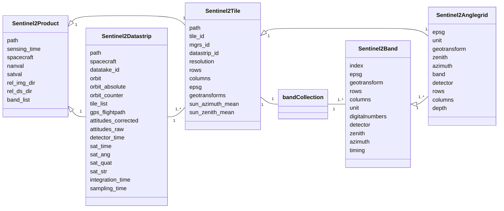

[](https://github.com/space-accountants/s2d2)
[](https://github.com/space-accountants/s2d2)
[](https://doi.org/10.5281/zenodo.10654893)
[](https://bestpractices.coreinfrastructure.org/projects/8399)
[](https://fair-software.eu)
[](https://sonarcloud.io/dashboard?id=space-accountants_s2d2)
[](https://s2d2.readthedocs.io/en/latest/?badge=latest)

# S2D2: Sentinel-2 data deepening


Easing the extraction of hard-to-find information that is within the meta-data of Sentinel-2 imagery.

## How to use s2d2

## A brief overview of Sentinel-2
With ease you can get lost in the terminology of Sentinel-2 data, and miss the rational. 
Therefore, a brief overview of the satellite system is given here, so hopefully a better understanding of the jargon can be created.

The Sentinel-2 satellites are a tandem mission that orbit in a sun-synchronous orbit. 
Since their inclination is 98 degrees, their orbit is in North-East to South-West orientation. 
Recordings of the sun-lit part are counted, in the meta-data these are termed **relative orbit number**.
This numbering system follows the orbit of the satellite system, hence when these are plotted on a map, 
the numbering of neighboring orbits is not incremental.

The flightpath over one orbit is called a **datatake**, this can the full extent of the orbit, but typically the sensor acquires only over land. 
Hence, recordings can be short, more specifics about the coverage can be found in the [campaign archive](https://sentinel.esa.int/web/sentinel/copernicus/sentinel-2/acquisition-plans/archive).
Furthermore, within a fight the data transfer can be subdivided towards different ground stations.
In that case the datatake is subdivided into **datastrips**, which should have some spatial overlap.

```geojson
{
"type": "FeatureCollection",
"crs": { "type": "name", "properties": { "name": "urn:ogc:def:crs:OGC:1.3:CRS84" } },
"features": [
{ "type": "Feature", "properties": { "Name": "44043-1", "description": null, "timestamp": null, "begin": "2023-11-28T00:39:46.774", "end": "2023-11-28T00:43:37.686", "altitudeMode": null, "tessellate": "-1", "extrude": "0", "visibility": "0", "drawOrder": null, "icon": null, "ID": "44043-1", "Timeliness": "NOMINAL", "Station": "EDRS-C", "Mode": "NOBS", "ObservationTimeStart": "2023-11-28T00:39:46.774", "ObservationTimeStop": "2023-11-28T00:43:37.686", "ObservationDuration": "230912", "OrbitAbsolute": "44043", "OrbitRelative": "2", "Scenes": "64" }, "geometry": { "type": "Polygon", "coordinates": [ [ [ 163.074136837991944, 60.738750237623613, 0.0 ], [ 160.527472941528572, 61.151095718040182, 0.0 ], [ 158.502806035932394, 57.702818586280863, 0.0 ], [ 156.778532745115427, 54.232582236586687, 0.0 ], [ 155.274980375344029, 50.745473567324389, 0.0 ], [ 154.150677513387564, 47.829074748292342, 0.0 ], [ 156.017942073372524, 47.499729559644067, 0.0 ], [ 157.860362379948555, 47.140567762863583, 0.0 ], [ 159.197722307382833, 50.029804552877991, 0.0 ], [ 161.002460439337, 53.47677175346125, 0.0 ], [ 163.088881182557628, 56.896231981667718, 0.0 ], [ 165.551847364486321, 60.27955007917059, 0.0 ], [ 163.074136837991944, 60.738750237623613, 0.0 ] ] ] } },
{ "type": "Feature", "properties": { "Name": "44043-2", "description": null, "timestamp": null, "begin": "2023-11-28T00:51:58.356", "end": "2023-11-28T00:53:24.948", "altitudeMode": null, "tessellate": "-1", "extrude": "0", "visibility": "0", "drawOrder": null, "icon": null, "ID": "44043-2", "Timeliness": "NOMINAL", "Station": "EDRS-C", "Mode": "NOBS", "ObservationTimeStart": "2023-11-28T00:51:58.356", "ObservationTimeStop": "2023-11-28T00:53:24.948", "ObservationDuration": "86592", "OrbitAbsolute": "44043", "OrbitRelative": "2", "Scenes": "24" }, "geometry": { "type": "Polygon", "coordinates": [ [ [ 147.30891938961264, 17.99320544158703, 0.0 ], [ 145.979745238663185, 18.275581379627603, 0.0 ], [ 145.175316605403083, 14.719856241039023, 0.0 ], [ 144.835022686249658, 13.197294210992666, 0.0 ], [ 146.131989624159615, 12.916248026612895, 0.0 ], [ 147.425877558149978, 12.628849759267727, 0.0 ], [ 147.782568914428339, 14.15006678390537, 0.0 ], [ 148.633594373520054, 17.701840934540186, 0.0 ], [ 147.30891938961264, 17.99320544158703, 0.0 ] ] ] } },
{ "type": "Feature", "properties": { "Name": "44043-3", "description": null, "timestamp": null, "begin": "2023-11-28T00:54:17.626", "end": "2023-11-28T00:55:22.570", "altitudeMode": null, "tessellate": "-1", "extrude": "0", "visibility": "0", "drawOrder": null, "icon": null, "ID": "44043-3", "Timeliness": "NOMINAL", "Station": "EDRS-C", "Mode": "NOBS", "ObservationTimeStart": "2023-11-28T00:54:17.626", "ObservationTimeStop": "2023-11-28T00:55:22.570", "ObservationDuration": "64944", "OrbitAbsolute": "44043", "OrbitRelative": "2", "Scenes": "18" }, "geometry": { "type": "Polygon", "coordinates": [ [ [ 145.413319019935699, 9.738735242217869, 0.0 ], [ 144.130611927431374, 10.019480052865966, 0.0 ], [ 143.347733134474225, 6.46057467370615, 0.0 ], [ 143.295215023618226, 6.22128143818889, 0.0 ], [ 144.566461000180198, 5.940413828633486, 0.0 ], [ 145.836343630931879, 5.656659465638152, 0.0 ], [ 145.889896192177503, 5.895881326560534, 0.0 ], [ 146.693753110628592, 9.453233462733923, 0.0 ], [ 145.413319019935699, 9.738735242217869, 0.0 ] ] ] } },
{ "type": "Feature", "properties": { "Name": "44043-4", "description": null, "timestamp": null, "begin": "2023-11-28T00:57:03.204", "end": "2023-11-28T01:07:09.348", "altitudeMode": null, "tessellate": "-1", "extrude": "0", "visibility": "0", "drawOrder": null, "icon": null, "ID": "44043-4", "Timeliness": "NOMINAL", "Station": "INS_/EDRS-C/SGS_", "Mode": "NOBS", "ObservationTimeStart": "2023-11-28T00:57:03.204", "ObservationTimeStop": "2023-11-28T01:07:09.348", "ObservationDuration": "606144", "OrbitAbsolute": "44043", "OrbitRelative": "2", "Scenes": "168" }, "geometry": { "type": "Polygon", "coordinates": [ [ [ 143.237779258709821, -0.084060846473957, 0.0 ], [ 141.97280358400937, 0.198010263009932, 0.0 ], [ 141.185927470901333, -3.359933750613149, 0.0 ], [ 140.389910722245105, -6.916225433916138, 0.0 ], [ 139.58041106682208, -10.470147917270891, 0.0 ], [ 138.752735848979825, -14.020962951321746, 0.0 ], [ 137.901682971228269, -17.567903335269392, 0.0 ], [ 137.021349180757625, -21.110161923049841, 0.0 ], [ 136.104890424656702, -24.646875856594122, 0.0 ], [ 135.144213265952885, -28.177103836551492, 0.0 ], [ 134.129567246440473, -31.699793855689538, 0.0 ], [ 133.048997491157934, -35.213737159028362, 0.0 ], [ 132.951142907020625, -35.519810196129065, 0.0 ], [ 134.517219880226804, -35.843084043714803, 0.0 ], [ 136.096088346307027, -36.145947248915981, 0.0 ], [ 136.181799341553699, -35.838545194122347, 0.0 ], [ 137.134912181476494, -32.310922822010568, 0.0 ], [ 138.0416692053806, -28.777051756370568, 0.0 ], [ 138.911545599949335, -25.237705790753658, 0.0 ], [ 139.752340452859187, -21.693597321441608, 0.0 ], [ 140.570614486754522, -18.145402745598677, 0.0 ], [ 141.372018580528788, -14.59377994915989, 0.0 ], [ 142.161544062421314, -11.039380348864769, 0.0 ], [ 142.943719909106477, -7.482856980343001, 0.0 ], [ 143.722774389859921, -3.924870099613203, 0.0 ], [ 144.502774063088452, -0.366091172671624, 0.0 ], [ 143.237779258709821, -0.084060846473957, 0.0 ] ] ] } },
{ "type": "Feature", "properties": { "Name": "44044-1", "description": null, "timestamp": null, "begin": "2023-11-28T02:20:29.030", "end": "2023-11-28T02:40:30.494", "altitudeMode": null, "tessellate": "-1", "extrude": "0", "visibility": "0", "drawOrder": null, "icon": null, "ID": "44044-1", "Timeliness": "NOMINAL", "Station": "INS_/EDRS-C/SGS_", "Mode": "NOBS", "ObservationTimeStart": "2023-11-28T02:20:29.030", "ObservationTimeStop": "2023-11-28T02:40:30.494", "ObservationDuration": "1201464", "OrbitAbsolute": "44044", "OrbitRelative": "3", "Scenes": "333" }, "geometry": { "type": "Polygon", "coordinates": [ [ [ 137.887082532124538, 60.721861156567428, 0.0 ], [ 135.341668838197904, 61.134037930585883, 0.0 ], [ 133.318747268969588, 57.685635438951522, 0.0 ], [ 131.595740024298834, 54.215304463770821, 0.0 ], [ 130.093147263949135, 50.728120323888916, 0.0 ], [ 128.756447677720388, 47.227540989862931, 0.0 ], [ 127.547077283514923, 43.716019117290301, 0.0 ], [ 126.43691425203339, 40.195373057352825, 0.0 ], [ 125.404928937146195, 36.667008484672238, 0.0 ], [ 124.435020609792787, 33.132060097441816, 0.0 ], [ 123.514584425439153, 29.591484199772509, 0.0 ], [ 122.633536655281077, 26.046120344337535, 0.0 ], [ 121.783634208341425, 22.496732901300494, 0.0 ], [ 120.957987505163288, 18.944039495589703, 0.0 ], [ 120.150702617300865, 15.388730358165075, 0.0 ], [ 119.356609436757239, 11.831481665754973, 0.0 ], [ 118.571050739814055, 8.272964701338248, 0.0 ], [ 117.789723759422614, 4.713850794128328, 0.0 ], [ 117.008517371135838, 1.154816940883882, 0.0 ], [ 116.223390206913777, -2.403451375426162, 0.0 ], [ 115.430247684608517, -5.960257171820324, 0.0 ], [ 114.624817562814243, -9.514888365374189, 0.0 ], [ 114.617309501295836, -9.547697043813599, 0.0 ], [ 115.902663581139947, -9.834349766173016, 0.0 ], [ 117.190330829437585, -10.116163469173916, 0.0 ], [ 117.197563501685934, -10.083328728709965, 0.0 ], [ 117.978494839031029, -6.526346559932802, 0.0 ], [ 118.757408057877626, -2.968080179262748, 0.0 ], [ 119.538348127733187, 0.590795385134467, 0.0 ], [ 120.325357661164574, 4.149590010270707, 0.0 ], [ 121.122599380401994, 7.707595256794143, 0.0 ], [ 121.934484462323212, 11.264080439574188, 0.0 ], [ 122.765813542855298, 14.818287031325157, 0.0 ], [ 123.621945123416182, 18.369420558443306, 0.0 ], [ 124.508999685635757, 21.916638752582283, 0.0 ], [ 125.434114446861543, 25.459034350829388, 0.0 ], [ 126.405776030696188, 28.995610463359576, 0.0 ], [ 127.434262839379798, 32.525245394325736, 0.0 ], [ 128.532246614296781, 36.046642166301211, 0.0 ], [ 129.715628023406737, 39.558255971619609, 0.0 ], [ 131.004722024263287, 43.058188391403505, 0.0 ], [ 132.425976670663687, 46.544030886429908, 0.0 ], [ 134.01452223640058, 50.012628727465781, 0.0 ], [ 135.81803576427933, 53.459717043819026, 0.0 ], [ 137.902852756501659, 56.879332457752746, 0.0 ], [ 140.363651339112693, 60.262857447574731, 0.0 ], [ 137.887082532124538, 60.721861156567428, 0.0 ] ] ] } },
{ "type": "Feature", "properties": { "Name": "44044-2", "description": null, "timestamp": null, "begin": "2023-11-28T02:43:16.596", "end": "2023-11-28T02:45:22.876", "altitudeMode": null, "tessellate": "-1", "extrude": "0", "visibility": "0", "drawOrder": null, "icon": null, "ID": "44044-2", "Timeliness": "NOMINAL", "Station": "EDRS-C", "Mode": "NOBS", "ObservationTimeStart": "2023-11-28T02:43:16.596", "ObservationTimeStop": "2023-11-28T02:45:22.876", "ObservationDuration": "126280", "OrbitAbsolute": "44044", "OrbitRelative": "3", "Scenes": "35" }, "geometry": { "type": "Polygon", "coordinates": [ [ [ 113.617072812997904, -19.71957689196757, 0.0 ], [ 112.269711235277271, -19.424327198897466, 0.0 ], [ 111.37137744662445, -22.963792755626251, 0.0 ], [ 110.43285827887415, -26.497232126063562, 0.0 ], [ 110.346612391502106, -26.813148267727041, 0.0 ], [ 111.77288468040372, -27.118460858207659, 0.0 ], [ 113.207059682464632, -27.409347276939013, 0.0 ], [ 113.285087158464464, -27.0926047206395, 0.0 ], [ 114.140225466090158, -23.550905119504741, 0.0 ], [ 114.969538836865595, -20.004768351246121, 0.0 ], [ 113.617072812997904, -19.71957689196757, 0.0 ] ] ] } },
{ "type": "Feature", "properties": { "Name": "44045-1", "description": null, "timestamp": null, "begin": "2023-11-28T04:01:12.581", "end": "2023-11-28T04:17:26.741", "altitudeMode": null, "tessellate": "-1", "extrude": "0", "visibility": "0", "drawOrder": null, "icon": null, "ID": "44045-1", "Timeliness": "NOMINAL", "Station": "INS_/EDRS-C/SGS_", "Mode": "NOBS", "ObservationTimeStart": "2023-11-28T04:01:12.581", "ObservationTimeStop": "2023-11-28T04:17:26.741", "ObservationDuration": "974160", "OrbitAbsolute": "44045", "OrbitRelative": "4", "Scenes": "270" }, "geometry": { "type": "Polygon", "coordinates": [ [ [ 112.647094866832262, 60.631549083210572, 0.0 ], [ 110.108348131988549, 61.042827698543704, 0.0 ], [ 108.094705132798893, 57.59375866790355, 0.0 ], [ 106.378431164398677, 54.122924278900797, 0.0 ], [ 104.880855052532013, 50.635345629909082, 0.0 ], [ 103.547998584716723, 47.134445814880877, 0.0 ], [ 102.34160611513164, 43.622659102358085, 0.0 ], [ 101.233779147811902, 40.101790511951954, 0.0 ], [ 100.203633063635991, 36.573237451203028, 0.0 ], [ 99.235180478600824, 33.038128421139177, 0.0 ], [ 98.315904639234773, 29.497415327416679, 0.0 ], [ 97.435778290852767, 25.951935301257066, 0.0 ], [ 96.586599768401257, 22.402451188858262, 0.0 ], [ 95.761509995179722, 18.849679688871444, 0.0 ], [ 94.954637412492531, 15.29431053801699, 0.0 ], [ 94.160829557121829, 11.737019571109505, 0.0 ], [ 93.375443563269172, 8.178477656469987, 0.0 ], [ 92.594176284932118, 4.619356676684909, 0.0 ], [ 92.421786712589835, 3.833373864389552, 0.0 ], [ 93.688824528785389, 3.552174512742301, 0.0 ], [ 94.955051989925451, 3.26925174662012, 0.0 ], [ 95.129523858516137, 4.055113529353993, 0.0 ], [ 95.926439281721144, 7.613149060757545, 0.0 ], [ 96.737874779059908, 11.169684252155719, 0.0 ], [ 97.568620100167905, 14.72396143724848, 0.0 ], [ 98.424017740139163, 18.275187213025308, 0.0 ], [ 99.310164866724278, 21.822520757119875, 0.0 ], [ 100.234167838238534, 25.365056778751256, 0.0 ], [ 101.204472368525416, 28.901801146307708, 0.0 ], [ 102.231302427814839, 32.431636011233635, 0.0 ], [ 103.327256757546422, 35.953269827443293, 0.0 ], [ 104.508130955868282, 39.465165934385567, 0.0 ], [ 105.794100040867747, 42.965437488006188, 0.0 ], [ 107.211426201074147, 46.451691885832552, 0.0 ], [ 108.794967549336775, 49.920798190690995, 0.0 ], [ 110.592019772184287, 53.368525285715357, 0.0 ], [ 112.668303602003078, 56.788966422620788, 0.0 ], [ 115.117572969401039, 60.173591744023327, 0.0 ], [ 112.647094866832262, 60.631549083210572, 0.0 ] ] ] } },
{ "type": "Feature", "properties": { "Name": "44046-1", "description": null, "timestamp": null, "begin": "2023-11-28T05:41:53.301", "end": "2023-11-28T05:54:27.373", "altitudeMode": null, "tessellate": "-1", "extrude": "0", "visibility": "0", "drawOrder": null, "icon": null, "ID": "44046-1", "Timeliness": "NOMINAL", "Station": "EDRS-C", "Mode": "NOBS", "ObservationTimeStart": "2023-11-28T05:41:53.301", "ObservationTimeStop": "2023-11-28T05:54:27.373", "ObservationDuration": "754072", "OrbitAbsolute": "44046", "OrbitRelative": "5", "Scenes": "209" }, "geometry": { "type": "Polygon", "coordinates": [ [ [ 87.522882086274649, 60.701742087648995, 0.0 ], [ 84.978956280359995, 61.113718197185904, 0.0 ], [ 82.958109642213941, 57.66516666467389, 0.0 ], [ 81.236607737763123, 54.194723166447169, 0.0 ], [ 79.735136306293597, 50.707450873882934, 0.0 ], [ 78.399310541084844, 47.206798828441237, 0.0 ], [ 77.190598641411427, 43.695218373454125, 0.0 ], [ 76.080951911863721, 40.174523025107433, 0.0 ], [ 75.049375254500518, 36.64611651378695, 0.0 ], [ 74.079792220335662, 33.111132260341599, 0.0 ], [ 73.159615347628687, 29.570525731323787, 0.0 ], [ 72.27877353360806, 26.02513593690994, 0.0 ], [ 71.429032948516692, 22.47572690555311, 0.0 ], [ 70.603510832300287, 18.923016054193262, 0.0 ], [ 70.155454443229786, 16.958268641507782, 0.0 ], [ 71.475105890389457, 16.676345698926454, 0.0 ], [ 72.790645862341222, 16.386130629248367, 0.0 ], [ 73.26714534915682, 18.34842531663914, 0.0 ], [ 74.153997169239986, 21.895669271579539, 0.0 ], [ 75.07886357139212, 25.438096225130568, 0.0 ], [ 76.050222036494517, 28.974709904537367, 0.0 ], [ 77.078338801509588, 32.504389474595236, 0.0 ], [ 78.175869291266594, 36.025839172803266, 0.0 ], [ 79.358692033317325, 39.537515918480302, 0.0 ], [ 80.647091497871756, 43.037523770915648, 0.0 ], [ 82.06747301922907, 46.52345779072833, 0.0 ], [ 83.654891225284146, 49.992170088061364, 0.0 ], [ 85.456960920953435, 53.439401132799411, 0.0 ], [ 87.539870740925224, 56.859201094129901, 0.0 ], [ 89.998091938677675, 60.242972081140557, 0.0 ], [ 87.522882086274649, 60.701742087648995, 0.0 ] ] ] } },
{ "type": "Feature", "properties": { "Name": "44046-2", "description": null, "timestamp": null, "begin": "2023-11-28T06:04:30.039", "end": "2023-11-28T06:04:48.079", "altitudeMode": null, "tessellate": "-1", "extrude": "0", "visibility": "0", "drawOrder": null, "icon": null, "ID": "44046-2", "Timeliness": "NOMINAL", "Station": "EDRS-C/SGS_", "Mode": "NOBS", "ObservationTimeStart": "2023-11-28T06:04:30.039", "ObservationTimeStop": "2023-11-28T06:04:48.079", "ObservationDuration": "18040", "OrbitAbsolute": "44046", "OrbitRelative": "5", "Scenes": "5" }, "geometry": { "type": "Polygon", "coordinates": [ [ [ 63.415440802410238, -19.100526499386156, 0.0 ], [ 62.073319805142333, -18.805958769618144, 0.0 ], [ 61.822127255294738, -19.817295195969869, 0.0 ], [ 63.172917177188495, -20.112989395638408, 0.0 ], [ 64.528940643419375, -20.398405276878393, 0.0 ], [ 64.762466662793827, -19.385380085161035, 0.0 ], [ 63.415440802410238, -19.100526499386156, 0.0 ] ] ] } },
{ "type": "Feature", "properties": { "Name": "44047-1", "description": null, "timestamp": null, "begin": "2023-11-28T07:22:37.018", "end": "2023-11-28T07:47:01.866", "altitudeMode": null, "tessellate": "-1", "extrude": "0", "visibility": "0", "drawOrder": null, "icon": null, "ID": "44047-1", "Timeliness": "NOMINAL", "Station": "INS_/EDRS-C/SGS_", "Mode": "NOBS", "ObservationTimeStart": "2023-11-28T07:22:37.018", "ObservationTimeStop": "2023-11-28T07:47:01.866", "ObservationDuration": "1464848", "OrbitAbsolute": "44047", "OrbitRelative": "6", "Scenes": "406" }, "geometry": { "type": "Polygon", "coordinates": [ [ [ 62.276214771548098, 60.602009124815957, 0.0 ], [ 59.739642036313441, 61.012995410573183, 0.0 ], [ 57.729014182432941, 57.563709745763944, 0.0 ], [ 56.01492923059174, 54.092711635150778, 0.0 ], [ 54.518984622403273, 50.605004613215179, 0.0 ], [ 53.187370259841835, 47.104001072166454, 0.0 ], [ 51.981939606582294, 43.59212855274825, 0.0 ], [ 50.874867224273146, 40.071187747185114, 0.0 ], [ 49.845329026830832, 36.542572625506146, 0.0 ], [ 48.877361520818972, 33.007410576190857, 0.0 ], [ 47.958463169432449, 29.466652776885066, 0.0 ], [ 47.078636484737267, 25.921134901051172, 0.0 ], [ 46.229693270026559, 22.371619301942303, 0.0 ], [ 45.404784365163465, 18.818822379330236, 0.0 ], [ 44.598045482210971, 15.263433711392869, 0.0 ], [ 43.804329394337906, 11.706129061426056, 0.0 ], [ 43.018996856075418, 8.147579288147854, 0.0 ], [ 42.237747001308904, 4.588456305756022, 0.0 ], [ 41.45647335118111, 1.02943734064526, 0.0 ], [ 40.671134769815829, -2.528791764294819, 0.0 ], [ 39.877631732143826, -6.085533082232176, 0.0 ], [ 39.071686063632228, -9.640074163638106, 0.0 ], [ 38.248701033763538, -13.19168254440916, 0.0 ], [ 37.403609322862188, -16.73959862511515, 0.0 ], [ 36.530690904931873, -20.283025816078265, 0.0 ], [ 35.623346231888618, -23.821116038997097, 0.0 ], [ 35.250049611960208, -25.231004493604573, 0.0 ], [ 36.65672389262069, -25.533832635051766, 0.0 ], [ 38.070625479371245, -25.823214877843874, 0.0 ], [ 38.411033141900873, -24.41007504209751, 0.0 ], [ 39.246014399481652, -20.864952250672562, 0.0 ], [ 40.05986688586303, -17.315898228001725, 0.0 ], [ 40.8580672334339, -13.763568418049619, 0.0 ], [ 41.645482617819134, -10.208613987273027, 0.0 ], [ 42.426558283365779, -6.65168923257187, 0.0 ], [ 43.205474300221283, -3.09345669139104, 0.0 ], [ 43.986278040855218, 0.4654090778017, 0.0 ], [ 44.773005980317599, 4.024218490785558, 0.0 ], [ 45.569814494048273, 7.582263812160058, 0.0 ], [ 46.38110368316439, 11.138815245724272, 0.0 ], [ 47.211659268898785, 14.693115392523469, 0.0 ], [ 48.066818147102992, 18.244371198784954, 0.0 ], [ 48.952669939539518, 21.791742312346834, 0.0 ], [ 49.876310966114822, 25.334324082608699, 0.0 ], [ 50.846173632410959, 28.871123273602883, 0.0 ], [ 51.872464202819955, 32.401023286257164, 0.0 ], [ 52.967751341771418, 35.922734715522772, 0.0 ], [ 54.147803371565509, 39.434723272836877, 0.0 ], [ 55.432757938112438, 42.935105189230583, 0.0 ], [ 56.848809391862375, 46.421493438763989, 0.0 ], [ 58.430727084758658, 49.890764800949604, 0.0 ], [ 60.225676958325828, 53.338699768983197, 0.0 ], [ 62.299185218589244, 56.759409494692193, 0.0 ], [ 64.744705964545133, 60.144392541467639, 0.0 ], [ 62.276214771548098, 60.602009124815957, 0.0 ] ] ] } },
{ "type": "Feature", "properties": { "Name": "44048-1", "description": null, "timestamp": null, "begin": "2023-11-28T09:03:18.563", "end": "2023-11-28T09:26:49.291", "altitudeMode": null, "tessellate": "-1", "extrude": "0", "visibility": "0", "drawOrder": null, "icon": null, "ID": "44048-1", "Timeliness": "NOMINAL", "Station": "SGS_", "Mode": "NOBS", "ObservationTimeStart": "2023-11-28T09:03:18.563", "ObservationTimeStop": "2023-11-28T09:26:49.291", "ObservationDuration": "1410728", "OrbitAbsolute": "44048", "OrbitRelative": "7", "Scenes": "391" }, "geometry": { "type": "Polygon", "coordinates": [ [ [ 37.118219782994991, 60.625432070870836, 0.0 ], [ 34.579923500673416, 61.036650093444649, 0.0 ], [ 32.566905661378186, 57.587536147414326, 0.0 ], [ 30.851085523684237, 54.116667817790621, 0.0 ], [ 29.353847634987389, 50.629062559013349, 0.0 ], [ 28.021248651958839, 47.128141245026249, 0.0 ], [ 26.815055557027971, 43.616336748844475, 0.0 ], [ 25.707385004250895, 40.09545319250546, 0.0 ], [ 24.677367287246415, 36.566887131057463, 0.0 ], [ 23.709012888397329, 33.031767253420263, 0.0 ], [ 22.789815300293331, 29.491044895406748, 0.0 ], [ 21.909751074554663, 25.945557025504328, 0.0 ], [ 21.060621338386085, 22.396066387611164, 0.0 ], [ 20.23556907100868, 18.843289618322618, 0.0 ], [ 19.4287242211857, 15.287916421402972, 0.0 ], [ 18.634935411489078, 11.730622616758067, 0.0 ], [ 17.849560526991041, 8.17207907063935, 0.0 ], [ 17.068296894804774, 4.612957672109566, 0.0 ], [ 16.287037155546447, 1.053935599068298, 0.0 ], [ 15.501738702705243, -2.504300993119503, 0.0 ], [ 14.708306099768626, -6.061054815114742, 0.0 ], [ 13.902461807342776, -9.615613575537035, 0.0 ], [ 13.079611003977387, -13.167244765387302, 0.0 ], [ 12.234690186194733, -16.715188994838226, 0.0 ], [ 11.36198453050371, -20.258649969641919, 0.0 ], [ 10.915944050677814, -22.01770441287341, 0.0 ], [ 12.287470075544606, -22.316063085711022, 0.0 ], [ 13.664988177685776, -22.602887684679484, 0.0 ], [ 14.076857561336913, -20.840533125054694, 0.0 ], [ 14.890585210171091, -17.291454317263312, 0.0 ], [ 15.688695831543296, -13.739104206750474, 0.0 ], [ 16.47605311308341, -10.184133961494911, 0.0 ], [ 17.257099970055897, -6.627197924956139, 0.0 ], [ 18.036013701420124, -3.068958718592794, 0.0 ], [ 18.816842545026091, 0.489909025979797, 0.0 ], [ 19.60362612716111, 4.048715628512372, 0.0 ], [ 20.400519371592136, 7.606753191660065, 0.0 ], [ 21.211924528793045, 11.163291751226108, 0.0 ], [ 22.04263051307387, 14.717573696365816, 0.0 ], [ 22.897978658679282, 18.268805696504838, 0.0 ], [ 23.784064569038112, 21.816147026794997, 0.0 ], [ 24.707992521526329, 25.35869252921815, 0.0 ], [ 25.678205471230658, 28.895448257892298, 0.0 ], [ 26.70492371796912, 32.42529662335923, 0.0 ], [ 27.800741081308264, 35.946946445338547, 0.0 ], [ 28.981443567025888, 39.458861789548408, 0.0 ], [ 30.267202380637414, 42.959156215208097, 0.0 ], [ 31.68426433412824, 46.445438354368363, 0.0 ], [ 33.267469135595093, 49.91457887014365, 0.0 ], [ 35.064085566540093, 53.362349053529535, 0.0 ], [ 37.139794017157726, 56.782845868945877, 0.0 ], [ 39.588286231075664, 60.167545354451406, 0.0 ], [ 37.118219782994991, 60.625432070870836, 0.0 ] ] ] } },
{ "type": "Feature", "properties": { "Name": "44048-2", "description": null, "timestamp": null, "begin": "2023-11-28T09:35:43.281", "end": "2023-11-28T09:36:01.321", "altitudeMode": null, "tessellate": "-1", "extrude": "0", "visibility": "0", "drawOrder": null, "icon": null, "ID": "44048-2", "Timeliness": "NOMINAL", "Station": "SGS_", "Mode": "NOBS", "ObservationTimeStart": "2023-11-28T09:35:43.281", "ObservationTimeStop": "2023-11-28T09:36:01.321", "ObservationDuration": "18040", "OrbitAbsolute": "44048", "OrbitRelative": "7", "Scenes": "5" }, "geometry": { "type": "Polygon", "coordinates": [ [ [ 1.872110328911574, -53.576241426386716, 0.0 ], [ -0.241444403914206, -53.174814080108639, 0.0 ], [ -0.797183660737063, -54.150990958866579, 0.0 ], [ 1.363419782122084, -54.559736675879286, 0.0 ], [ 3.566305823108114, -54.92934003541324, 0.0 ], [ 4.024885800002179, -53.939828800727113, 0.0 ], [ 1.872110328911574, -53.576241426386716, 0.0 ] ] ] } },
{ "type": "Feature", "properties": { "Name": "44049-1", "description": null, "timestamp": null, "begin": "2023-11-28T10:44:01.304", "end": "2023-11-28T11:00:19.072", "altitudeMode": null, "tessellate": "-1", "extrude": "0", "visibility": "0", "drawOrder": null, "icon": null, "ID": "44049-1", "Timeliness": "NOMINAL", "Station": "SGS_", "Mode": "NOBS", "ObservationTimeStart": "2023-11-28T10:44:01.304", "ObservationTimeStop": "2023-11-28T11:00:19.072", "ObservationDuration": "977768", "OrbitAbsolute": "44049", "OrbitRelative": "8", "Scenes": "271" }, "geometry": { "type": "Polygon", "coordinates": [ [ [ 11.911512204743039, 60.581029992505236, 0.0 ], [ 9.376481440645883, 60.991809098271993, 0.0 ], [ 7.367989051475229, 57.542369991945208, 0.0 ], [ 5.655454754684349, 54.071255886307675, 0.0 ], [ 4.160666040117515, 50.583457892769047, 0.0 ], [ 2.829931785378779, 47.082380832252667, 0.0 ], [ 1.625182689979388, 43.570447484882955, 0.0 ], [ 0.518645041645551, 40.049455480492533, 0.0 ], [ -0.510469671234047, 36.520796786877582, 0.0 ], [ -1.478092600513097, 32.985597072856791, 0.0 ], [ -2.396716988154316, 29.444807214260109, 0.0 ], [ -3.276331366944075, 25.899262502028346, 0.0 ], [ -4.125107908670797, 22.349724580800686, 0.0 ], [ -4.949888748802887, 18.796909639305696, 0.0 ], [ -5.756533025361187, 15.241507144054063, 0.0 ], [ -6.550184257112392, 11.684192808280542, 0.0 ], [ -7.33547912715981, 8.125637484481887, 0.0 ], [ -8.116716889888764, 4.566513109820873, 0.0 ], [ -8.336053973365281, 3.566508003958036, 0.0 ], [ -7.069344329025959, 3.285259585249574, 0.0 ], [ -5.80338380782813, 3.002417412416984, 0.0 ], [ -5.581520864130209, 4.00227908534178, 0.0 ], [ -4.784787978245117, 7.560331326399258, 0.0 ], [ -3.973602376852882, 11.11689425952861, 0.0 ], [ -3.143181191244861, 14.671210674943477, 0.0 ], [ -2.288191491916197, 18.222487766030614, 0.0 ], [ -1.402549003448935, 21.769885513455542, 0.0 ], [ -0.479164518713735, 25.312499719817207, 0.0 ], [ 0.490384938103292, 28.849337783284099, 0.0 ], [ 1.516289696959136, 32.379284154076466, 0.0 ], [ 2.611103214889114, 35.901050690902721, 0.0 ], [ 3.790576503818798, 39.413104554777199, 0.0 ], [ 5.074811961296349, 42.913564713076539, 0.0 ], [ 6.489959940220226, 46.400047847081908, 0.0 ], [ 8.070726935920176, 49.869436199322458, 0.0 ], [ 9.864187025910823, 53.317518481109403, 0.0 ], [ 11.935728710907021, 56.738418512393423, 0.0 ], [ 14.378593882225799, 60.12365496570483, 0.0 ], [ 11.911512204743039, 60.581029992505236, 0.0 ] ] ] } },
{ "type": "Feature", "properties": { "Name": "44049-2", "description": null, "timestamp": null, "begin": "2023-11-28T11:17:10.854", "end": "2023-11-28T11:18:23.014", "altitudeMode": null, "tessellate": "-1", "extrude": "0", "visibility": "0", "drawOrder": null, "icon": null, "ID": "44049-2", "Timeliness": "NOMINAL", "Station": "SGS_", "Mode": "NOBS", "ObservationTimeStart": "2023-11-28T11:17:10.854", "ObservationTimeStop": "2023-11-28T11:18:23.014", "ObservationDuration": "72160", "OrbitAbsolute": "44049", "OrbitRelative": "8", "Scenes": "20" }, "geometry": { "type": "Polygon", "coordinates": [ [ [ -24.705678073490912, -56.190896907274457, 0.0 ], [ -26.950033917930426, -55.768893078554619, 0.0 ], [ -29.272416002592887, -59.151108829985795, 0.0 ], [ -29.754616459064739, -59.780739166375632, 0.0 ], [ -27.266366923798941, -60.243084761737819, 0.0 ], [ -24.709838194605581, -60.65769874962524, 0.0 ], [ -24.315711128079133, -60.01482053659069, 0.0 ], [ -22.41320381168137, -56.571486680941085, 0.0 ], [ -24.705678073490912, -56.190896907274457, 0.0 ] ] ] } },
{ "type": "Feature", "properties": { "Name": "44050-1", "description": null, "timestamp": null, "begin": "2023-11-28T12:25:21.208", "end": "2023-11-28T12:25:39.248", "altitudeMode": null, "tessellate": "-1", "extrude": "0", "visibility": "0", "drawOrder": null, "icon": null, "ID": "44050-1", "Timeliness": "NOMINAL", "Station": "SGS_", "Mode": "NOBS", "ObservationTimeStart": "2023-11-28T12:25:21.208", "ObservationTimeStop": "2023-11-28T12:25:39.248", "ObservationDuration": "18040", "OrbitAbsolute": "44050", "OrbitRelative": "9", "Scenes": "5" }, "geometry": { "type": "Polygon", "coordinates": [ [ [ -14.721300041617024, 58.421881794219566, 0.0 ], [ -17.108168217428151, 58.81312372890352, 0.0 ], [ -17.654441506045487, 57.826355439289223, 0.0 ], [ -15.328518591457582, 57.442924116517851, 0.0 ], [ -13.054123159663229, 57.017718519285566, 0.0 ], [ -12.390437178346744, 57.987425972847319, 0.0 ], [ -14.721300041617024, 58.421881794219566, 0.0 ] ] ] } },
{ "type": "Feature", "properties": { "Name": "44050-2", "description": null, "timestamp": null, "begin": "2023-11-28T12:30:39.441", "end": "2023-11-28T12:31:51.601", "altitudeMode": null, "tessellate": "-1", "extrude": "0", "visibility": "0", "drawOrder": null, "icon": null, "ID": "44050-2", "Timeliness": "NOMINAL", "Station": "SGS_", "Mode": "NOBS", "ObservationTimeStart": "2023-11-28T12:30:39.441", "ObservationTimeStop": "2023-11-28T12:31:51.601", "ObservationDuration": "72160", "OrbitAbsolute": "44050", "OrbitRelative": "9", "Scenes": "20" }, "geometry": { "type": "Polygon", "coordinates": [ [ [ -22.939162491458845, 39.966693917239546, 0.0 ], [ -24.588219572541828, 40.273928694380942, 0.0 ], [ -25.62175071393202, 36.745722601427687, 0.0 ], [ -25.808169754671873, 36.083417559575459, 0.0 ], [ -24.249625199224536, 35.784393530403186, 0.0 ], [ -22.703521445410392, 35.465493095851265, 0.0 ], [ -22.491326577573236, 36.125020274614556, 0.0 ], [ -21.305833008033606, 39.636396221064935, 0.0 ], [ -22.939162491458845, 39.966693917239546, 0.0 ] ] ] } },
{ "type": "Feature", "properties": { "Name": "44050-3", "description": null, "timestamp": null, "begin": "2023-11-28T12:42:46.215", "end": "2023-11-28T12:45:28.575", "altitudeMode": null, "tessellate": "-1", "extrude": "0", "visibility": "0", "drawOrder": null, "icon": null, "ID": "44050-3", "Timeliness": "NOMINAL", "Station": "SGS_", "Mode": "NOBS", "ObservationTimeStart": "2023-11-28T12:42:46.215", "ObservationTimeStop": "2023-11-28T12:45:28.575", "ObservationDuration": "162360", "OrbitAbsolute": "44050", "OrbitRelative": "9", "Scenes": "45" }, "geometry": { "type": "Polygon", "coordinates": [ [ [ -33.629935035084891, -3.008907390866369, 0.0 ], [ -34.897036540517206, -2.725813215024513, 0.0 ], [ -35.691113060696551, -6.282451504320883, 0.0 ], [ -36.497877346202763, -9.836849772841363, 0.0 ], [ -37.065029736310827, -12.290655011509308, 0.0 ], [ -35.766890876635813, -12.57924417001812, 0.0 ], [ -34.465733395720228, -12.861595496330978, 0.0 ], [ -33.92239112257699, -10.405549295239059, 0.0 ], [ -33.141074277798495, -6.84871640850378, 0.0 ], [ -32.362146190872984, -3.29053878797447, 0.0 ], [ -33.629935035084891, -3.008907390866369, 0.0 ] ] ] } },
{ "type": "Feature", "properties": { "Name": "44051-2", "description": null, "timestamp": null, "begin": "2023-11-28T14:17:06.958", "end": "2023-11-28T14:38:13.366", "altitudeMode": null, "tessellate": "-1", "extrude": "0", "visibility": "0", "drawOrder": null, "icon": null, "ID": "44051-2", "Timeliness": "NOMINAL", "Station": "INS_/SGS_", "Mode": "NOBS", "ObservationTimeStart": "2023-11-28T14:17:06.958", "ObservationTimeStop": "2023-11-28T14:38:13.366", "ObservationDuration": "1266408", "OrbitAbsolute": "44051", "OrbitRelative": "10", "Scenes": "351" }, "geometry": { "type": "Polygon", "coordinates": [ [ [ -53.708749086167316, 19.595540409604887, 0.0 ], [ -55.050665045248756, 19.87857774974665, 0.0 ], [ -55.862257500251566, 16.323890853813563, 0.0 ], [ -56.659357148529068, 12.767087530384453, 0.0 ], [ -57.446731068293595, 9.208839143864077, 0.0 ], [ -58.228765093789185, 5.649816786904461, 0.0 ], [ -59.009609705690174, 2.090695766994068, 0.0 ], [ -59.793312571579229, -1.467840978439771, 0.0 ], [ -60.5839424101245, -5.025099800878062, 0.0 ], [ -61.385712292137498, -8.580372972489002, 0.0 ], [ -62.203110312259767, -12.132934393768005, 0.0 ], [ -63.041046152717222, -15.682033331432079, 0.0 ], [ -63.905023827477869, -19.226885492013107, 0.0 ], [ -64.801349133684113, -22.766659523245476, 0.0 ], [ -65.737408591275255, -26.300459702810173, 0.0 ], [ -66.722013515992401, -29.827297804970012, 0.0 ], [ -67.765868348583808, -33.346055250298512, 0.0 ], [ -68.88220979415641, -36.855428778474007, 0.0 ], [ -70.087696839083719, -40.353852033426563, 0.0 ], [ -71.403677553373299, -43.839381305592767, 0.0 ], [ -72.858032259522673, -47.309526280237776, 0.0 ], [ -74.487918396166748, -50.760993579087369, 0.0 ], [ -76.343961348076846, -54.18928851101348, 0.0 ], [ -76.527600580043611, -54.502074595120824, 0.0 ], [ -74.349450233595064, -54.913573166755562, 0.0 ], [ -72.127836487282892, -55.285448591810976, 0.0 ], [ -71.976548981014446, -54.968179681114151, 0.0 ], [ -70.440623858583749, -51.496646915374498, 0.0 ], [ -69.078869822434655, -48.010608843776204, 0.0 ], [ -67.850385536795926, -44.512601716208628, 0.0 ], [ -66.725505252203874, -41.00447870486726, 0.0 ], [ -65.682142271506407, -37.487652199279481, 0.0 ], [ -64.703454687063385, -33.963246985610567, 0.0 ], [ -63.776308552030258, -30.432199693275575, 0.0 ], [ -62.890237347555498, -26.895324966546422, 0.0 ], [ -62.036718824970905, -23.353360185916696, 0.0 ], [ -61.208658168493415, -19.806995914960616, 0.0 ], [ -60.400007117697228, -16.256896847031161, 0.0 ], [ -59.605504025119707, -12.703716186617829, 0.0 ], [ -58.820425332282504, -9.148105397437218, 0.0 ], [ -58.040420372057, -5.590720829423023, 0.0 ], [ -57.261363134070123, -2.032228262357751, 0.0 ], [ -56.479221104767369, 1.526693582519889, 0.0 ], [ -55.68993205161, 5.085350093067382, 0.0 ], [ -54.889280775009063, 8.643027437792814, 0.0 ], [ -54.072767890960307, 12.198988220053778, 0.0 ], [ -53.235461974196099, 15.752465386445209, 0.0 ], [ -52.371826184499646, 19.302653186696535, 0.0 ], [ -53.708749086167316, 19.595540409604887, 0.0 ] ] ] } },
{ "type": "Feature", "properties": { "Name": "44052-1", "description": null, "timestamp": null, "begin": "2023-11-28T15:46:08.387", "end": "2023-11-28T15:53:46.603", "altitudeMode": null, "tessellate": "-1", "extrude": "0", "visibility": "0", "drawOrder": null, "icon": null, "ID": "44052-1", "Timeliness": "NOMINAL", "Station": "INS_/SGS_", "Mode": "NOBS", "ObservationTimeStart": "2023-11-28T15:46:08.387", "ObservationTimeStop": "2023-11-28T15:53:46.603", "ObservationDuration": "458216", "OrbitAbsolute": "44052", "OrbitRelative": "11", "Scenes": "127" }, "geometry": { "type": "Polygon", "coordinates": [ [ [ -63.662025267559969, 60.512460007678747, 0.0 ], [ -66.192029183755409, 60.922564443180349, 0.0 ], [ -68.193566188253556, 57.472625226790967, 0.0 ], [ -69.901055028632427, 54.001133597248163, 0.0 ], [ -71.392081771912217, 50.513039403115364, 0.0 ], [ -72.719951073250357, 47.01172288541008, 0.0 ], [ -73.922481243293191, 43.499591364355865, 0.0 ], [ -75.02727784236005, 39.978432523011385, 0.0 ], [ -76.055013701335369, 36.449631825472657, 0.0 ], [ -76.662308339259781, 34.252190250112399, 0.0 ], [ -75.137934738513437, 33.956081424086328, 0.0 ], [ -73.624816476195605, 33.641391544060134, 0.0 ], [ -72.936214120144598, 35.830185145196658, 0.0 ], [ -71.758626120894277, 39.342451834022334, 0.0 ], [ -70.476733028993408, 42.843166936479683, 0.0 ], [ -69.064527607433618, 46.329959185619593, 0.0 ], [ -67.487507766984109, 49.799728580145562, 0.0 ], [ -65.698898076015112, 53.248290535360297, 0.0 ], [ -63.633757557325424, 56.669810021504993, 0.0 ], [ -61.199539928892186, 60.055871859283968, 0.0 ], [ -63.662025267559969, 60.512460007678747, 0.0 ] ] ] } },
{ "type": "Feature", "properties": { "Name": "44052-2", "description": null, "timestamp": null, "begin": "2023-11-28T15:55:20.369", "end": "2023-11-28T16:01:28.385", "altitudeMode": null, "tessellate": "-1", "extrude": "0", "visibility": "0", "drawOrder": null, "icon": null, "ID": "44052-2", "Timeliness": "NOMINAL", "Station": "INS_/SGS_", "Mode": "NOBS", "ObservationTimeStart": "2023-11-28T15:55:20.369", "ObservationTimeStop": "2023-11-28T16:01:28.385", "ObservationDuration": "368016", "OrbitAbsolute": "44052", "OrbitRelative": "11", "Scenes": "102" }, "geometry": { "type": "Polygon", "coordinates": [ [ [ -76.680506293943637, 28.376477393019805, 0.0 ], [ -78.11762445355366, 28.665707713112038, 0.0 ], [ -78.989804331766265, 25.119221367394903, 0.0 ], [ -79.832752521106372, 21.568902491835701, 0.0 ], [ -80.653068154182947, 18.015459968112459, 0.0 ], [ -81.456432427330782, 14.459579281460286, 0.0 ], [ -82.247861094482261, 10.901934408366985, 0.0 ], [ -83.03190320917912, 7.343195997823885, 0.0 ], [ -83.124479567514612, 6.921682564772891, 0.0 ], [ -81.851563219671448, 6.640875386859532, 0.0 ], [ -80.580174678663809, 6.356838770599169, 0.0 ], [ -80.485506009123583, 6.778202915641304, 0.0 ], [ -79.677890641505854, 10.335157145044393, 0.0 ], [ -78.852133074329103, 13.890034039160064, 0.0 ], [ -78.003037120053378, 17.442049481128009, 0.0 ], [ -77.124703335462797, 20.990375100915401, 0.0 ], [ -76.210288644345383, 24.534122610224724, 0.0 ], [ -75.251696437617085, 28.072321441793932, 0.0 ], [ -76.680506293943637, 28.376477393019805, 0.0 ] ] ] } },
{ "type": "Feature", "properties": { "Name": "44052-3", "description": null, "timestamp": null, "begin": "2023-11-28T16:01:59.517", "end": "2023-11-28T16:02:17.557", "altitudeMode": null, "tessellate": "-1", "extrude": "0", "visibility": "0", "drawOrder": null, "icon": null, "ID": "44052-3", "Timeliness": "NOMINAL", "Station": "SGS_", "Mode": "NOBS", "ObservationTimeStart": "2023-11-28T16:01:59.517", "ObservationTimeStop": "2023-11-28T16:02:17.557", "ObservationDuration": "18040", "OrbitAbsolute": "44052", "OrbitRelative": "11", "Scenes": "5" }, "geometry": { "type": "Polygon", "coordinates": [ [ [ -82.272675758836883, 4.739959294876625, 0.0 ], [ -83.541520951371027, 5.020969554713326, 0.0 ], [ -83.764382210703459, 4.004823650880502, 0.0 ], [ -82.497119145589039, 3.723654607676132, 0.0 ], [ -81.23070582294848, 3.440678822426731, 0.0 ], [ -81.004914651138975, 4.456647864228693, 0.0 ], [ -82.272675758836883, 4.739959294876625, 0.0 ] ] ] } },
{ "type": "Feature", "properties": { "Name": "44052-4", "description": null, "timestamp": null, "begin": "2023-11-28T16:28:06.895", "end": "2023-11-28T16:28:32.151", "altitudeMode": null, "tessellate": "-1", "extrude": "0", "visibility": "0", "drawOrder": null, "icon": null, "ID": "44052-4", "Timeliness": "NOMINAL", "Station": "SGS_", "Mode": "NOBS", "ObservationTimeStart": "2023-11-28T16:28:06.895", "ObservationTimeStop": "2023-11-28T16:28:32.151", "ObservationDuration": "25256", "OrbitAbsolute": "44052", "OrbitRelative": "11", "Scenes": "7" }, "geometry": { "type": "Polygon", "coordinates": [ [ [ -169.563036503129467, -81.353399844408642, 0.0 ], [ -170.866791545779478, -80.036007988825801, 0.0 ], [ -179.316164766850477, -80.1473669189443, 0.0 ], [ -179.270042291456377, -81.481438280098686, 0.0 ], [ -179.20691364703481, -82.815921655160366, 0.0 ], [ -167.795346544927412, -82.665224800345754, 0.0 ], [ -169.563036503129467, -81.353399844408642, 0.0 ] ] ] } },
{ "type": "Feature", "properties": { "Name": "44053-1", "description": null, "timestamp": null, "begin": "2023-11-28T17:26:48.722", "end": "2023-11-28T17:39:01.146", "altitudeMode": null, "tessellate": "-1", "extrude": "0", "visibility": "0", "drawOrder": null, "icon": null, "ID": "44053-1", "Timeliness": "NOMINAL", "Station": "INS_/SGS_", "Mode": "NOBS", "ObservationTimeStart": "2023-11-28T17:26:48.722", "ObservationTimeStop": "2023-11-28T17:39:01.146", "ObservationDuration": "732424", "OrbitAbsolute": "44053", "OrbitRelative": "12", "Scenes": "203" }, "geometry": { "type": "Polygon", "coordinates": [ [ [ -88.770934313821925, 60.604518685474432, 0.0 ], [ -91.307691613102975, 61.015529778416166, 0.0 ], [ -93.318575241454667, 57.566262491379284, 0.0 ], [ -95.032845906128145, 54.095278271807196, 0.0 ], [ -96.528928939472479, 50.607582143067013, 0.0 ], [ -97.860648694823809, 47.106587404671103, 0.0 ], [ -99.066160961655186, 43.594722167804711, 0.0 ], [ -100.173297374718416, 40.073787491626234, 0.0 ], [ -101.202886281318669, 36.545177586067496, 0.0 ], [ -102.170895823652529, 33.010020088752974, 0.0 ], [ -103.089826205355308, 29.469266084161756, 0.0 ], [ -103.969678315012047, 25.923751421004621, 0.0 ], [ -104.818641491973892, 22.374238494307278, 0.0 ], [ -105.643565737682707, 18.82144372915463, 0.0 ], [ -105.799615900935123, 18.139344582458921, 0.0 ], [ -104.471468201127507, 17.857019376822898, 0.0 ], [ -103.147778848938856, 17.565778120916299, 0.0 ], [ -102.981491695517207, 18.246989041685932, 0.0 ], [ -102.095614841264108, 21.794356966601949, 0.0 ], [ -101.17194309837322, 25.336934853779454, 0.0 ], [ -100.20204293205154, 28.873729391286179, 0.0 ], [ -99.175706575585139, 32.403623874070476, 0.0 ], [ -98.080362326592137, 35.925328686577373, 0.0 ], [ -96.900241005756484, 39.43730942572742, 0.0 ], [ -95.615200340490958, 42.937681975063335, 0.0 ], [ -94.199040710616998, 46.42405886455051, 0.0 ], [ -92.616985235121462, 49.89331621924287, 0.0 ], [ -90.821856967979329, 53.34123354775496, 0.0 ], [ -88.748113205823486, 56.761920484062621, 0.0 ], [ -86.302274424390689, 60.146873181892971, 0.0 ], [ -88.770934313821925, 60.604518685474432, 0.0 ] ] ] } },
{ "type": "Feature", "properties": { "Name": "44053-2", "description": null, "timestamp": null, "begin": "2023-11-28T18:07:46.582", "end": "2023-11-28T18:08:15.446", "altitudeMode": null, "tessellate": "-1", "extrude": "0", "visibility": "0", "drawOrder": null, "icon": null, "ID": "44053-2", "Timeliness": "NOMINAL", "Station": "INS_", "Mode": "NOBS", "ObservationTimeStart": "2023-11-28T18:07:46.582", "ObservationTimeStop": "2023-11-28T18:08:15.446", "ObservationDuration": "28864", "OrbitAbsolute": "44053", "OrbitRelative": "12", "Scenes": "8" }, "geometry": { "type": "Polygon", "coordinates": [ [ [ -173.03356937174209, -80.047507508799555, 0.0 ], [ -176.560488949949502, -78.87936583754994, 0.0 ], [ -184.778334099974614, -79.54116481497077, 0.0 ], [ -182.02326481247718, -80.789746235389089, 0.0 ], [ -178.422541795606975, -82.011326714567176, 0.0 ], [ -168.599282280022067, -81.16945301480618, 0.0 ], [ -173.03356937174209, -80.047507508799555, 0.0 ] ] ] } },
{ "type": "Feature", "properties": { "Name": "44054-1", "description": null, "timestamp": null, "begin": "2023-11-28T19:07:31.798", "end": "2023-11-28T19:14:15.894", "altitudeMode": null, "tessellate": "-1", "extrude": "0", "visibility": "0", "drawOrder": null, "icon": null, "ID": "44054-1", "Timeliness": "NOMINAL", "Station": "INS_", "Mode": "NOBS", "ObservationTimeStart": "2023-11-28T19:07:31.798", "ObservationTimeStop": "2023-11-28T19:14:15.894", "ObservationDuration": "404096", "OrbitAbsolute": "44054", "OrbitRelative": "13", "Scenes": "112" }, "geometry": { "type": "Polygon", "coordinates": [ [ [ -113.991197613591851, 60.541111123711751, 0.0 ], [ -116.523298891631697, 60.95149699513415, 0.0 ], [ -118.527741364048993, 57.501766860469878, 0.0 ], [ -120.237334170235087, 54.030432678659437, 0.0 ], [ -121.729929844381246, 50.542462038288129, 0.0 ], [ -123.058994078217083, 47.041245419969357, 0.0 ], [ -124.262449786697019, 43.529196585152427, 0.0 ], [ -125.36797262152065, 40.00810736146024, 0.0 ], [ -126.114896520209243, 37.468938922719076, 0.0 ], [ -124.528425613716067, 37.167453181560617, 0.0 ], [ -122.955384996661721, 36.845073848782278, 0.0 ], [ -122.097951238189452, 39.37197213816367, 0.0 ], [ -120.815080898570358, 42.872580860558443, 0.0 ], [ -119.401647890264158, 46.359244136478587, 0.0 ], [ -117.823064907529698, 49.828854563835094, 0.0 ], [ -116.032432030710936, 53.277216428970149, 0.0 ], [ -113.964621764208474, 56.698477555157744, 0.0 ], [ -111.526794334032715, 60.084194706908832, 0.0 ], [ -113.991197613591851, 60.541111123711751, 0.0 ] ] ] } },
{ "type": "Feature", "properties": { "Name": "44054-2", "description": null, "timestamp": null, "begin": "2023-11-28T19:28:01.316", "end": "2023-11-28T19:28:30.180", "altitudeMode": null, "tessellate": "-1", "extrude": "0", "visibility": "0", "drawOrder": null, "icon": null, "ID": "44054-2", "Timeliness": "NOMINAL", "Station": "INS_", "Mode": "NOBS", "ObservationTimeStart": "2023-11-28T19:28:01.316", "ObservationTimeStop": "2023-11-28T19:28:30.180", "ObservationDuration": "28864", "OrbitAbsolute": "44054", "OrbitRelative": "13", "Scenes": "8" }, "geometry": { "type": "Polygon", "coordinates": [ [ [ -136.275384598360034, -11.739280284447453, 0.0 ], [ -137.569264323584804, -11.451317273016953, 0.0 ], [ -137.954887189504205, -13.105638150573389, 0.0 ], [ -136.652317711178256, -13.394864465567979, 0.0 ], [ -135.346511656992931, -13.67743099141471, 0.0 ], [ -134.978706467096742, -12.021436850978981, 0.0 ], [ -136.275384598360034, -11.739280284447453, 0.0 ] ] ] } },
{ "type": "Feature", "properties": { "Name": "44054-3", "description": null, "timestamp": null, "begin": "2023-11-28T19:29:21.552", "end": "2023-11-28T19:31:06.184", "altitudeMode": null, "tessellate": "-1", "extrude": "0", "visibility": "0", "drawOrder": null, "icon": null, "ID": "44054-3", "Timeliness": "NOMINAL", "Station": "INS_/EDRS-C", "Mode": "NOBS", "ObservationTimeStart": "2023-11-28T19:29:21.552", "ObservationTimeStop": "2023-11-28T19:31:06.184", "ObservationDuration": "104632", "OrbitAbsolute": "44054", "OrbitRelative": "13", "Scenes": "29" }, "geometry": { "type": "Polygon", "coordinates": [ [ [ -137.367219355524696, -16.489414805193974, 0.0 ], [ -138.689326937724957, -16.197493746084163, 0.0 ], [ -139.557588940900445, -19.741660468876759, 0.0 ], [ -140.210888334247102, -22.321067657227943, 0.0 ], [ -138.836297470310086, -22.619817721753673, 0.0 ], [ -137.455604823345396, -22.906857372668206, 0.0 ], [ -136.852126748435921, -20.322640931860473, 0.0 ], [ -136.041005276624929, -16.773043925452637, 0.0 ], [ -137.367219355524696, -16.489414805193974, 0.0 ] ] ] } },
{ "type": "Feature", "properties": { "Name": "44055-1", "description": null, "timestamp": null, "begin": "2023-11-28T20:48:12.565", "end": "2023-11-28T20:48:48.645", "altitudeMode": null, "tessellate": "-1", "extrude": "0", "visibility": "0", "drawOrder": null, "icon": null, "ID": "44055-1", "Timeliness": "NOMINAL", "Station": "EDRS-C", "Mode": "NOBS", "ObservationTimeStart": "2023-11-28T20:48:12.565", "ObservationTimeStop": "2023-11-28T20:48:48.645", "ObservationDuration": "36080", "OrbitAbsolute": "44055", "OrbitRelative": "14", "Scenes": "10" }, "geometry": { "type": "Polygon", "coordinates": [ [ [ -139.117608031516795, 60.608663275152672, 0.0 ], [ -141.654670193868071, 61.019715348872573, 0.0 ], [ -142.875259558878042, 59.000884565077001, 0.0 ], [ -140.476381764553594, 58.608087840963563, 0.0 ], [ -138.134420684966756, 58.171796962885558, 0.0 ], [ -136.648669495488662, 60.150969997606651, 0.0 ], [ -139.117608031516795, 60.608663275152672, 0.0 ] ] ] } },
{ "type": "Feature", "properties": { "Name": "44055-2", "description": null, "timestamp": null, "begin": "2023-11-28T20:59:33.420", "end": "2023-11-28T21:00:16.716", "altitudeMode": null, "tessellate": "-1", "extrude": "0", "visibility": "0", "drawOrder": null, "icon": null, "ID": "44055-2", "Timeliness": "NOMINAL", "Station": "EDRS-C", "Mode": "NOBS", "ObservationTimeStart": "2023-11-28T20:59:33.420", "ObservationTimeStop": "2023-11-28T21:00:16.716", "ObservationDuration": "43296", "OrbitAbsolute": "44055", "OrbitRelative": "14", "Scenes": "12" }, "geometry": { "type": "Polygon", "coordinates": [ [ [ -154.103504927848888, 20.86035899747792, 0.0 ], [ -155.456418122019812, 21.144009604773231, 0.0 ], [ -156.036213399736511, 18.633782855967919, 0.0 ], [ -154.704304687908376, 18.351269936841629, 0.0 ], [ -153.377003297592182, 18.059577369585732, 0.0 ], [ -152.755993990657174, 20.56616658831561, 0.0 ], [ -154.103504927848888, 20.86035899747792, 0.0 ] ] ] } },
{ "type": "Feature", "properties": { "Name": "44055-3", "description": null, "timestamp": null, "begin": "2023-11-28T21:04:16.710", "end": "2023-11-28T21:05:43.302", "altitudeMode": null, "tessellate": "-1", "extrude": "0", "visibility": "0", "drawOrder": null, "icon": null, "ID": "44055-3", "Timeliness": "NOMINAL", "Station": "EDRS-C", "Mode": "NOBS", "ObservationTimeStart": "2023-11-28T21:04:16.710", "ObservationTimeStop": "2023-11-28T21:05:43.302", "ObservationDuration": "86592", "OrbitAbsolute": "44055", "OrbitRelative": "14", "Scenes": "24" }, "geometry": { "type": "Polygon", "coordinates": [ [ [ -157.945498666468382, 4.068425021058363, 0.0 ], [ -159.213249622254409, 4.349536078742194, 0.0 ], [ -159.994673142526665, 0.790548954120429, 0.0 ], [ -160.330235642666963, -0.732601227101331, 0.0 ], [ -159.064951179510075, -1.014966430127292, 0.0 ], [ -157.79943559492537, -1.296839002425227, 0.0 ], [ -157.464877654709483, 0.226504475493356, 0.0 ], [ -156.678676768933883, 3.785339612123822, 0.0 ], [ -157.945498666468382, 4.068425021058363, 0.0 ] ] ] } },
{ "type": "Feature", "properties": { "Name": "44055-4", "description": null, "timestamp": null, "begin": "2023-11-28T21:08:04.205", "end": "2023-11-28T21:08:29.461", "altitudeMode": null, "tessellate": "-1", "extrude": "0", "visibility": "0", "drawOrder": null, "icon": null, "ID": "44055-4", "Timeliness": "NOMINAL", "Station": "EDRS-C", "Mode": "NOBS", "ObservationTimeStart": "2023-11-28T21:08:04.205", "ObservationTimeStop": "2023-11-28T21:08:29.461", "ObservationDuration": "25256", "OrbitAbsolute": "44055", "OrbitRelative": "14", "Scenes": "7" }, "geometry": { "type": "Polygon", "coordinates": [ [ [ -160.928403460375847, -9.424407180013814, 0.0 ], [ -162.212120821747277, -9.13801755469904, 0.0 ], [ -162.54272149599646, -10.579711847218961, 0.0 ], [ -161.252940437323645, -10.867056220178297, 0.0 ], [ -159.960585452405837, -11.149038908798209, 0.0 ], [ -159.642475056261532, -9.706164220727638, 0.0 ], [ -160.928403460375847, -9.424407180013814, 0.0 ] ] ] } },
{ "type": "Feature", "properties": { "Name": "44055-5", "description": null, "timestamp": null, "begin": "2023-11-28T21:09:04.434", "end": "2023-11-28T21:09:26.082", "altitudeMode": null, "tessellate": "-1", "extrude": "0", "visibility": "0", "drawOrder": null, "icon": null, "ID": "44055-5", "Timeliness": "NOMINAL", "Station": "EDRS-C", "Mode": "NOBS", "ObservationTimeStart": "2023-11-28T21:09:04.434", "ObservationTimeStop": "2023-11-28T21:09:26.082", "ObservationDuration": "21648", "OrbitAbsolute": "44055", "OrbitRelative": "14", "Scenes": "6" }, "geometry": { "type": "Polygon", "coordinates": [ [ [ -161.735227661497362, -12.99254483913179, 0.0 ], [ -163.035572466480971, -12.703636683625621, 0.0 ], [ -163.323814983240879, -13.930550725977582, 0.0 ], [ -162.016461541391919, -14.220452007379571, 0.0 ], [ -160.705646428965707, -14.503263112069503, 0.0 ], [ -160.431754320983828, -13.275001765901543, 0.0 ], [ -161.735227661497362, -12.99254483913179, 0.0 ] ] ] } },
{ "type": "Feature", "properties": { "Name": "44055-6", "description": null, "timestamp": null, "begin": "2023-11-28T21:10:22.198", "end": "2023-11-28T21:10:40.238", "altitudeMode": null, "tessellate": "-1", "extrude": "0", "visibility": "0", "drawOrder": null, "icon": null, "ID": "44055-6", "Timeliness": "NOMINAL", "Station": "EDRS-C", "Mode": "NOBS", "ObservationTimeStart": "2023-11-28T21:10:22.198", "ObservationTimeStop": "2023-11-28T21:10:40.238", "ObservationDuration": "18040", "OrbitAbsolute": "44055", "OrbitRelative": "14", "Scenes": "5" }, "geometry": { "type": "Polygon", "coordinates": [ [ [ -162.801241021816281, -17.594884591259241, 0.0 ], [ -164.131416813618245, -17.301886933991337, 0.0 ], [ -164.378849817687353, -18.313818483361999, 0.0 ], [ -163.040765178240264, -18.607858532561863, 0.0 ], [ -161.697931527594335, -18.892456367755489, 0.0 ], [ -161.466628804420964, -17.878993675579498, 0.0 ], [ -162.801241021816281, -17.594884591259241, 0.0 ] ] ] } },
{ "type": "Feature", "properties": { "Name": "44056-1", "description": null, "timestamp": null, "begin": "2023-11-28T22:28:55.702", "end": "2023-11-28T22:31:34.454", "altitudeMode": null, "tessellate": "-1", "extrude": "0", "visibility": "0", "drawOrder": null, "icon": null, "ID": "44056-1", "Timeliness": "NOMINAL", "Station": "INS_/EDRS-C", "Mode": "NOBS", "ObservationTimeStart": "2023-11-28T22:28:55.702", "ObservationTimeStop": "2023-11-28T22:31:34.454", "ObservationDuration": "158752", "OrbitAbsolute": "44056", "OrbitRelative": "15", "Scenes": "44" }, "geometry": { "type": "Polygon", "coordinates": [ [ [ -164.340357775365021, 60.541796577941696, 0.0 ], [ -166.872509305777726, 60.952189190783834, 0.0 ], [ -168.87702117198549, 57.502464043068535, 0.0 ], [ -170.586664386866261, 54.03113363318861, 0.0 ], [ -171.54954268031571, 51.8329688966381, 0.0 ], [ -169.527871112995314, 51.486420359892406, 0.0 ], [ -167.538761472098486, 51.105771596496069, 0.0 ], [ -166.381696533102115, 53.277908446633056, 0.0 ], [ -164.313822310266005, 56.699163383610426, 0.0 ], [ -161.875908544469496, 60.084872297537018, 0.0 ], [ -164.340357775365021, 60.541796577941696, 0.0 ] ] ] } },
{ "type": "Feature", "properties": { "Name": "44056-2", "description": null, "timestamp": null, "begin": "2023-11-28T22:37:59.797", "end": "2023-11-28T22:38:21.445", "altitudeMode": null, "tessellate": "-1", "extrude": "0", "visibility": "0", "drawOrder": null, "icon": null, "ID": "44056-2", "Timeliness": "NOMINAL", "Station": "EDRS-C", "Mode": "NOBS", "ObservationTimeStart": "2023-11-28T22:37:59.797", "ObservationTimeStop": "2023-11-28T22:38:21.445", "ObservationDuration": "21648", "OrbitAbsolute": "44056", "OrbitRelative": "15", "Scenes": "6" }, "geometry": { "type": "Polygon", "coordinates": [ [ [ -177.24805519333529, 28.872379843364151, 0.0 ], [ -178.691984465410258, 29.162113468822316, 0.0 ], [ -178.998943034398479, 27.937026030233099, 0.0 ], [ -177.571527923346679, 27.64850120634933, 0.0 ], [ -176.152095499518623, 27.34549936318199, 0.0 ], [ -175.812662723733496, 28.567411732345406, 0.0 ], [ -177.24805519333529, 28.872379843364151, 0.0 ] ] ] } },
{ "type": "Feature", "properties": { "Name": "44056-3", "description": null, "timestamp": null, "begin": "2023-11-28T22:46:06.129", "end": "2023-11-28T22:46:56.641", "altitudeMode": null, "tessellate": "-1", "extrude": "0", "visibility": "0", "drawOrder": null, "icon": null, "ID": "44056-3", "Timeliness": "NOMINAL", "Station": "EDRS-C", "Mode": "NOBS", "ObservationTimeStart": "2023-11-28T22:46:06.129", "ObservationTimeStop": "2023-11-28T22:46:56.641", "ObservationDuration": "50512", "OrbitAbsolute": "44056", "OrbitRelative": "15", "Scenes": "14" }, "geometry": { "type": "Polygon", "coordinates": [ [ [ 175.998069314306264, 0.066009642212237, 0.0 ], [ 174.733108767056279, 0.348036297293639, 0.0 ], [ 174.083368032581376, -2.593457618377734, 0.0 ], [ 175.35029989161427, -2.8764991601815, 0.0 ], [ 176.617888655635852, -3.158142481363174, 0.0 ], [ 177.26301484189446, -0.216049031651602, 0.0 ], [ 175.998069314306264, 0.066009642212237, 0.0 ] ] ] } },
{ "type": "Feature", "properties": { "Name": "44056-4", "description": null, "timestamp": null, "begin": "2023-11-28T22:51:18.224", "end": "2023-11-28T22:52:37.600", "altitudeMode": null, "tessellate": "-1", "extrude": "0", "visibility": "0", "drawOrder": null, "icon": null, "ID": "44056-4", "Timeliness": "NOMINAL", "Station": "EDRS-C", "Mode": "NOBS", "ObservationTimeStart": "2023-11-28T22:51:18.224", "ObservationTimeStop": "2023-11-28T22:52:37.600", "ObservationDuration": "79376", "OrbitAbsolute": "44056", "OrbitRelative": "15", "Scenes": "22" }, "geometry": { "type": "Polygon", "coordinates": [ [ [ 171.82737198023122, -18.426810451003266, 0.0 ], [ 170.490735361343638, -18.132960545633566, 0.0 ], [ 169.605128639982041, -21.674394752230196, 0.0 ], [ 169.325412798446138, -22.763228070571145, 0.0 ], [ 170.704559656385641, -23.062559281382153, 0.0 ], [ 172.089970601403252, -23.349921647278133, 0.0 ], [ 172.347234217091255, -22.258905098104449, 0.0 ], [ 173.168700984209863, -18.711317562352352, 0.0 ], [ 171.82737198023122, -18.426810451003266, 0.0 ] ] ] } },
{ "type": "Feature", "properties": { "Name": "44056-5", "description": null, "timestamp": null, "begin": "2023-11-28T22:54:13.279", "end": "2023-11-28T22:54:31.319", "altitudeMode": null, "tessellate": "-1", "extrude": "0", "visibility": "0", "drawOrder": null, "icon": null, "ID": "44056-5", "Timeliness": "NOMINAL", "Station": "EDRS-C", "Mode": "NOBS", "ObservationTimeStart": "2023-11-28T22:54:13.279", "ObservationTimeStop": "2023-11-28T22:54:31.319", "ObservationDuration": "18040", "OrbitAbsolute": "44056", "OrbitRelative": "15", "Scenes": "5" }, "geometry": { "type": "Polygon", "coordinates": [ [ [ 169.243638551825825, -28.756760062480136, 0.0 ], [ 167.795403575355806, -28.448659926545119, 0.0 ], [ 167.510484624958735, -29.455035936802688, 0.0 ], [ 168.973149172371677, -29.764971502184554, 0.0 ], [ 170.444965328308569, -30.058778549151864, 0.0 ], [ 170.700529895204852, -29.049390488173412, 0.0 ], [ 169.243638551825825, -28.756760062480136, 0.0 ] ] ] } },
{ "type": "Feature", "properties": { "Name": "44056-6", "description": null, "timestamp": null, "begin": "2023-11-28T23:01:29.974", "end": "2023-11-28T23:01:48.014", "altitudeMode": null, "tessellate": "-1", "extrude": "0", "visibility": "0", "drawOrder": null, "icon": null, "ID": "44056-6", "Timeliness": "NOMINAL", "Station": "EDRS-C", "Mode": "NOBS", "ObservationTimeStart": "2023-11-28T23:01:29.974", "ObservationTimeStop": "2023-11-28T23:01:48.014", "ObservationDuration": "18040", "OrbitAbsolute": "44056", "OrbitRelative": "15", "Scenes": "5" }, "geometry": { "type": "Polygon", "coordinates": [ [ [ 160.14838619677127, -54.209648666091176, 0.0 ], [ 158.004811781902021, -53.80356286452421, 0.0 ], [ 157.433899198077711, -54.778228287412738, 0.0 ], [ 159.626087803343836, -55.191938995091185, 0.0 ], [ 161.86270035525169, -55.565643826186445, 0.0 ], [ 162.333117394135257, -54.577061183303648, 0.0 ], [ 160.14838619677127, -54.209648666091176, 0.0 ] ] ] } },
{ "type": "Feature", "properties": { "Name": "44056-7", "description": null, "timestamp": null, "begin": "2023-11-28T23:08:16.591", "end": "2023-11-28T23:09:35.967", "altitudeMode": null, "tessellate": "-1", "extrude": "0", "visibility": "0", "drawOrder": null, "icon": null, "ID": "44056-7", "Timeliness": "NOMINAL", "Station": "EDRS-C", "Mode": "NOBS", "ObservationTimeStart": "2023-11-28T23:08:16.591", "ObservationTimeStop": "2023-11-28T23:09:35.967", "ObservationDuration": "79376", "OrbitAbsolute": "44056", "OrbitRelative": "15", "Scenes": "22" }, "geometry": { "type": "Polygon", "coordinates": [ [ [ 132.688161694227034, -76.254481300762791, 0.0 ], [ 128.601758075336249, -75.37398310056156, 0.0 ], [ 116.963119802511031, -77.754634634709276, 0.0 ], [ 112.516376899482623, -78.368096894822557, 0.0 ], [ 116.343744053451118, -79.48155669545919, 0.0 ], [ 121.041580046906347, -80.538907691894835, 0.0 ], [ 125.805424336815349, -79.800217495215833, 0.0 ], [ 137.29830191479715, -77.059184993548243, 0.0 ], [ 132.688161694227034, -76.254481300762791, 0.0 ] ] ] } },
{ "type": "Feature", "properties": { "Name": "44051-1", "description": null, "timestamp": null, "begin": "2023-11-28T14:14:51.538", "end": "2023-11-28T14:16:28.954", "altitudeMode": null, "tessellate": "-1", "extrude": "0", "visibility": "0", "drawOrder": null, "icon": null, "ID": "44051-1", "Timeliness": "NOMINAL", "Station": "SGS_", "Mode": "VIC", "ObservationTimeStart": "2023-11-28T14:14:51.538", "ObservationTimeStop": "2023-11-28T14:16:28.954", "ObservationDuration": "97416", "OrbitAbsolute": "44051", "OrbitRelative": "10", "Scenes": "27" }, "geometry": { "type": "Polygon", "coordinates": [ [ [ -51.70967665923915, 27.601676432987354, 0.0 ], [ -53.136483017810455, 27.89015741129586, 0.0 ], [ -54.00164218214266, 24.342770020434745, 0.0 ], [ -54.514067582319456, 22.182578514944414, 0.0 ], [ -53.151492340446978, 21.898361461858677, 0.0 ], [ -51.794669379994964, 21.603026206982154, 0.0 ], [ -51.238989266490094, 23.759246084724193, 0.0 ], [ -50.290832435133275, 27.29874702274607, 0.0 ], [ -51.70967665923915, 27.601676432987354, 0.0 ] ] ] } }
]
}
```

The main instrument onboard of Sentinel-2 is the multi-spectral imager (MSI).
Which is a composition of several photo-sensitive arrays, in the along-track direction these are sensitive in different spectral ranges.
While in the across-track direction these are placed in an alternating fashion, with some overlap, which looks like:

Each .

## Datamodel



## Installation

Download and access the package folder using `git`:

```console
git clone https://github.com/space-accountants/s2d2.git
cd s2d2
```

The dependencies are most easily installed with `conda` from the `conda-forge` channel (see
[Miniforge installers](https://github.com/conda-forge/miniforge/releases) for a minimal Conda
installation). Create and activate a virtual environment with all the required dependencies:

```console
conda env create -n s2d2 -f environment.yml
conda activate s2d2
```

Install `s2d2` using `pip` (add the `-e` option to install in development mode):

```console
pip install .
```

## Documentation
<div align='right'>

  [](https://s2d2.readthedocs.io/en/latest/?badge=latest)

</div>
Read the full project documentation at [s2d2.readthedocs.io](https://s2d2.readthedocs.io).

## Contributing to s2d2 
<div align='right'>

  [](https://github.com/space-accountants/s2d2/graphs/contributors)

</div>

If you want to contribute to the development of s2d2,
have a look at the [contribution guidelines](CONTRIBUTING.md).

## Credits

This package was created with [Cookiecutter](https://github.com/audreyr/cookiecutter) and the [NLeSC/python-template](https://github.com/NLeSC/python-template).
