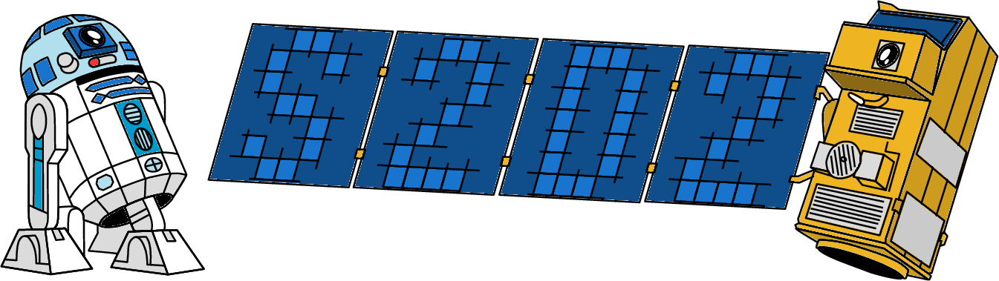
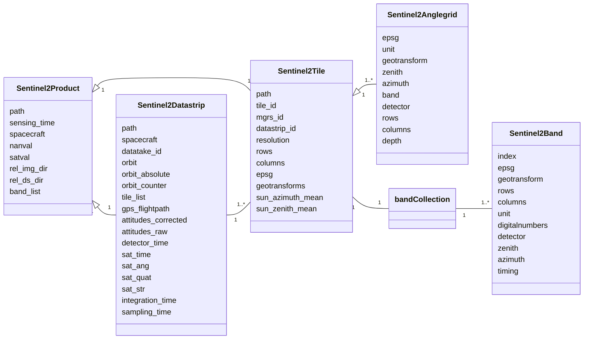

[](https://github.com/space-accountants/s2d2)
[](https://github.com/space-accountants/s2d2)
[](https://doi.org/10.5281/zenodo.10654893)
[](https://bestpractices.coreinfrastructure.org/projects/8399)
[](https://fair-software.eu)
[](https://sonarcloud.io/dashboard?id=space-accountants_s2d2)
[](https://s2d2.readthedocs.io/en/latest/?badge=latest)

# S2D2: Sentinel-2 data deepening



Easing the extraction of hard-to-find information that is within the meta-data of Sentinel-2 imagery.

## How to use s2d2

## A brief overview of Sentinel-2
With ease you can get lost in the terminology of Sentinel-2 data, and miss the rational. 
Therefore, a brief overview of the satellite system is given here, so hopefully a better understanding of the jargon can be created.

The Sentinel-2 satellites are a tandem mission that orbit in a sun-synchronous orbit. 
Since their inclination is 98 degrees, their orbit is in North-East to South-West orientation. 
Recordings of the sun-lit part are counted, in the meta-data these are termed **relative orbit number**.
This numbering system follows the orbit of the satellite system, hence when these are plotted on a map, 
the numbering of neighboring orbits is not incremental.

The flightpath over one orbit is called a **datatake**, this can the full extent of the orbit, but typically the sensor acquires only over land. 
Hence, recordings can be short, more specifics about the coverage can be found in the [campaign archive](https://sentinel.esa.int/web/sentinel/copernicus/sentinel-2/acquisition-plans/archive).
Furthermore, within a fight the data transfer can be subdivided towards different ground stations.
In that case the datatake is subdivided into **datastrips**, which should have some spatial overlap.

The main instrument onboard of Sentinel-2 is the multi-spectral imager (MSI).
Which is a composition of several photo-sensitive arrays, in the along-track direction these are sensitive in different spectral ranges.
While in the across-track direction these are placed in an alternating fashion, with some overlap, which looks like:

Each .

## Datamodel



## Installation

Download and access the package folder using `git`:

```console
git clone https://github.com/space-accountants/s2d2.git
cd s2d2
```

The dependencies are most easily installed with `conda` from the `conda-forge` channel (see
[Miniforge installers](https://github.com/conda-forge/miniforge/releases) for a minimal Conda
installation). Create and activate a virtual environment with all the required dependencies:

```console
conda env create -n s2d2 -f environment.yml
conda activate s2d2
```

Install `s2d2` using `pip` (add the `-e` option to install in development mode):

```console
pip install .
```

## Documentation
<div align='right'>

  [](https://s2d2.readthedocs.io/en/latest/?badge=latest)

</div>
Read the full project documentation at [s2d2.readthedocs.io](https://s2d2.readthedocs.io).

## Contributing to s2d2 
<div align='right'>

  [](https://github.com/space-accountants/s2d2/graphs/contributors)

</div>

If you want to contribute to the development of s2d2,
have a look at the [contribution guidelines](CONTRIBUTING.md).

## Credits

This package was created with [Cookiecutter](https://github.com/audreyr/cookiecutter) and the [NLeSC/python-template](https://github.com/NLeSC/python-template).
