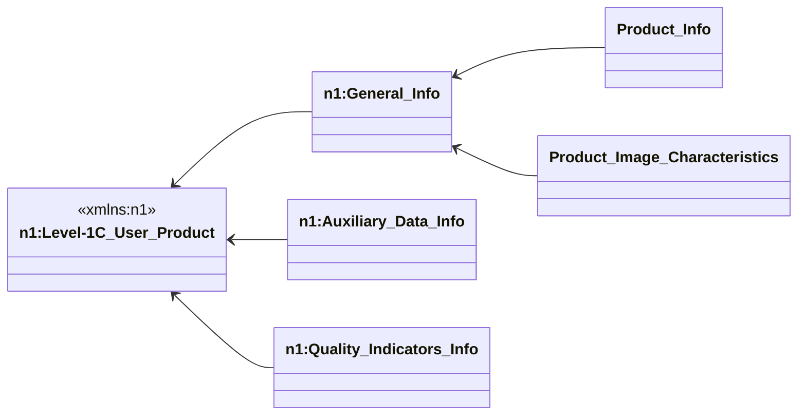

## Datamodel

```mermaid
classDiagram
  direction LR
  `n1:Level-1C_User_Product` <-- `n1:General_Info` 
  `n1:Level-1C_User_Product` <-- `n1:Auxiliary_Data_Info`
  `n1:Level-1C_User_Product` <-- `n1:Quality_Indicators_Info`
  `n1:General_Info` <-- `Product_Info`
  `n1:General_Info` <-- `Product_Image_Characteristics`

  class `Product_Info`
  class `Product_Image_Characteristics`
  class `n1:General_Info`
  class `n1:Auxiliary_Data_Info`
  class `n1:Quality_Indicators_Info`
  class `n1:Level-1C_User_Product`{
    <<xmlns:n1>>}
```
