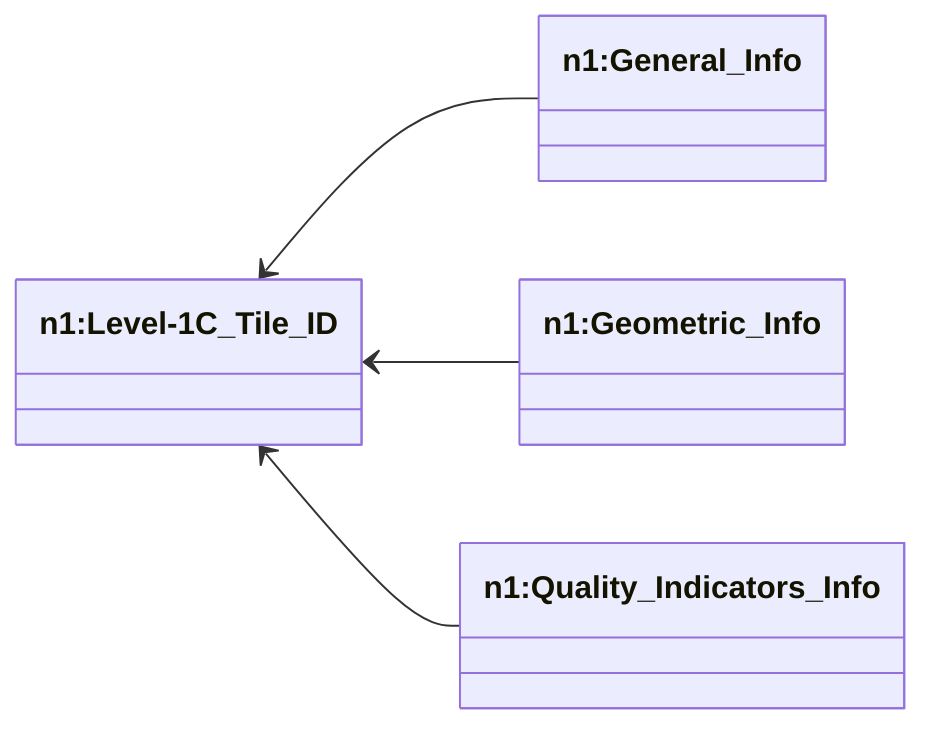

## Datamodel

```mermaid
classDiagram
  direction LR
  `n1:Level-1C_Tile_ID` <-- `n1:General_Info`  
  `n1:Level-1C_Tile_ID` <-- `n1:Geometric_Info`
  `n1:Level-1C_Tile_ID` <-- `n1:Quality_Indicators_Info`    

  class `n1:Level-1C_Tile_ID`
  class `n1:General_Info`
  class `n1:Geometric_Info`
  class `n1:Quality_Indicators_Info`
```
