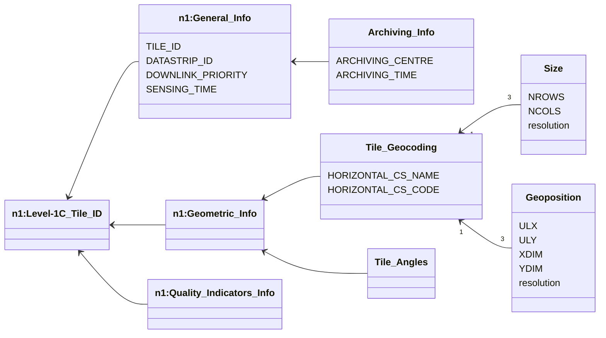

## Datamodel

```mermaid
classDiagram
  direction LR
  `n1:Level-1C_Tile_ID` <-- `n1:General_Info`  
  `n1:Level-1C_Tile_ID` <-- `n1:Geometric_Info`
  `n1:Level-1C_Tile_ID` <-- `n1:Quality_Indicators_Info`    
  `n1:General_Info` <-- `Archiving_Info`
  `n1:Geometric_Info` <-- `Tile_Geocoding`
  `n1:Geometric_Info` <-- `Tile_Angles` 
  `Tile_Geocoding` "1" <-- "3" `Size`
  `Tile_Geocoding` "1" <-- "3" `Geoposition`
   
  class `n1:Level-1C_Tile_ID`
  class `n1:General_Info`
    `n1:General_Info` : TILE_ID
    `n1:General_Info` : DATASTRIP_ID
    `n1:General_Info` : DOWNLINK_PRIORITY
    `n1:General_Info` : SENSING_TIME
  class `Archiving_Info`
    `Archiving_Info` : ARCHIVING_CENTRE
    `Archiving_Info` : ARCHIVING_TIME
  class `n1:Geometric_Info`
  class `Tile_Geocoding`
    `Tile_Geocoding` : HORIZONTAL_CS_NAME 
    `Tile_Geocoding` : HORIZONTAL_CS_CODE
  class `Size`
    `Size` : NROWS  
    `Size` : NCOLS  
    `Size` : resolution   
  class `Geoposition`
    `Geoposition` : ULX  
    `Geoposition` : ULY 
    `Geoposition` : XDIM 
    `Geoposition` : YDIM  
    `Geoposition` : resolution      
  class `Tile_Angles`
  class `n1:Quality_Indicators_Info`
```
