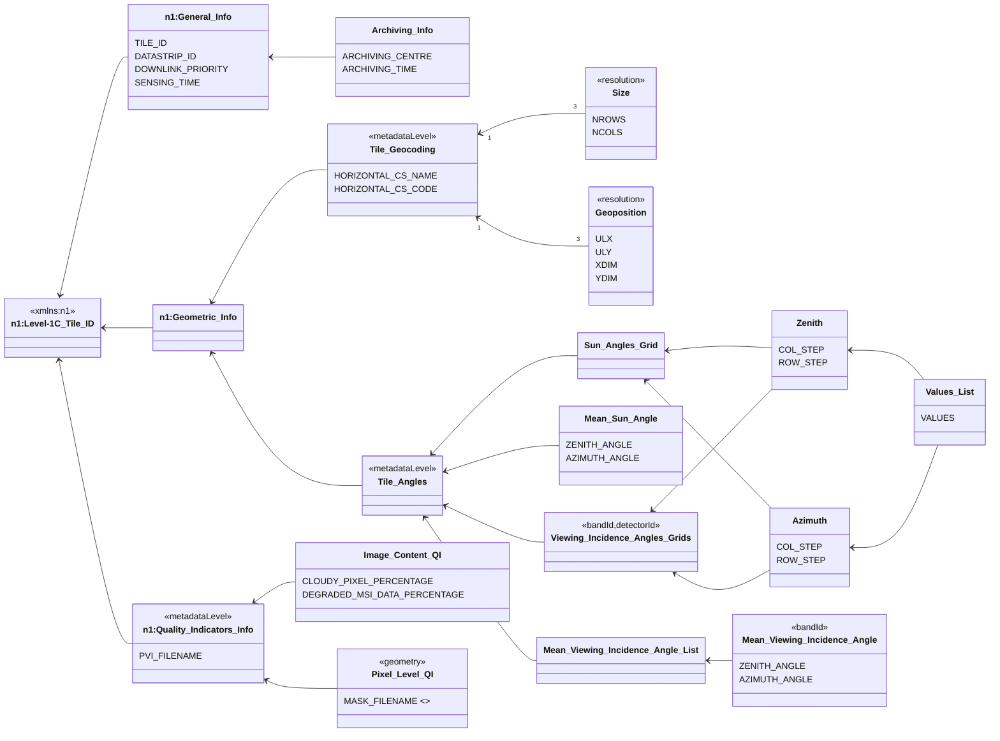

## Datamodel

```mermaid
classDiagram
  direction LR
  `n1:Level-1C_Tile_ID` <-- `n1:General_Info`  
  `n1:Level-1C_Tile_ID` <-- `n1:Geometric_Info`
  `n1:Level-1C_Tile_ID` <-- `n1:Quality_Indicators_Info`    
  `n1:General_Info` <-- `Archiving_Info`
  `n1:Geometric_Info` <-- `Tile_Geocoding`
  `n1:Geometric_Info` <-- `Tile_Angles` 
  `Tile_Geocoding` "1" <-- "3" `Size`
  `Tile_Geocoding` "1" <-- "3" `Geoposition`
  `Tile_Angles` <-- `Sun_Angles_Grid`
  `Sun_Angles_Grid` <-- `Zenith`  
  `Sun_Angles_Grid` <-- `Azimuth`
  `Zenith` <-- `Values_List`  
  `Azimuth` <-- `Values_List`  
  `Tile_Angles` <-- `Mean_Sun_Angle`  
  `Tile_Angles` <-- `Viewing_Incidence_Angles_Grids`
  `Viewing_Incidence_Angles_Grids` <-- `Zenith` 
  `Viewing_Incidence_Angles_Grids` <-- `Azimuth` 
  `Tile_Angles` <-- `Mean_Viewing_Incidence_Angle_List`
  `Mean_Viewing_Incidence_Angle_List` <-- `Mean_Viewing_Incidence_Angle`
  `n1:Quality_Indicators_Info` <-- `Image_Content_QI`
  `n1:Quality_Indicators_Info` <-- `Pixel_Level_QI`

  class `n1:Level-1C_Tile_ID`{
    <<xmlns:n1>>}
  class `n1:General_Info`{
    TILE_ID
    DATASTRIP_ID
    DOWNLINK_PRIORITY
    SENSING_TIME}
  class `Archiving_Info`{
    ARCHIVING_CENTRE
    ARCHIVING_TIME}
  class `n1:Geometric_Info`
  class `Tile_Geocoding`{
    <<metadataLevel>>
    HORIZONTAL_CS_NAME 
    HORIZONTAL_CS_CODE}
  class `Size`{
    <<resolution>>
    NROWS  
    NCOLS}
  class `Geoposition`{
    <<resolution>>
    ULX  
    ULY 
    XDIM 
    YDIM}
  class `Tile_Angles`{
    <<metadataLevel>>}
  class `Sun_Angles_Grid`
  class `Zenith`{
    COL_STEP
    ROW_STEP}
  class `Values_List`{
    VALUES}
  class `Azimuth`{
    COL_STEP
    ROW_STEP}
  class `Mean_Sun_Angle`{
    ZENITH_ANGLE
    AZIMUTH_ANGLE}
  class `Viewing_Incidence_Angles_Grids`{
    <<bandId,detectorId>>}
  class Mean_Viewing_Incidence_Angle_List
  class `Mean_Viewing_Incidence_Angle`{
    <<bandId>>
    ZENITH_ANGLE
    AZIMUTH_ANGLE}
  class `n1:Quality_Indicators_Info`{
    <<metadataLevel>>
    PVI_FILENAME}
  class `Image_Content_QI`{
    CLOUDY_PIXEL_PERCENTAGE
    DEGRADED_MSI_DATA_PERCENTAGE}
  class `Pixel_Level_QI`{
    <<geometry>>
    MASK_FILENAME <<bandId,type>>}
```
